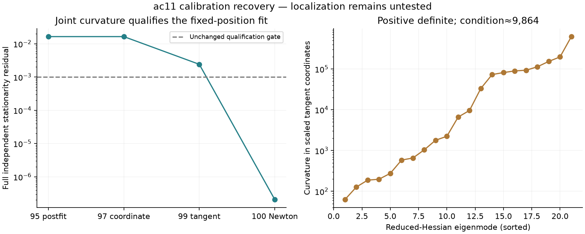

# Iteration100: corrected calibration postfit now qualifies

The reduced-Hessian Newton polish qualified the saved failed postfit without changing the position, model, priors, physical constraints or 0.001 stationarity requirement. This recovers the calibration prerequisite; **it does not yet establish a better position**.

| Quantity | Saved99 start | Qualified100 |
|---|---:|---:|
| Objective, same corrected model | 40544.490315728603 | 40544.490315668474 |
| Full scaled KKT residual | 0.002408070987 | 2.072541299e-07 |
| Fixed regional position | (−47.5,−62.5)km | Unchanged |

One accepted Newton round used **46 evaluations**: initial evaluation, 42 central gradient probes for 21 tangent coordinates, and three damped trials. The objective decreased by 6.01285137e-08; no score increase was needed. The initial 128 ULP ceiling and full qualification gate remained enforced.

## Why this succeeded

The earlier coordinate step tried to leave an active coupled timing constraint. Scalar tangent steps stayed feasible and improved the fit, but did not resolve all coupled residual directions. The 21-dimensional reduced Hessian accounts for those couplings simultaneously while remaining on the same active face.

Its eigenvalues range from **63.061613** to **622019.114968**, giving condition number **9863.67**. Every eigenvalue exceeds the numerical positive-definite threshold 2.90044e-09; no ridge or eigenvalue clipping was used. Maximum pre-symmetrization disagreement is 0.000588803, or 2.07064e-09 of the largest Hessian entry. This supports numerical consistency of this local calculation, not a global-optimum claim.

The active normal has rank 1. Minimum physical constraint slack after the step is 1.7522e-11. Maximum timing-basis coordinate movement is 2.06926e-05s; this is a basis-coordinate change, not an individual satellite or receiver clock correction.

## Support, c coverage and remaining test

The model retains 17 candidates and the same observations. The saved iteration95 starting postfit had effective signal support 2074.973999 and posterior RMS 152.318181Hz. The iteration100 solver did not persist refreshed support/RMS, so this read-only report does not claim those quantities remained numerically identical or recompute them.

This remains shared fitted-c calibration. Neither c arm has a new regional final or B7 position, and no fresh ordinary-only B7 parity measurement exists yet. Separately frozen iteration98 must carry the qualified calibration through association, both c finals, the unchanged regional winner policy and baseline/candidate B7 replays. Only that comparison can establish whether the user's 55.7km fitted-c failure improves.

Verified 706 frozen source/input hashes, receipt protocol binding, exact saved99 initial vector, unchanged position, feasible evaluated trials, objective ceiling and recorded Hessian eigenvalues. No model evaluation or fit was run to produce this report. This consumed single case is not cohort or independent validation.

Sources: [protocol](protocol.json), [result and all trials](result.json), [verification](verification.json), [iteration99](../2026_10_09_position_error_iter99/README.md).
