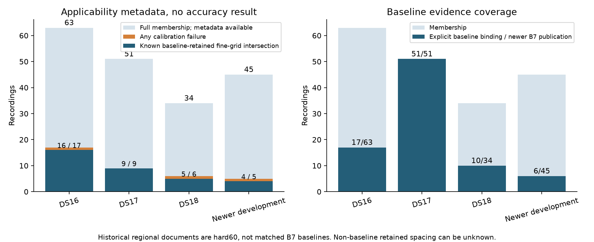

# Calibration-recovery applicability inventory

Metadata-only inventory covers all **193 members**: DS16 63, DS17 51, DS18 34 and the 45 development members of iteration89. No recording was excluded. No fit, reference-position/error extraction, RF collection or reserve access occurred. `inventory.json` records source hashes, configuration identity, failure reasons, baseline retained-grid spacing and explicit evidence gaps per member.

| Dataset | Members with available metadata | Members with calibration failures in any available pass |
|---|---:|---:|
| DS16 |63/63|17|
| DS17 |51/51|9|
| DS18 |34/34|6|
| Newer development |45/45|5|

Counts identify an applicability pool; they do not establish that recovery succeeds or improves accuracy. Historical sep25/sep50 documents are complete archived **hard60 regional** results, not matched B7 baselines. Explicit archived baseline bindings are read where available; a missing binding remains missing rather than being substituted by a later publication. Full B7 research baselines remain separately authoritative in iteration85.



Known baseline-retained fine-grid intersections (<40km spacing) occur in16 DS16,9 DS17,5 DS18 and4 newer development members. These are lower-bound intersections from available documents; unknown non-baseline geometry is not a negative finding. Explicit archived baseline coverage is17/63 DS16,51/51 DS17 and10/34 DS18. `inventory_artifact_hashes.json` records plot/source hashes and these descriptive counts. The plot was generated only from saved inventory; it adds no metadata exposure or accuracy claim. Two synthetic inventory tests pass using the repository `.venv/bin/python`; the reproduction command below was executed successfully.

For newer development, public `B7Store.status` yields six B7 publications and `Hard60Store.status` yields39 hard60 publications. The other namespace is pending for each member, recorded explicitly. The39 older publications must not be treated as matched B7 baselines. Calibration failures appear in members006,026,046,050 and051 (ac11); member050 has B7 metadata exposure in this iteration, superseding its previously metadata-only queue exposure without changing iteration89's immutable authority.

Retained membership and spacing are matched against each document's baseline retained basins. Production B7 includes failure lists from all three separation passes, but only baseline retained geometry in its document. Consequently non-baseline failures can have unknown retained membership/spacing: this is an evidence gap requiring public checkpoint receipts, not proof they were coarse or unretained. Failure-count entries are pass-level occurrences and can duplicate a physical basin across passes.

This is a supplemental analysis-metadata exposure receipt for **all45 development IDs**, accessed through a strict membership allowlist. Ac11 and7eb were previously consumed. All eight newer reserve recordings and the11 previous reserve recordings remain closed. No lack of registry matches is interpreted as unseen validation. `inventory.json` preserves the iteration89 membership hash; iteration89 files are unchanged.

Reproduce metadata access (read-only public stores):

```sh
sudo -n env PYTHONPATH=src:. .venv/bin/python reports/2026_10_09_position_error_iter101/inventory.py
```

The script writes only this iteration's inventory receipt. Source/reference coordinates and localization-error fields are intentionally omitted from the receipt and are never used for selection.
