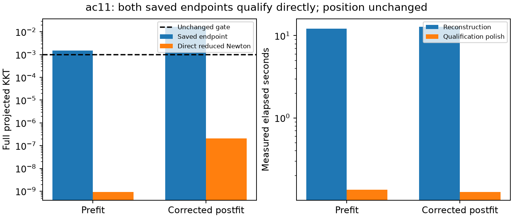

# Direct qualification of two saved calibration endpoints

**Both saved endpoints qualify in one reduced-Hessian round and 46 evaluations each.**
The full independent 0.001 gate, hard60, priors, fixed hypothesis position and
initial-objective 128-ULP ceiling remain unchanged. No new final position was produced.

| Endpoint | Initial KKT | Final KKT | Evaluations | Polish s | Reconstruction s | Score delta |
|---|---:|---:|---:|---:|---:|---:|
| calibration-prefit | 0.00153543861 | 9.29360575e-10 | 46 | 0.1347 | 12.1484 | -2.18278728426e-11 |
| calibration-postfit | 0.0164009702 | 2.08561542e-07 | 46 | 0.1261 | 12.7437 | -6.11253199168e-08 |

The polish timing excludes reconstruction. These timings describe two consumed
single-scan saved endpoints, not whole-pipeline overhead or a fleet runtime guarantee.
All returned position coordinates exactly equal their initial coordinates.

## Conditional scope

The prefit attempt starts directly from the original ordinary coarse receipt.
The postfit attempt starts directly from the saved iteration95 corrected endpoint,
whose receiver correction was built from iteration96's qualified prefit.
Neither attempt chains iteration99's tangent-gradient refinements. Nevertheless,
this is not yet an end-to-end test that builds the correction from the newly
directly qualified prefit and independently qualifies its ensuing postfit.
That complete path requires a separately frozen experiment.

These results support a cheaper direct numerical qualification path at the tested
states. They establish no additional positioning gain, RF interpretation or independent
validation. Iteration98's matched position rescue remains a separate conditional result.
No reference-guided seed, per-scan threshold, new RF collection or production edit occurred.

All 714 frozen source/input hashes match.
Protocol preparation was published at `38fc8678d` before execution.
Every numerical trial remains in [result.json](result.json); see [verification](verification.json)
and [artifact hashes](report-integrity.json). This report reads persisted receipts only.
