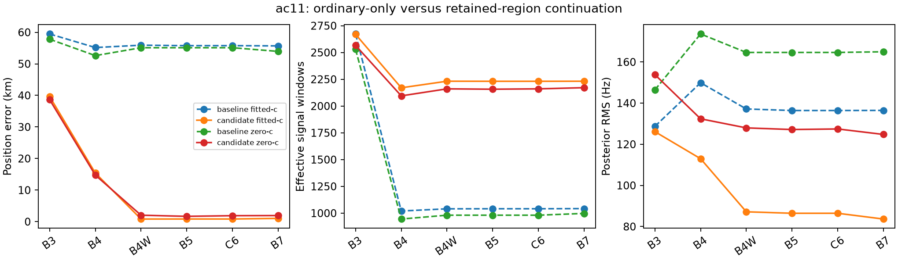

# Direct calibration path and matched c continuation

This run starts from iteration102's directly qualified ordinary prefit, builds a
fresh receiver correction, fits its corrected postfit and uses direct qualification
only if needed. It does not reuse iteration96's correction or iteration99's
intermediate tangent states. The source prefit and both follow-on arms remain
conditional on this consumed ordinary score-selected scan, not unseen validation.

## Calibration cost

| Component | Evaluations | Elapsed s |
|---|---:|---:|
| Direct prefit polish (102) | 46 | 0.1347 |
| Fresh bounded postfit | 114 | 0.3130 |
| Direct postfit polish | 46 | 0.1232 |

Fresh correction/postfit/validation together took 0.4440s.
This excludes bank/input reconstruction and downstream association/B7 costs.
The prefit polish occurred in the prior frozen102 run; it is included for algorithm
cost accounting, not represented as a new103 fit.

## Comparison with the earlier research chain

| Arm | Research98 error km | Direct103 error km |
|---|---:|---:|
| fitted-c | 1.030621 | 1.030621 |
| zero-c | 1.927094 | 1.927094 |

Both are the same consumed scan. Their difference does not constitute independent
validation or a new matched algorithm population. Use the ordinary-only replay below
as the controlled B7 baseline. No frozen prior receipt is modified.

The score-selected final errors are stable, but nonwinning zero-timing starts are
sensitive to the directly rebuilt calibration:

| Arm | Research98 zero-timing error km | Direct103 zero-timing error km |
|---|---:|---:|
| fitted-c | 18.866713 | 34.188688 |
| zero-c | 20.955908 | 40.534545 |

These starts remain qualified but have worse same-model scores than the association
starts. This is observed start sensitivity, not a reason to tune using reference errors
or to substitute a different operational winner.

# Retained-region continuation: matched c arms

Recorded status: **complete**. All position errors below are evaluation-only.
Restoring and qualifying the ordinary score-selected region reduces this scan's final error from **55.685 to 1.031 km fitted-c**, and **53.945 to 1.927 km zero-c**. The ordinary-only replay reproduces both archived endpoint vectors and objectives exactly. This establishes a single-scan rescue, not broad generalization or a production deployment.



| Arm | Archived error km | Ordinary-only replay km | Candidate km | Candidate minus replay km |
|---|---:|---:|---:|---:|
| fitted-c | 55.685054 | 55.685054 | 1.030621 | -54.654433 |
| zero-c | 53.945451 | 53.945451 | 1.927094 | -52.018356 |

Baseline replay parity and operational selection:

- **fitted-c** parity: `{"vector_exact": true, "vector_max_abs_delta": 0.0, "objective_delta": 0.0, "error_delta_km": -7.105427357601002e-15}`; selection: `{"region_source": "recovered-ordinary-region", "basin": "point:-47.5:-62.5", "start": "B7", "accepted_stage": "B7", "calibration_penalty": 0.0}`.
- **zero-c** parity: `{"vector_exact": true, "vector_max_abs_delta": 0.0, "objective_delta": 0.0, "error_delta_km": -7.105427357601002e-15}`; selection: `{"region_source": "recovered-ordinary-region", "basin": "point:-47.5:-62.5", "start": "B7", "accepted_stage": "B7", "calibration_penalty": 0.0}`.

Recovered regional finals (before B7):

| Arm / start | Qualified | Error km | Objective | Failure |
|---|---|---:|---:|---|
| zero-c / association | True | 41.463862 | 40661.896693 | None |
| zero-c / zero-timing | True | 40.534545 | 47084.370533 | None |
| zero-c / own-continuation | True | 41.463862 | 40661.896693 | None |
| fitted-c / association | True | 40.607945 | 39960.280697 | None |
| fitted-c / zero-timing | True | 34.188688 | 46895.358980 | None |
| fitted-c / own-continuation | True | 40.607945 | 39960.280697 | None |

All 24 baseline/candidate B3–B7 arm-stage attempts qualify; neither replay reports a fallback reason. The candidate fitted-c B4W error is 0.826 km, but the unchanged pipeline finishes at B7 with 1.031 km. We do not select an earlier stage by reference error.

Candidate stage errors and frequency fit:

| Stage | Fitted-c error km | Zero-c error km | Fitted-c RMS Hz | Zero-c RMS Hz |
|---|---:|---:|---:|---:|
| B3 | 39.662737 | 38.654180 | 126.127 | 153.854 |
| B4 | 15.398499 | 14.754290 | 112.976 | 132.369 |
| B4W | 0.825782 | 2.039759 | 87.170 | 127.954 |
| B5 | 0.840546 | 1.683942 | 86.448 | 127.155 |
| C6 | 0.840546 | 1.890831 | 86.448 | 127.437 |
| B7 | 1.030621 | 1.927094 | 83.644 | 124.767 |

Full stage metrics, unqualified attempts, regional model-score winners and fallback reasons
are preserved in [summary.json](summary.json) and [compressed raw receipts](receipts.tar.gz).
The model-selected result, never the smallest reference error, determines candidate outcome.
Compare objective scores only within the same physical model/bank and calibration baseline.
B3–B7 change nuisance models and satellite banks; their raw scores are not a common accuracy scale.
Frequency RMS/support effects are reported separately from geographic accuracy.

This consumed single-scan test retains ordinary candidates and uses matched c arms, priors and budgets.
Reference coordinates are read only by this report; no reference-guided seed or winner selection occurs.
No additional objective evaluation, RF collection or deployment was performed for reporting.

All 721 frozen hashes match. See [protocol](protocol.json)
and [artifact hashes](report-integrity.json).

## Compressed raw receipts

[receipts.tar.gz](receipts.tar.gz) contains result.json, fresh-calibration.json and
every stages/*.json receipt. [receipts-manifest.json](receipts-manifest.json) records
per-file hashes/sizes and the archive hash. Deterministic archive creation and
readback verification preserved every original local raw file.
Individual raw JSON receipts are omitted from the published directory; unpack the
archive to inspect or reproduce them. Summary tables remain directly readable.

Restore into a **new, nonexistent directory**, without overwriting existing work:

```bash
python reports/2026_10_09_position_error_iter103/unpack_receipts.py /tmp/ac11-103-receipts
```

The verifier checks the archive hash, exact controlled membership, regular files,
relative paths, per-file sizes and hashes before creating the destination. It does
not use unrestricted tar extraction. Copy verified receipts into a separate checkout
of the frozen protocol if reproducing reports; do not replace existing local receipts.
The reporting helper also needs the published iteration98 report.py/summary.json
and original iteration93 document. Archive extraction itself runs no analysis.
