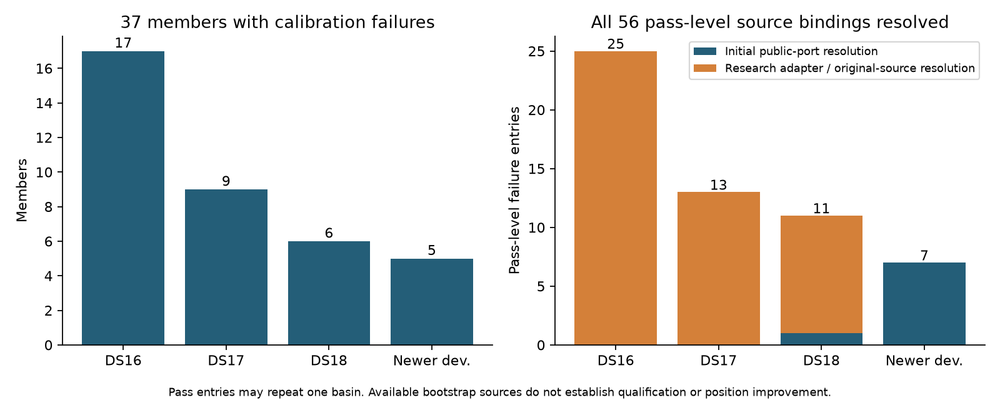

# Generic calibration recovery source bindings

`source_bindings.json` accounts for all193 members and resolves checkpoint keys without fitting or reference-error selection. It uses iteration101 membership and failure metadata, archived regional documents and public `RegionalCheckpointStore.get` / publication-status ports. All closed reserves remain untouched.

| Dataset | Members | Matched research B7 endpoint bindings | Calibration-failure members | Members with public bootstrap/coarse receipts |
|---|---:|---:|---:|---:|
| DS16 |63|63|17|0|
| DS17 |51|51|9|0|
| DS18 |34|34|6|1|
| Newer development |45|0|5|5|

The148 historical B7 endpoint bindings are available in iteration85: missing raw regional checkpoint metadata does **not** mean missing B7 baseline. Newer endpoints need a matched B7 replay before a cohort position comparison; iteration101 found six operational B7 publications and39 older hard60 publications.

Eight pass-level failure bindings across six members have public bootstrap/coarse receipts. Forty-seven pass-level entries lack `checkpoint_binding` (24 DS16,13 DS17,10 DS18); one additional DS16 entry has a binding but no bootstrap/coarse receipt in the ordinary public root. These counts include duplicated basins across separation passes and are not independent failures.

Each available receipt records semantic key, canonical payload digest, bootstrap digest, config signature, source input digest and score/prior configuration signature. Availability is necessary but not sufficient for replay: exact observation ordering, candidate bank and model reconstruction still require independent verification. No generic recovery is claimed qualified from metadata alone.

Historical generated regional documents often omit production checkpoint bindings because iteration51 uses the research `ExperimentCheckpoints` adapter with per-label/per-separation caches and borrows ordinary checkpoints through `ReplayCheckpoints` (see `iter51/evaluate.py:47`). Those sources require an explicitly bound research checkpoint reader and provenance verification; this inventory does not construct private storage paths or treat missing production bindings as irrecoverability. The isolated standard-baseline root in iteration45 is another explicitly documented root requiring its matching binding. Ac11's already-consumed verified extraction in iteration93 remains an independent exact receipt for its shared bootstrap and three calibration failures.

Reproduce with the public-port metadata reader:

```sh
sudo -n env PYTHONPATH=src:. .venv/bin/python reports/2026_10_09_position_error_iter104/bindings.py
```

No checkpoint writes, numerical fits, new recording access or reference-position/error reads are performed. Future driver freezing must distinguish available endpoint, available raw checkpoint and fully reconstructable calibrated model as separate gates.

## Supplemental research-adapter resolution

`research_source_bindings.json` resolves **all49 historical pass-level calibration failures** to an available bootstrap receipt. The frozen iteration51 `ExperimentCheckpoints.get` verifies cache binding, key and canonical payload digest; the borrowed-stage fallback uses the original case document's public `RegionalCheckpointStore.get`, matching `ReplayCheckpoints` semantics. In particular, DS17's ordinary source is its frozen `iter01/published` document rather than the subsequently generated baseline document. Legacy DS16 likewise borrows its original public publication. The isolated iteration45 root comes directly from its completion receipt.

This resolves the apparent47 missing-binding gaps and the additional ordinary-root miss above. Those were first-pass production-port gaps, **not missing scientific checkpoints**. `research_bindings.py` was executed successfully without numerical loading or fitting. Each supplemental entry names the verified adapter/root/key and canonical value hash. Available bootstrap is not a claim that downstream calibration or localization will qualify; full observation/bank/model identity remains a required preflight.



Combined source coverage is all56 pass-level entries across37 failure members:25 DS16,13 DS17,11 DS18 and7 newer-development entries. The initial production-port pass resolved8 entries;48 additional entries are resolved by the supplemental research/original-source read. This chart is generated only from existing receipts and adds no metadata exposure. The initial-versus-supplemental distinction is a resolution phase, not a classification of every payload as research or production: research adapters can borrow original production checkpoints.

```sh
sudo -n env PYTHONPATH=src:. .venv/bin/python reports/2026_10_09_position_error_iter104/research_bindings.py
```
