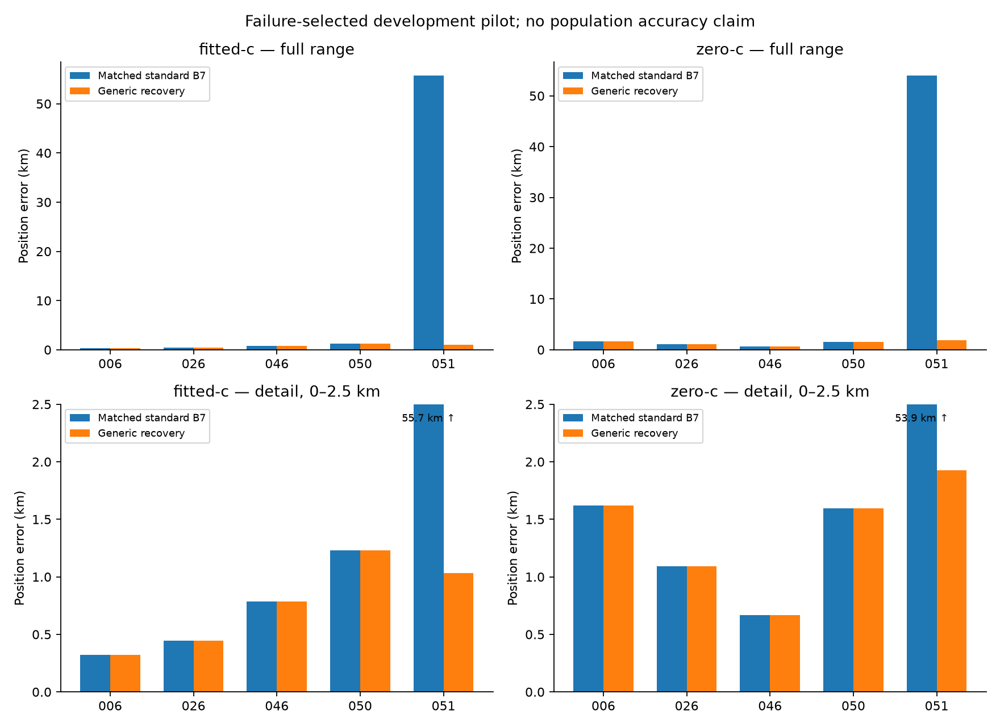

# Generic calibration-recovery pilot

All five failure-selected development members are accounted for. This pilot does not estimate population mean accuracy. Frequency fit and position error remain separate.

| Member | Arm | Baseline km | Candidate km | Delta km | Status |
|---|---|---:|---:|---:|---|
|POST18-NEWER-20261009-006|fitted-c|0.319850|0.319850|0.000000|complete / complete|
|POST18-NEWER-20261009-006|zero-c|1.621769|1.621769|0.000000|complete / complete|
|POST18-NEWER-20261009-026|fitted-c|0.444719|0.444719|0.000000|complete / complete|
|POST18-NEWER-20261009-026|zero-c|1.093705|1.093705|0.000000|complete / complete|
|POST18-NEWER-20261009-046|fitted-c|0.785445|0.785445|0.000000|complete / complete|
|POST18-NEWER-20261009-046|zero-c|0.669770|0.669770|0.000000|complete / complete|
|POST18-NEWER-20261009-050|fitted-c|1.229910|1.229910|0.000000|complete / complete|
|POST18-NEWER-20261009-050|zero-c|1.593123|1.593123|0.000000|complete / complete|
|POST18-NEWER-20261009-051|fitted-c|55.685054|1.030621|-54.654433|complete / complete|
|POST18-NEWER-20261009-051|zero-c|53.945451|1.927094|-52.018356|complete / complete|

## Pilot metrics

These five members were selected for calibration failures, not position error. They are consumed development data. The known ac11 rescue is member051; its repetition under generic code is not independent validation.

| Arm / phase | Mean km | Median km | p95 km | Worst km |
|---|---:|---:|---:|---:|
|fitted-c / baseline|11.692996|0.785445|44.794026|55.685054|
|fitted-c / candidate|0.762109|0.785445|1.190053|1.229910|
|zero-c / baseline|11.784764|1.593123|43.480714|53.945451|
|zero-c / candidate|1.381092|1.593123|1.866029|1.927094|

## Recovery convergence and failures

Optimizer success alone is not qualification. Unqualified regional starts remain excluded by the unchanged independent gate. These are attempt failures even when a member completes with a valid ordinary winner.

| Member | Recovery calibration | Qualified regional starts | Unqualified regional starts |
|---|---|---:|---:|
|006|qualified|2 / 6|4|
|026|qualified|6 / 6|0|
|046|qualified|4 / 6|2|
|050|qualified|6 / 6|0|
|051|qualified|6 / 6|0|

## Frequency fit, reported separately

| Member | Arm | Baseline RMS Hz | Candidate RMS Hz |
|---|---|---:|---:|
|006|fitted-c|67.733|67.733|
|006|zero-c|112.992|112.992|
|026|fitted-c|66.377|66.377|
|026|zero-c|130.662|130.662|
|046|fitted-c|66.287|66.287|
|046|zero-c|122.442|122.442|
|050|fitted-c|71.704|71.704|
|050|zero-c|124.742|124.742|
|051|fitted-c|136.462|83.644|
|051|zero-c|164.956|124.767|

[comparison.json](comparison.json) contains per-arm signal support, convergence, fallbacks, regional selection, archived B7 parity, slice claims and recorded evaluation/polish diagnostics. Full-pilot aggregate metrics are withheld if any matched member fails.

See [interpretation and next steps](INTERPRETATION.md), [independent runtime audit](RUNTIME_AUDIT.md), and [raw receipt restoration](RESULT_ARCHIVE.md).
