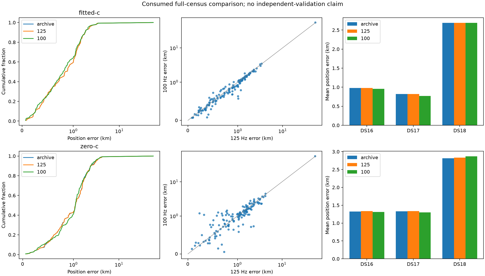

# Frequency-width comparison

Complete membership: True.
Consumed development only. Missing/failed inputs withhold full position metrics.
Reference values do not guide model construction, starts or winners. A legacy loader compares an archived error field only for artifact consistency; see [the dependency audit](REFERENCE_DEPENDENCY_AUDIT.md).

| Dataset | Arm | Model | n | Mean km | Median km | p95 km | Worst km |
|---|---|---|---:|---:|---:|---:|---:|
| DS16 | fitted-c | archive | 63 | 0.9790 | 0.8349 | 2.0885 | 3.2048 |
| DS16 | fitted-c | 125 | 63 | 0.9790 | 0.8349 | 2.0885 | 3.2048 |
| DS16 | fitted-c | 100 | 63 | 0.9574 | 0.8261 | 2.0818 | 3.3144 |
| DS16 | zero-c | archive | 63 | 1.3211 | 1.0750 | 2.9373 | 4.2636 |
| DS16 | zero-c | 125 | 63 | 1.3358 | 1.0750 | 3.3513 | 4.2636 |
| DS16 | zero-c | 100 | 63 | 1.3140 | 1.1234 | 3.0496 | 4.4850 |
| DS17 | fitted-c | archive | 51 | 0.8191 | 0.6963 | 2.0590 | 2.4836 |
| DS17 | fitted-c | 125 | 51 | 0.8191 | 0.6963 | 2.0590 | 2.4836 |
| DS17 | fitted-c | 100 | 51 | 0.7691 | 0.6713 | 2.0079 | 2.0828 |
| DS17 | zero-c | archive | 51 | 1.3269 | 1.3599 | 2.8741 | 3.1250 |
| DS17 | zero-c | 125 | 51 | 1.3334 | 1.3120 | 2.8741 | 3.1250 |
| DS17 | zero-c | 100 | 51 | 1.2963 | 1.0946 | 2.4912 | 2.9851 |
| DS18 | fitted-c | archive | 34 | 2.6917 | 1.1225 | 2.9035 | 53.4007 |
| DS18 | fitted-c | 125 | 34 | 2.6917 | 1.1225 | 2.9035 | 53.4007 |
| DS18 | fitted-c | 100 | 34 | 2.6906 | 1.0564 | 2.8679 | 54.8355 |
| DS18 | zero-c | archive | 34 | 2.8158 | 1.1302 | 3.7015 | 54.8321 |
| DS18 | zero-c | 125 | 34 | 2.8338 | 1.1302 | 3.8049 | 54.7812 |
| DS18 | zero-c | 100 | 34 | 2.8702 | 1.1021 | 3.7743 | 56.7726 |
| Pooled | fitted-c | archive | 148 | 1.3174 | 0.8637 | 2.2692 | 53.4007 |
| Pooled | fitted-c | 125 | 148 | 1.3174 | 0.8637 | 2.2692 | 53.4007 |
| Pooled | fitted-c | 100 | 148 | 1.2907 | 0.8050 | 2.0986 | 54.8355 |
| Pooled | zero-c | archive | 148 | 1.6665 | 1.1152 | 3.1222 | 54.8321 |
| Pooled | zero-c | 125 | 148 | 1.6791 | 1.1152 | 3.1776 | 54.7812 |
| Pooled | zero-c | 100 | 148 | 1.6654 | 1.1069 | 3.0461 | 56.7726 |
| DS16-original48 | fitted-c | archive | 48 | 1.0234 | 0.9023 | 2.0334 | 3.2048 |
| DS16-original48 | fitted-c | 125 | 48 | 1.0234 | 0.9023 | 2.0334 | 3.2048 |
| DS16-original48 | fitted-c | 100 | 48 | 1.0003 | 0.8389 | 2.0187 | 3.3144 |
| DS16-original48 | zero-c | archive | 48 | 1.3230 | 1.0920 | 3.2489 | 4.2636 |
| DS16-original48 | zero-c | 125 | 48 | 1.3424 | 1.0920 | 3.4427 | 4.2636 |
| DS16-original48 | zero-c | 100 | 48 | 1.2848 | 1.1227 | 2.9496 | 4.4850 |
| DS16-added15 | fitted-c | archive | 15 | 0.8370 | 0.7039 | 1.7853 | 2.2456 |
| DS16-added15 | fitted-c | 125 | 15 | 0.8370 | 0.7039 | 1.7853 | 2.2456 |
| DS16-added15 | fitted-c | 100 | 15 | 0.8201 | 0.6648 | 1.7235 | 2.2177 |
| DS16-added15 | zero-c | archive | 15 | 1.3148 | 1.0536 | 2.5023 | 2.8841 |
| DS16-added15 | zero-c | 125 | 15 | 1.3148 | 1.0536 | 2.5023 | 2.8841 |
| DS16-added15 | zero-c | 100 | 15 | 1.4074 | 1.1324 | 2.8728 | 3.0790 |
| DS18-prior24 | fitted-c | archive | 24 | 3.2513 | 1.1089 | 3.1242 | 53.4007 |
| DS18-prior24 | fitted-c | 125 | 24 | 3.2513 | 1.1089 | 3.1242 | 53.4007 |
| DS18-prior24 | fitted-c | 100 | 24 | 3.2492 | 1.0564 | 3.1878 | 54.8355 |
| DS18-prior24 | zero-c | archive | 24 | 3.4315 | 1.1076 | 3.8526 | 54.8321 |
| DS18-prior24 | zero-c | 125 | 24 | 3.4570 | 1.1076 | 4.1036 | 54.7812 |
| DS18-prior24 | zero-c | 100 | 24 | 3.4809 | 1.0894 | 3.8412 | 56.7726 |
| DS18-other10-consumed | fitted-c | archive | 10 | 1.3486 | 1.2713 | 2.4799 | 2.6420 |
| DS18-other10-consumed | fitted-c | 125 | 10 | 1.3486 | 1.2713 | 2.4799 | 2.6420 |
| DS18-other10-consumed | fitted-c | 100 | 10 | 1.3500 | 1.2629 | 2.4403 | 2.5441 |
| DS18-other10-consumed | zero-c | archive | 10 | 1.3382 | 1.2447 | 2.8186 | 3.2060 |
| DS18-other10-consumed | zero-c | 125 | 10 | 1.3382 | 1.2447 | 2.8186 | 3.2060 |
| DS18-other10-consumed | zero-c | 100 | 10 | 1.4045 | 1.3136 | 2.9938 | 3.1599 |

Predeclared gates: `{"fitted-c": {"checks": {"mean": false, "median": true, "dataset_means": true, "tails": true, "regression_count": false}, "passed": false, "frozen_regression_definition": "No increase versus archive, candidate compared with control", "candidate_vs_control_regressed_over_1km": 1, "stricter_zero_new_regressions_sensitivity": false, "sensitivity_is_not_frozen_gate": true}, "zero-c": {"checks": {"mean": false, "median": false, "dataset_means": true, "tails": true, "regression_count": false}, "passed": false, "frozen_regression_definition": "No increase versus archive, candidate compared with control", "candidate_vs_control_regressed_over_1km": 1, "stricter_zero_new_regressions_sensitivity": false, "sensitivity_is_not_frozen_gate": true}}`
Frozen regression criterion: relative to the same archived B7 endpoint, compare >1 km regression counts for candidate and control. Candidate-versus-control counts and the stricter zero-new-regressions sensitivity are also reported separately; the sensitivity does not replace the frozen gate.

Complete coverage and separate fit diagnostics: [summary.json](summary.json). Different-width objective values do not rank models.

Available raw-fit diagnostics (not full-census accuracy estimates):

| Group | Arm | Hz | Raw qualified/attempts | Failed | Fallbacks | Mean seconds |
|---|---|---:|---:|---:|---:|---:|
| DS16 | fitted-c | 125 | 63/63 | 0 | 0 | 0.0576 |
| DS16 | fitted-c | 100 | 63/63 | 0 | 0 | 1.0567 |
| DS16 | zero-c | 125 | 63/63 | 0 | 0 | 1.0574 |
| DS16 | zero-c | 100 | 63/63 | 0 | 0 | 1.1390 |
| DS17 | fitted-c | 125 | 51/51 | 0 | 0 | 0.0568 |
| DS17 | fitted-c | 100 | 51/51 | 0 | 0 | 1.0447 |
| DS17 | zero-c | 125 | 51/51 | 0 | 0 | 1.0890 |
| DS17 | zero-c | 100 | 51/51 | 0 | 0 | 1.1868 |
| DS18 | fitted-c | 125 | 34/34 | 0 | 0 | 0.0637 |
| DS18 | fitted-c | 100 | 34/34 | 0 | 0 | 1.1204 |
| DS18 | zero-c | 125 | 34/34 | 0 | 0 | 1.0923 |
| DS18 | zero-c | 100 | 34/34 | 0 | 0 | 1.1683 |
| Pooled | fitted-c | 125 | 148/148 | 0 | 0 | 0.0587 |
| Pooled | fitted-c | 100 | 148/148 | 0 | 0 | 1.0672 |
| Pooled | zero-c | 125 | 148/148 | 0 | 0 | 1.0763 |
| Pooled | zero-c | 100 | 148/148 | 0 | 0 | 1.1622 |

Frequency/association diagnostics are distinct from position:

| Group | Arm | Hz | Median posterior RMS Hz | Mean clutter | Mean changed assignments |
|---|---|---:|---:|---:|---:|
| DS16 | fitted-c | 125 | 65.9080 | 0.0688 | — |
| DS16 | fitted-c | 100 | 58.9479 | 0.0713 | 0.0084 |
| DS16 | zero-c | 125 | 104.8430 | 0.0816 | — |
| DS16 | zero-c | 100 | 95.1009 | 0.1000 | 0.0295 |
| DS17 | fitted-c | 125 | 59.2296 | 0.0702 | — |
| DS17 | fitted-c | 100 | 54.2266 | 0.0726 | 0.0083 |
| DS17 | zero-c | 125 | 118.1067 | 0.0905 | — |
| DS17 | zero-c | 100 | 101.6164 | 0.1228 | 0.0473 |
| DS18 | fitted-c | 125 | 73.1708 | 0.0849 | — |
| DS18 | fitted-c | 100 | 68.1682 | 0.0884 | 0.0107 |
| DS18 | zero-c | 125 | 86.8241 | 0.0923 | — |
| DS18 | zero-c | 100 | 79.2924 | 0.1033 | 0.0196 |
| Pooled | fitted-c | 125 | 65.6381 | 0.0730 | — |
| Pooled | fitted-c | 100 | 58.8294 | 0.0757 | 0.0089 |
| Pooled | zero-c | 125 | 110.5365 | 0.0871 | — |
| Pooled | zero-c | 100 | 95.5901 | 0.1086 | 0.0334 |

