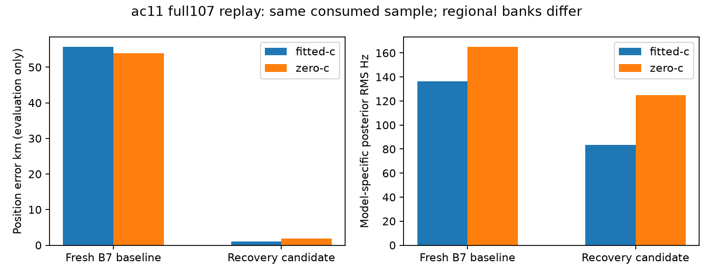

# ac11 rescue reproduces in the full-cohort engine

`scan-fw-ac11ac00c0676d1b`, newer development member051, now has terminal complete
iteration107 baseline/candidate receipts. Reporting-only evaluation through the
existing reference port gives the following matched results. No fit, objective
call or input reconstruction was performed for this report.

|Arm|Fresh B7 baseline km|Recovery candidate km|Baseline RMS Hz|Candidate RMS Hz|
|---|---:|---:|---:|---:|
|Fitted-c|55.685054|1.030621|136.4618|83.6439|
|c=0|53.945451|1.927094|164.9557|124.7674|

Both candidate endpoints qualify independently and remain above the research
goal of0.4 km mean error. The fitted result is slightly above1 km for this member.
The two c arms retain the same observations, ordinary hypothesis inventory,
priors, hard60 policy and budgets, including the existing zero-c RF locks.

The generic trigger finds the failed retained5 km region `point:-47.5:-62.5`
across all three ordinary passes and deduplicates it. Direct prefit and postfit
qualification each use46 evaluations, taking0.1206 and0.1198 seconds respectively.
Both qualify, association becomes available and all six regional finals qualify.
The ordinary regions remain byte-value identical in the candidate receipt; new
recovery hypotheses are added without losing baseline options. The unchanged
model-score rule selects the recovered region for both arms, followed by B7.
Reference errors did not choose a seed, region, bank or operational winner.

Fresh baseline **and** recovered candidate vectors, clocks and objectives exactly
match the earlier iteration105 consumed-case replay in both arms. Position,
objective, RMS and signal-window values also reproduce iteration103's direct
rescue. This confirms integration/replay parity, not independent validation:
ac11 was repeatedly inspected and used for mechanism development.

The selected regional model changes from16 to25 satellites. Effective signal
windows rise1042.28→2231.51 fitted and997.27→2171.30 zero-c. Frequency fit and
position accuracy are therefore reported separately; differing banks and
responsibilities prevent treating the objective/RMS reduction alone as controlled
evidence of localization gain. The observed position improvement is evaluated
directly after inference selection seals.

This is one completed consumed member within the still-running193-member
experiment. It does not establish the full-cohort mean, generalization or readiness
for deployment. The completed DS18 subset already shows no selected improvements;
remaining full-cohort positives and counterexamples must stay visible.

[Compact evaluation, exact105 parity,103 comparison and source hashes](AC11_FULL107_REPLAY.json).
[Artifact/phase receipt integrity](ac11-full107-integrity.json).
