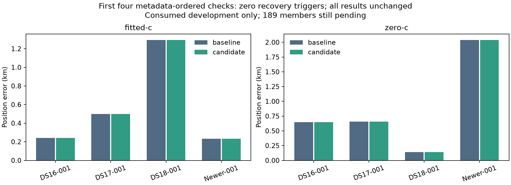

# Four-case runtime check passed; full193 accuracy remains pending

Both initial controllers exited successfully. The first metadata-ordered member
of each dataset completed its current B7 baseline and recovery candidate in one
slice per phase. All four had zero retained calibration-failure triggers, so
this checks ordinary reconstruction and preservation, not a new recovery success.
All eight matched arm outcomes retain exactly the same position/clock vectors,
objectives, frequency RMS and independent qualification. Timing receipts differ.

| Member | Fitted-c baseline/candidate km | c=0 baseline/candidate km | Baseline s | Candidate s |
|---|---:|---:|---:|---:|
| DS16-001 | 0.241520 / 0.241520 | 0.649406 / 0.649406 | 116.19 | 22.48 |
| DS17-001 | 0.498439 / 0.498439 | 0.657090 / 0.657090 | 215.89 | 28.31 |
| DS18-001 | 1.293729 / 1.293729 | 0.140969 / 0.140969 | 146.52 | 27.15 |
| POST18-NEWER-20261009-001 | 0.232663 / 0.232663 | 2.038412 / 2.038412 | 164.59 | 23.34 |

These cases were selected by frozen metadata ordering, never reference error.
References were evaluated only after each paired run terminated. No mean or
population improvement is inferred from four cases. All193 are listed in the
[coverage snapshot](coverage-report.json): four complete pairs,189 pending.
The [coverage report](COVERAGE.md) withholds full-census position metrics.

Current reconstruction exercised both source paths. DS17-001 admitted the known
legacy bootstrap/coarse-only source through all runtime identity, objective,
feasibility and qualification checks. The other three used compatible current
coarse sources. There were no source rejections. Repeated get calls are not
unique points: each member has2,409 coarse hits across repeated traversal, not
2,409 independent grid points. Current recovery, association and B7 still ran.

DS16/DS18 reproduced archived85 endpoint vectors exactly. DS17's freshly
reconstructed baseline differs from archived85 at tiny floating-point scale
(error differences below0.00000003 km); candidate/control equality is exact.
The newer member receives a fresh B7 baseline, not an old hard60 accuracy proxy.

The phase costs above include loading and stage work as recorded by the driver;
checkpoint/controller finalization adds a small overhead. This research candidate
reruns the downstream sequence even without a trigger, so its20–30 seconds here
is not the deployment cost of a future no-op fast path. No such production
optimization or pipeline change is part of this experiment.

Next, complete the short frozen148-member no-fit ambiguity census using the two
freed worker slots, then continue the remaining193-member recovery comparison.
The full recovery protocol and budgets remain unchanged. Production B7 remains
unchanged; no RF collection or reserve access occurred. Raw append-only receipts
remain local and their phase hashes are in the coverage snapshot; final full
experiment publication will include the raw archive.
