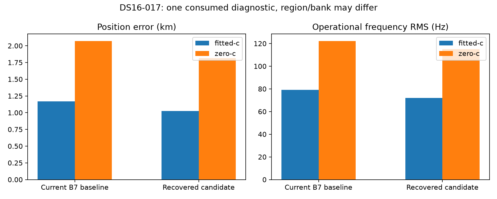

# DS16-017: first observed selected recovery changes

For consumed development recording `scan-fw-5fab2b5974ce6bfb`, the frozen generic recovery rule selected a recovered region in both matched arms. Reference coordinates entered only this post-fit evaluation through the existing report helper; they did not select triggers, regions, banks or winners. This is one partial diagnostic while full193 remains pending, not a deployment recommendation or population improvement.

| Arm | Current B7 baseline error km | Recovered candidate error km | Change km | Baseline / candidate frequency RMS Hz |
|---|---:|---:|---:|---:|
| fitted-c | 1.169119 | 1.023524 | −0.145594 | 79.143 / 71.959 |
| c=0 | 2.072298 | 1.815128 | −0.257170 | 122.286 / 114.963 |

Both arms changed from ordinary basin `point:-92.5:-97.5` to recovered basin `point:-87.5:-82.5`, accepted at B7 with zero calibration penalty. The ordinary/candidate banks contain23/26 satellites, respectively. Fitted-c operational objectives are26181.460620/24764.802202; c=0 objectives26876.350138/25518.930363. Operational scores, signal support and RMS are model-specific: this is not an identical-bank likelihood comparison, and reduced frequency RMS does not cause or independently establish the measured accuracy gain.

All four selected endpoints independently qualified. Baseline/candidate stationarity is0.00016816/0.00005682 fitted-c and0.00009311/0.00037614 c=0. Three retained calibration failures triggered recovery; all three recovered calibrations qualified. Their six regional finals qualified6/6,6/6 and4/6 (the latter has two unqualified c=0 alternatives). The selected recovered region has all six regional finals qualified; no endpoint fallback occurred. Unqualified alternatives remain in the compact receipt and do not disappear from coverage.

The freshly reproduced baseline differs slightly from archived85: objective deltas−1.69e−8/−2.55e−8 and error deltas−3.10e−7/+1.65e−8 km (fitted/c=0). Vectors are not byte-identical; this comparison uses the fresh matched baseline rather than asserting exact archived parity.

[Compact result](DS16_017_PARTIAL.json) contains selection, qualification, support, and vector/clock hashes without association payloads. [Integrity receipt](DS16_017_PARTIAL_integrity.json) binds both phase receipts, protocol, reporter, plot, compact result and100 saved stage files; every stage canonical value hash and protocol identity verified. No numerical fits, full coverage refresh or frozen-file changes were performed for this report.
