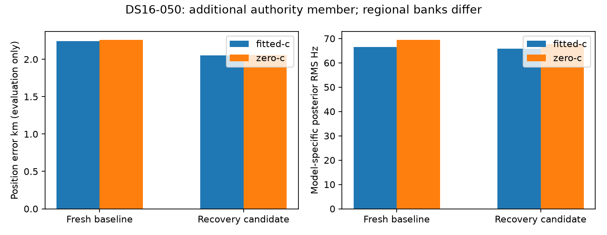

# DS16-050: a modest selected improvement in the additional authority members

DS16-050 is one of the15 members beyond the previously evaluated48-member DS16
subset. Its fresh iteration107 baseline and recovery candidate are now complete.
This consumed development comparison covers both c arms without any recording
reconstruction, objective evaluation or fit during reporting.

|Arm|Baseline km|Candidate km|Position improvement km|RMS Hz baseline→candidate|
|---|---:|---:|---:|---:|
|Fitted-c|2.245629|2.050285|0.195343|66.5645→65.7655|
|c=0|2.257896|2.055716|0.202180|69.3985→67.6633|

Both selected endpoints qualify; vectors, clocks and objectives change. The
improvement is modest and remaining errors are about2.05 km, above the research
target. No reference coordinate was used to pick the recovered region or winner.

One retained region triggers recovery. Prefit qualification uses46 evaluations
and0.08723 seconds; the corrected calibration then qualifies without a separate
postfit polish. Association succeeds and all six regional finals qualify. Ordinary
baseline regions remain preserved exactly; the candidate adds alternatives.

Winner selection occurs **before joint B3→B7 fitting**. Regional objective plus
calibration penalty selects `point:-85:-75` over `point:-67.5:-77.5`:

|Arm|Old regional selection score|Recovered regional selection score|
|---|---:|---:|
|Fitted-c|25904.0244|25805.9457|
|c=0|25908.0978|25811.9030|

Those regional banks have33 and31 satellites respectively. Subsequent joint
stages retain24 baseline satellites versus26 candidate satellites. Final B7
objectives actually increase (fitted25638.8503→25760.2505; zero25660.1394→25778.6597).
The pipeline accepts independently converged updates within each stage; it does
not rerank these two different-bank final models by B7 objective. Thus it would
be inaccurate to say a lower final score selected the recovered solution.

Effective signal windows barely change:1946.2703→1946.5728 fitted and
1945.6265→1945.5796 zero-c. Frequency/score effects remain separate from the
directly evaluated position improvement. Different banks prevent treating
cross-model objective or RMS differences as a controlled localization measure.

This is a newly completed comparison in the full authority, not new independent
validation and not a full63-member DS16 or193-member conclusion. It demonstrates
why the additional15 DS16 members must remain in coverage rather than reusing
only the earlier48 results.

[Compact evaluations, regional score accounting and phase/source hashes](DS16_050_REPLAY.json).
[Artifact integrity](ds16-050-replay-integrity.json).
