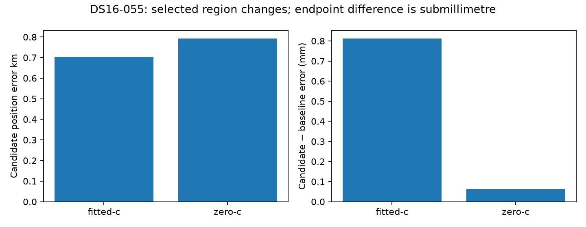

# DS16-055: changed regional winner, effectively unchanged position

DS16-055 is among the15 additional DS16 authority members beyond the earlier48
subset. Both sealed phases complete and both selected arms qualify. The selected
vectors/clocks differ, but the evaluated position change is negligible and slightly
worse: fitted0.703944530→0.703945341 km (+0.81144 mm), c=0
0.792035874→0.792035935 km (+0.06148 mm). Preserve these positive deltas in paired
regression accounting without presenting them as a meaningful accuracy failure.

One recovered region qualifies without extra prefit/postfit Newton polish, reaches
association and all six regional finals qualify. Ordinary regions are preserved.
Before B3→B7, regional objective plus calibration penalty selects `point:-80:-80`
over `point:-102.5:-77.5`: fitted selection score24688.3527→24629.2397 and zero
25028.4406→24959.3142. The recovery penalty is larger (16.9403 versus2.6831),
but the regional objective improvement outweighs it. Final B7 does not rerank
the two regional branches by their final objectives.

Both final banks contain the same16 satellite IDs. Final fitted objective differs
by−1.82e-11 and zero objective is exactly equal. Fitted RMS54.35659385→54.35659394
Hz and zero82.50921417→82.50921475 Hz are effectively unchanged. The residual
position deltas should be interpreted as numerical endpoint sensitivity after
different starts; no localization benefit or physical mechanism is established.
Frequency and position diagnostics remain separate.

Reporting used existing reference ports only after operational choices sealed;
no fit, objective call, input reconstruction or truth-guided selection occurred.
This is consumed development and one completed member, not a full63-member or
193-member result. Its negligible regressions remain visible alongside the larger
ac11 and DS16-050 improvements.

[Compact matched evaluation, regional selection accounting and hashes](DS16_055_REPLAY.json).
[Artifact integrity](ds16-055-replay-integrity.json).
