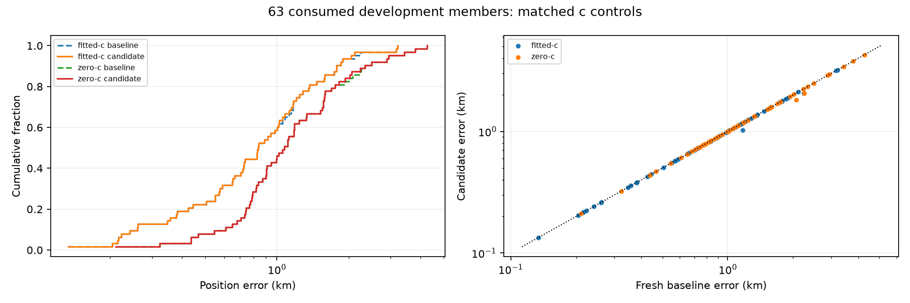

# DS16: completed matched recovery comparison

All 63 members are terminal. These are consumed development recordings, not independent validation. Known coordinates were used only after sealed selections for this report. No new fits, objective evaluations or RF collection were performed.

| Dataset | Arm | Phase | Mean km | Median km | p95 km | Worst km |
|---|---|---|---:|---:|---:|---:|
| DS16 | fitted-c | baseline | 0.979007 | 0.834879 | 2.088464 | 3.204798 |
| DS16 | fitted-c | candidate | 0.973596 | 0.834879 | 2.034266 | 3.204798 |
| DS16 | zero-c | baseline | 1.321051 | 1.075030 | 2.937303 | 4.263626 |
| DS16 | zero-c | candidate | 1.313759 | 1.075030 | 2.937303 | 4.263626 |
| DS16 historical48 | fitted-c | baseline | 1.023385 | 0.902279 | 2.033361 | 3.204798 |
| DS16 historical48 | fitted-c | candidate | 1.020352 | 0.902279 | 2.033361 | 3.204798 |
| DS16 historical48 | zero-c | baseline | 1.323009 | 1.091990 | 3.248905 | 4.263626 |
| DS16 historical48 | zero-c | candidate | 1.317651 | 1.091990 | 3.248905 | 4.263626 |
| DS16 additional15 | fitted-c | baseline | 0.836999 | 0.703945 | 1.785348 | 2.245629 |
| DS16 additional15 | fitted-c | candidate | 0.823976 | 0.703945 | 1.726745 | 2.050285 |
| DS16 additional15 | zero-c | baseline | 1.314785 | 1.053576 | 2.502279 | 2.884142 |
| DS16 additional15 | zero-c | candidate | 1.301306 | 1.053576 | 2.502279 | 2.884142 |

p95 uses linear interpolation. DS16 includes all 63 authority members: the historical 48 and all 15 additional members. DS18 includes its sealed unpublished member; its ten unmatched exposure records are not claimed unseen. Newer development includes only 001–008 and 017–053; reserves 009–016 remain closed.

Additional DS16 membership (authority legacy-label mapping, not index range): DS16-001, DS16-008, DS16-009, DS16-011, DS16-013, DS16-015, DS16-023, DS16-034, DS16-041, DS16-042, DS16-045, DS16-046, DS16-047, DS16-050, DS16-055.
Selected vector/clock/objective changes: DS16-017, DS16-050, DS16-055.

fitted-c: 1 paired regressions (>1e−9km): DS16-055 (+0.000000811km).
zero-c: 1 paired regressions (>1e−9km): DS16-055 (+0.000000061km).

There were 23 triggers and 23 saved recovery outcomes. Candidate fallbacks: 0. Explicit baseline/candidate terminal failures: 0/0.

Recovery outcomes: {"prefit-unqualified": 1, "qualified": 22}.

Members with unqualified recovered calibration: DS16-049.
Recovered-region fitted-c finals: 60/66 qualified; 6 raw unqualified finals are retained.
Recovered-region zero-c finals: 58/66 qualified; 8 raw unqualified finals are retained.
baseline: 2 explicit stage failures; full member-level details remain in the JSON snapshot.
candidate: 2 explicit stage failures; full member-level details remain in the JSON snapshot.
baseline: 10160.960s across 63 completed slices; this is persisted slice elapsed time, not a sum of nested optimizer times or a CPU benchmark.
baseline fitted-c: 63/63 selected endpoints qualified; mean/median RMS 67.065771/65.907955Hz; mean signal-window support 2696.801407.
baseline zero-c: 63/63 selected endpoints qualified; mean/median RMS 101.847068/104.843008Hz; mean signal-window support 2658.645054.
candidate: 1826.355s across 63 completed slices; this is persisted slice elapsed time, not a sum of nested optimizer times or a CPU benchmark.
candidate fitted-c: 63/63 selected endpoints qualified; mean/median RMS 66.939054/65.765520Hz; mean signal-window support 2702.359754.
candidate zero-c: 63/63 selected endpoints qualified; mean/median RMS 101.703292/104.843008Hz; mean signal-window support 2664.150063.

Frequency fit is separate from positioning. Banks and associations may change between regions; final B7 objective changes do not establish better localization. The regional winner is selected before B3–B7 using the existing regional score and calibration penalty. Ordinary regions are preserved; no reference-guided selection or cross-model score selection is introduced.

[Full membership, failures and receipt hashes](DS16_COMPLETE_SNAPSHOT.json). The full raw corpus (57GB) remains intact locally and is not remotely published. A measured 139MB phase receipt compressed to 23MB with deterministic gzip6, implying a multi-GB archive rather than a lean Git artifact. The compact snapshot binds all phase receipts by SHA256; remote report reproduction uses that snapshot, while full raw replay requires the retained local receipts. No complete raw archive was created or claimed remotely reproducible.
