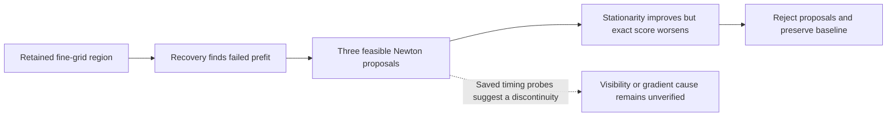

# DS17-033: genuine prefit rejection with a possible nonsmooth score boundary

Saved receipt/source audit only. No reference errors, new objective calls or fits
were used. The ordinary5 km point `(-42.5,-127.5)` fails calibration prefit in
all three passes. Generic recovery correctly discovers and deduplicates it.
The rescue is **prefit-unqualified**, with no calibration or regional finals;
both selected endpoint vectors, clocks and objectives remain baseline-exact.

The starting independent KKT is71.9844, far above0.001. This differs fundamentally
from ac11's tiny threshold miss. There are no active constraint normals (rank0,
tangent dimension18), and minimum physical constraint slack is4.27556. Helper
normalization changes nothing. This is not the active coupled-bound limitation
seen in earlier ac11 scalar tests.

The reduced Hessian is positive definite, with eigenvalues52.7633 to1,182,275.29
and asymmetry0.0007056. The algorithm uses40 evaluations:36 central curvature
probes plus the starting evaluation and three damped Newton proposals. It accepts
zero rounds and stops `no-kkt-improving-admissible-step`; neither100-evaluation
nor two-round budget is exhausted, and elapsed polish is0.07034 seconds.

|Newton damping|Feasible|Objective increase|Full KKT|Accepted|
|---:|---|---:|---:|---|
|1|Yes|0.1102704|1.03955|No|
|0.5|Yes|0.1556278|36.2452|No|
|0.25|Yes|0.2146868|54.0505|No|

All Newton proposals reduce full KKT but increase the exact objective well beyond
the fixed128-ULP allowance4.6566e-10; none qualifies even ignoring the score gate.
Curvature probes are derivative measurements, not acceptance candidates. Some
probe values reduce KKT or cost, but that does not mean the Newton acceptance
rule discarded a qualified optimum. The frozen rejection is legitimate.

There is one useful forensic clue: the saved common-timing ±1e-5-second probes
change objective by+0.0007724 and+0.1481658, whereas the stored common-timing
derivative is+71.9844. The positive side roughly agrees with a local smooth
linear increment; the negative side has a much larger opposing jump. This is
consistent with a nonsmooth objective boundary or derivative mismatch, rather
than ordinary floating-point score noise. Production visibility is binary and
changes detection normalization, while its derivative treats visibility as fixed.
However the receipt does not save per-probe visibility masks or wrapped-branch
identities, so attributing the jump specifically to visibility remains a hypothesis.

A general next diagnostic could retain changed visibility/branch counts alongside
existing probes and compare analytic directional slopes with saved finite
differences. If a visibility jump is verified, a bounded one-sided/trust-region
qualification strategy or a globally specified smooth visibility model merits
its own controlled test. More time or a looser KKT/score tolerance is not an
established solution. No case-specific rerun, seed or relaxed gate is proposed.

[Compact scalar trials, qualification and source hashes](DS17_033_RECOVERY_AUDIT.json).
