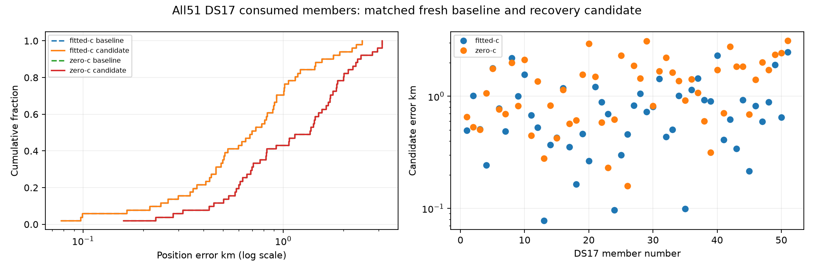

# Completed DS17: recovery preserves all51 selected endpoints

All51 DS17 authority members have complete matched baseline/candidate receipts,
with102 phase hashes. Every selected vector, clock coefficient and objective is
exactly unchanged in both c arms. No positions are missing, no paired improvements
or regressions occur, and there are no candidate-level fallbacks. All204 operational
endpoints qualify (51 × two phases × two arms). This is a completed consumed DS17
subset, not the full193-member result or independent validation.

|Arm|Mean km|Median km|p95 km|Worst km|Baseline versus candidate|
|---|---:|---:|---:|---:|---|
|Fitted-c|0.819111|0.696276|2.058978|2.483593|Exactly equal|
|c=0|1.326922|1.359911|2.874086|3.124958|Exactly equal|

The fitted DS17 mean is below1 km but above the0.4 km research target; recovery
does not produce that baseline accuracy. The matched c=0 comparison remains
visible rather than inferring localization benefit from frequency fit alone.

Nine members trigger nine recovered regions. Seven calibrations qualify;
DS17-025 andDS17-033 fail prefit qualification. Of42 reached regional finals,
39 qualify:18 fitted and21 zero-c. DS17-012 has one unqualified fitted final and
DS17-045 two. None of the recovered alternatives becomes an operational winner;
ordinary baseline candidates are preserved. Successful selected convergence
therefore must not hide these raw recovery failures.

DS17-033's [saved recovery audit](DS17_033_RECOVERY_AUDIT.md) identifies a large
KKT residual and exact-score rejection of all Newton proposals, with a possible
timing-score discontinuity. That remains a hypothesis pending its separately
queued diagnostic, not a reason to loosen this report's gate or remove the member.

Frequency RMS and effective signal-window metrics are reported separately in
the snapshot JSON. They are baseline/candidate-identical for each arm because
the selected endpoint and model are unchanged. No score improvement or calibrated
uncertainty claim follows from the recovery attempt counts.

|Arm|Mean posterior RMS Hz|Median RMS Hz|Mean effective signal windows|
|---|---:|---:|---:|
|Fitted-c|63.1352|59.2296|2723.5131|
|c=0|121.0240|118.1067|2663.1201|

The reporting helper evaluates already sealed endpoints through pinned reference
authorities. It performs no recording reconstruction, prediction, objective call
or optimization. No reserve recording or new RF collection was accessed.

[All51 identities/statuses, paired metrics, raw recovery qualifications and102 phase hashes](DS17_COMPLETE_SNAPSHOT.json).
[Artifact integrity](ds17-complete-integrity.json).
Reproduce the figure from the reporting snapshot with `plot_ds17.py`.
