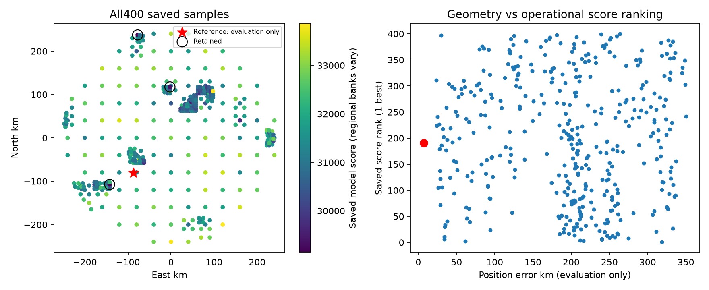

# DS18-022: coarse coverage exists, but score-led refinement misses it

All 400 ordinary sampled grid points and their persisted checkpoints are present.
Baseline, sep25 and sep50 have identical sample coordinates and scores;
changing retained-basin separation does not change this member's search trace.
There are 121 samples at40 km, 59 at20 km, 73 at10 km and147 at5 km. Search stops
at its point budget with267 deferred cells. These are saved results, not a new
search. Reference coordinates were used only to evaluate sealed sample geometry.

The nearest saved point is `(-80,-80)` km, **7.105 km** from the reference. Its
fixed-position fit qualifies (KKT0.0002585) with score31318.958, 17 satellites,
168.750 Hz RMS and828.656 effective signal windows. Its saved score rank is191
of400, versus best score29145.139. It is a40 km grid sample and is not retained.
It is shown only as a forensic example, never proposed as an operational seed.

The closest saved samples at successively finer levels are31.131 km (20 km grid),
26.070 km (10 km) and23.495 km (5 km). Thus coarse physical coverage reaches
the vicinity, but this trace does not refine it into a near-reference fine-grid
sample. A7.105 km fixed-position point is not proof that a sub-kilometre optimum
exists or would be selected after free fitting.

Retention sorts supported samples by score and takes three sufficiently separated
points. The actual retained samples are `(-77.5,237.5)`, `(-142.5,-107.5)` and
`(-2.5,117.5)` km. The7.105 km diagnostic sample is excluded by its poor score
rank before any calibration recovery issue; its fit is qualified. All retained
calibrations also qualify. This explains why the calibration-failure recovery
trigger cannot act on the missing hypothesis.

Regional banks differ between points (17 at the diagnostic sample;21,27,31 at
retained regions). The saved score ordering establishes the operational exclusion,
but does not isolate whether geometry, assignments, bank normalization or nuisance
flexibility causes that ordering. Likewise267 deferred cells establish finite
search coverage, not that the correct region was specifically queued or would
win with more budget. No deferred-cell coordinates are present in this trace.

The next unresolved distinction is a common-model comparison versus search
allocation. A future reference-free rule could retain diverse ordinary hypotheses
under a globally documented bank/score policy, then compare matched fits. This
audit supplies no truth-directed seed, per-scan retention threshold or new fit.
It narrows the root cause to score-led hypothesis refinement/retention before
calibration, while leaving the cause of the misleading scores unresolved.

[All400 sampled coordinates, score ranks, evaluation errors and source hashes](DS18_022_GRID_AUDIT.json).
[Earlier sealed-stage audit](DS18_022_STAGE_AUDIT.md).
