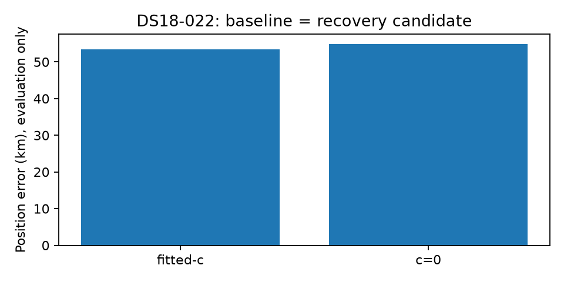

# DS18-022 remains outside the calibration-recovery mechanism

`scan-fw-f1a32cacd910c005` is an already consumed DS18 development recording.
Its iteration107 baseline and candidate are terminal while the full cohort remains
in progress. This is a single-member evaluation, not refreshed full-cohort metrics.

The recovery exclusion is established directly: ordinary baseline, sep25 and
sep50 passes each contain **zero failures**, and the trigger inventory has zero
candidates and zero explicit rejected failures. The generic rule starts from
retained calibration-stage failures. There is no such failure here to retry;
this is not a missing coarse checkpoint or spacing rejection by the inventory.

|Matched arm|Position error km|Independent KKT|Frequency RMS Hz|
|---|---:|---:|---:|
|Fitted-c|53.400741|0.000002304|108.5645|
|c=0|54.832123|0.000026182|108.4881|

Both are independently converged B7 endpoints. Candidate vectors, clock
coefficients and objectives equal their own fresh baseline exactly. Both retain
the ordinary V16 basin `point:-142.5:-107.5`. Reference coordinates entered only
the existing reporting helper after these choices were sealed; the storage port
required privileged read access, with its document identity checks retained.

Prior controlled iteration106 evidence found the fitted125 endpoint at the same
53.400741 km error; narrowing frequency width to100 Hz worsened fitted error to
54.835462 km while improving conditional frequency RMS. All those fits qualified.
Its zero125 shared-start result differs from this fresh107 zero endpoint; do not
conflate their zero-arm baselines. That experiment held the regional origin/bank
fixed and did not retry search. It establishes a converged severe tail and a
frequency/position tradeoff, not the hardware cause or existence of a better
reachable region.

The present mechanism fixes loss of retained regions through failed calibration.
It cannot resolve this member because that failure trigger is absent. Whether
the remaining error comes from ordinary region coverage, model-score preference,
association ambiguity or nuisance/geometry confounding remains unresolved here.
Do not infer a basin-selection root cause merely from the large reference error,
or choose a new region using that reference. No new search or fit was performed.

[Compact receipt audit, exact parity and source hashes](DS18_022_PARTIAL.json).
[Prior controlled likelihood-width evidence](../2026_10_09_position_error_iter106/REPORT_AUDIT.md).
