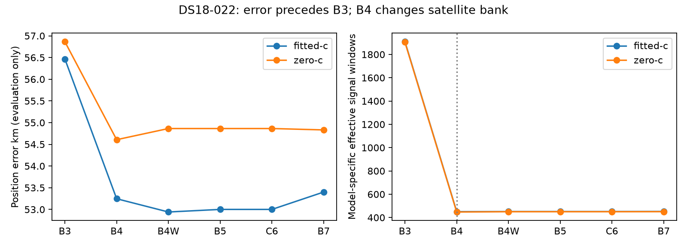

# DS18-022: the severe error predates joint fitting

This supplements the [published partial audit](DS18_022_PARTIAL.md), without
changing its receipts. All errors below evaluate already sealed endpoints only;
no optimization, reference-guided selection or recording objective evaluation
was performed. The full iteration107 cohort remains live.

The ordinary retained regions are identical across baseline/sep25/sep50:
`(-77.5,237.5)`, `(-142.5,-107.5)` and `(-2.5,117.5)` km. Their fixed-position
calibration endpoints have evaluation errors 318.624, 61.473 and 215.741 km.
Calibration succeeds for all three. This establishes that the selected retained
region is already far away before association/final fitting; it does not prove
that the sampled grid never visited a better region.

The selected region `point:-142.5:-107.5` has qualified association/continuation
finals at 58.694 km fitted and 58.727 km zero-c. Its fitted zero-timing alternative
is 54.403 km, also qualified, but objective 33043.47 versus association 26606.39.
Operational selection uses objective plus calibration penalty, never these
reference errors. Other retained regions have qualified alternatives at roughly
214–319 km. None of the saved regional finals is a near-correct alternative lost
solely through calibration nonqualification.

Regional banks differ: selected region has 21 satellites, the other two 27 and
31. Scores therefore refer to different regional models; their ranking does not
constitute a controlled common-bank hypothesis comparison. A future comparison
must rebuild all retained starts under a documented common reference-free bank
before attributing the ranking to geometry rather than model support.

|Stage|Fitted error km|c=0 error km|Fitted RMS Hz|Fitted signal windows|
|---|---:|---:|---:|---:|
|B3|56.466|56.864|108.54|1909.01|
|B4|53.246|54.607|118.10|450.37|
|B4W|52.941|54.864|111.15|451.49|
|B5|53.000|54.864|111.23|451.59|
|C6|53.000|54.864|111.23|451.59|
|B7|53.401|54.832|108.56|452.20|

All twelve matched stage endpoints qualify. B3 already has the severe error;
later joint-clock/satellite corrections do not create it. B4 removes 15 of the
selected 21 satellites using the existing absolute relative-timing 5-second gate,
leaving six. Effective signal support falls sharply. This bank change is material
and prevents interpreting cross-stage objective/support changes as a fixed-model
likelihood comparison. Position slightly improves at B4, so the receipts do not
establish pruning as the original cause. Later stages stay in the same severe tail.

The unresolved distinction is upstream hypothesis access versus model preference:
did ordinary reference-free search retain sufficiently diverse hypotheses, and
would a controlled common-bank ranking select a different ordinary hypothesis?
A suitable next experiment freezes ordinary sampled/retained starts, bank policy
and identical budgets without reading errors, preserves distinct regions, and
compares inference-selected winners after fitting. Separately ablate the timing
bank gate under the same starts to isolate its later support effect. This report
does not choose starts by truth proximity, and it does not demonstrate that a
correct basin exists among the saved starts. Neither proposed experiment was run
for this audit.

[All retained finals, calibration/stage diagnostics and source hashes](DS18_022_STAGE_AUDIT.json).
