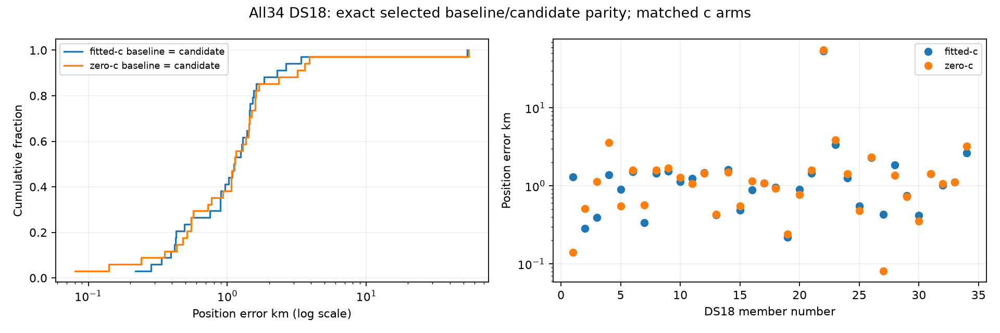

# Completed DS18 comparison: recovery preserves every selected endpoint

All34 DS18 members have terminal complete baseline and candidate receipts, with
matched fitted-c/c=0 positions. The snapshot binds all68 receipts by SHA256 and
includes every member, including sealed unpublished `scan-fw-4e603fa090384662`. This is the
completed DS18 subset of the ongoing193-member experiment; the other159 members
are outside this report, not claimed complete. No fit, objective evaluation or
recording reconstruction was performed for reporting.

**Selected vectors, clock coefficients and objectives are exactly unchanged for
all34 members in both arms.** There are no paired improvements or regressions and
no missing position evaluations. These are fresh current B7 baselines, not an
assumption that earlier archived baselines were identical.

|Arm|Mean km|Median km|p95 km|Worst km|Baseline versus candidate|
|---|---:|---:|---:|---:|---|
|Fitted-c|2.691656|1.122461|2.903525|53.400741|Exactly equal|
|c=0|2.815838|1.130151|3.701531|54.832123|Exactly equal|

Eight members trigger nine recovered regions. Seven recoveries qualify; DS18-016
fails corrected calibration and DS18-017 fails prefit qualification. Among the42
regional finals reached,40 qualify; DS18-009 has two unqualified fitted finals.
These failed attempts remain explicit and never replace the preserved baseline.
No recovered region becomes the operational winner, and no candidate-level
fallback occurs. This is useful evidence of preservation and limited recovery
effect, not evidence that the severe tail is solved.

DS18-022 remains the worst case in both arms, with no calibration-failure trigger.
Its [sealed grid audit](DS18_022_GRID_AUDIT.md) finds a qualified coarse sample
within7.105 km, excluded by saved score rank191, while retained finals remain
far away. This separate consumed-data diagnosis cannot justify truth-guided
starts or selecting a different endpoint by its reference error.

Frequency RMS and effective signal support are reported separately in the JSON.
Each baseline/candidate frequency diagnostic is also unchanged, because selected
vectors, clocks and model are unchanged. A fitted-c frequency advantage over c=0
would not itself establish a positioning improvement; the table reports accuracy
directly under matched observations and policies.

|Arm|Mean posterior RMS Hz|Median RMS Hz|Mean effective signal windows|
|---|---:|---:|---:|
|Fitted-c|73.5641|73.1708|2656.6482|
|c=0|91.9011|86.0829|2632.7640|

All136 operational endpoints (34 members × two phases × two arms) qualify. Earlier
partial audits saying all observed calibration recoveries qualified predated
DS18-016/017; this complete snapshot explicitly includes their negative results.

Exposure remains development-only:24 DS18 members overlap previously consumed
NEW/FRESH/LATER/RESERVED diagnostics, and ten lack registry matches. The latter
are not relabeled unseen validation. Reference authorities are read through the
existing reporting port only after corresponding baseline/candidate choices seal.

[All34 statuses, paired accuracy, frequency diagnostics, recovery failures and68 receipt hashes](DS18_COMPLETE_SNAPSHOT.json).

|Member|Baseline/candidate|Recovery regions|Recovery outcome|
|---|---|---:|---|
|DS18-004|Complete/complete|1|Qualified; no winner change|
|DS18-009|Complete/complete|1|Qualified calibration; two fitted finals fail|
|DS18-016|Complete/complete|1|Calibration unqualified|
|DS18-017|Complete/complete|1|Prefit unqualified|
|DS18-018|Complete/complete|1|Qualified; no winner change|
|DS18-019|Complete/complete|2|Both qualified; no winner change|
|DS18-028|Complete/complete|1|Qualified; no winner change|
|DS18-032|Complete/complete|1|Qualified; no winner change|

The remaining26 members have complete matched receipts with no recovery trigger;
their full identities and failures are preserved in the snapshot JSON.
