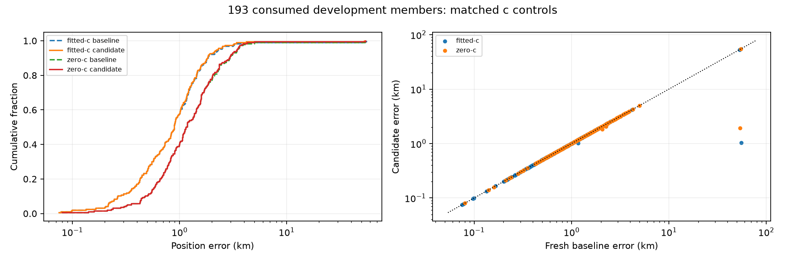

# FULL193: completed matched recovery comparison

All 193 members are terminal. These are consumed development recordings, not independent validation. Known coordinates were used only after sealed selections for this report. No new fits, objective evaluations or RF collection were performed.

This full census merges the four sealed completed dataset reports. Their integrity manifests and all 386 current baseline/candidate phase receipt hashes were verified before publication; no additional recording reconstruction or reference query was needed for the merge.

Fitted-c mean changes from 1.539760 to 1.254810km; median changes from 0.892565 to 0.892565km. The 0.4km mean target is not achieved.

| Dataset | Arm | Phase | Mean km | Median km | p95 km | Worst km |
|---|---|---|---:|---:|---:|---:|
| DS16 | fitted-c | baseline | 0.979007 | 0.834879 | 2.088464 | 3.204798 |
| DS16 | fitted-c | candidate | 0.973596 | 0.834879 | 2.034266 | 3.204798 |
| DS16 | zero-c | baseline | 1.321051 | 1.075030 | 2.937303 | 4.263626 |
| DS16 | zero-c | candidate | 1.313759 | 1.075030 | 2.937303 | 4.263626 |
| DS17 | fitted-c | baseline | 0.819111 | 0.696276 | 2.058978 | 2.483593 |
| DS17 | fitted-c | candidate | 0.819111 | 0.696276 | 2.058978 | 2.483593 |
| DS17 | zero-c | baseline | 1.326922 | 1.359911 | 2.874086 | 3.124958 |
| DS17 | zero-c | candidate | 1.326922 | 1.359911 | 2.874086 | 3.124958 |
| DS18 | fitted-c | baseline | 2.691656 | 1.122461 | 2.903525 | 53.400741 |
| DS18 | fitted-c | candidate | 2.691656 | 1.122461 | 2.903525 | 53.400741 |
| DS18 | zero-c | baseline | 2.815838 | 1.130151 | 3.701531 | 54.832123 |
| DS18 | zero-c | candidate | 2.815838 | 1.130151 | 3.701531 | 54.832123 |
| POST18-development | fitted-c | baseline | 2.271230 | 0.915968 | 2.444009 | 55.685054 |
| POST18-development | fitted-c | candidate | 1.056687 | 0.915968 | 2.084591 | 4.204489 |
| POST18-development | zero-c | baseline | 2.908188 | 1.472280 | 3.628392 | 53.945451 |
| POST18-development | zero-c | candidate | 1.752225 | 1.472280 | 3.547434 | 5.001511 |
| DS16 historical48 | fitted-c | baseline | 1.023385 | 0.902279 | 2.033361 | 3.204798 |
| DS16 historical48 | fitted-c | candidate | 1.020352 | 0.902279 | 2.033361 | 3.204798 |
| DS16 historical48 | zero-c | baseline | 1.323009 | 1.091990 | 3.248905 | 4.263626 |
| DS16 historical48 | zero-c | candidate | 1.317651 | 1.091990 | 3.248905 | 4.263626 |
| DS16 additional15 | fitted-c | baseline | 0.836999 | 0.703945 | 1.785348 | 2.245629 |
| DS16 additional15 | fitted-c | candidate | 0.823976 | 0.703945 | 1.726745 | 2.050285 |
| DS16 additional15 | zero-c | baseline | 1.314785 | 1.053576 | 2.502279 | 2.884142 |
| DS16 additional15 | zero-c | candidate | 1.301306 | 1.053576 | 2.502279 | 2.884142 |
| Full193 | fitted-c | baseline | 1.539760 | 0.892565 | 2.293549 | 55.685054 |
| Full193 | fitted-c | candidate | 1.254810 | 0.892565 | 2.235773 | 53.400741 |
| Full193 | zero-c | baseline | 1.955991 | 1.150144 | 3.471598 | 54.832123 |
| Full193 | zero-c | candidate | 1.684085 | 1.150144 | 3.426455 | 54.832123 |

p95 uses linear interpolation. DS16 includes all 63 authority members: the historical 48 and all 15 additional members. DS18 includes its sealed unpublished member; its ten unmatched exposure records are not claimed unseen. Newer development includes only 001–008 and 017–053; reserves 009–016 remain closed.

Additional DS16 membership (authority legacy-label mapping, not index range): DS16-001, DS16-008, DS16-009, DS16-011, DS16-013, DS16-015, DS16-023, DS16-034, DS16-041, DS16-042, DS16-045, DS16-046, DS16-047, DS16-050, DS16-055.
Selected vector/clock/objective changes: DS16-017, POST18-NEWER-20261009-051, DS16-050, DS16-055.

| Changed member | Fitted before km | Fitted after km | Zero before km | Zero after km |
|---|---:|---:|---:|---:|
| DS16-017 | 1.169118544 | 1.023524119 | 2.072298000 | 1.815128377 |
| POST18-NEWER-20261009-051 | 55.685054343 | 1.030621257 | 53.945450776 | 1.927094397 |
| DS16-050 | 2.245628821 | 2.050285324 | 2.257895714 | 2.055716141 |
| DS16-055 | 0.703944530 | 0.703945341 | 0.792035874 | 0.792035935 |

Remaining fitted-c worst case: DS18-022 at 53.400741km. The unchanged median means this recovery experiment does not demonstrate a broad improvement in typical position error.

fitted-c: 1 paired regressions (>1e−9km): DS16-055 (+0.000000811km).
zero-c: 1 paired regressions (>1e−9km): DS16-055 (+0.000000061km).

There were 52 triggers and 52 saved recovery outcomes. Candidate fallbacks: 0. Explicit baseline/candidate terminal failures: 0/0.

Recovery outcomes: {"calibration-unqualified": 1, "prefit-unqualified": 4, "qualified": 47}.

Members with unqualified recovered calibration: DS18-016, DS18-017, DS17-025, DS17-033, DS16-049.
Recovered-region fitted-c finals: 124/141 qualified; 17 raw unqualified finals are retained.
Recovered-region zero-c finals: 130/141 qualified; 11 raw unqualified finals are retained.
baseline: 14 explicit stage failures; full member-level details remain in the JSON snapshot.
candidate: 14 explicit stage failures; full member-level details remain in the JSON snapshot.
baseline: 28321.999s across 193 completed slices; this is persisted slice elapsed time, not a sum of nested optimizer times or a CPU benchmark.
baseline fitted-c: 193/193 selected endpoints qualified; mean/median RMS 66.685242/65.372598Hz; mean signal-window support 2690.770018.
baseline zero-c: 193/193 selected endpoints qualified; mean/median RMS 109.045875/113.120509Hz; mean signal-window support 2640.703221.
candidate: 5449.919s across 193 completed slices; this is persisted slice elapsed time, not a sum of nested optimizer times or a CPU benchmark.
candidate fitted-c: 193/193 selected endpoints qualified; mean/median RMS 66.370210/65.372598Hz; mean signal-window support 2698.746241.
candidate zero-c: 193/193 selected endpoints qualified; mean/median RMS 108.790714/113.120509Hz; mean signal-window support 2648.583267.

| Dataset | Arm | Phase | Mean RMS Hz | Mean signal-window support |
|---|---|---|---:|---:|
| DS16 | fitted-c | baseline | 67.065771 | 2696.801407 |
| DS16 | fitted-c | candidate | 66.939054 | 2702.359754 |
| DS16 | zero-c | baseline | 101.847068 | 2658.645054 |
| DS16 | zero-c | candidate | 101.703292 | 2664.150063 |
| DS17 | fitted-c | baseline | 63.135248 | 2723.513099 |
| DS17 | fitted-c | candidate | 63.135248 | 2723.513099 |
| DS17 | zero-c | baseline | 121.024047 | 2663.120124 |
| DS17 | zero-c | candidate | 121.024047 | 2663.120124 |
| DS18 | fitted-c | baseline | 73.564076 | 2656.648235 |
| DS18 | fitted-c | candidate | 73.564076 | 2656.648235 |
| DS18 | zero-c | baseline | 91.901072 | 2632.763978 |
| DS18 | zero-c | candidate | 91.901072 | 2632.763978 |
| POST18-development | fitted-c | baseline | 64.978485 | 2670.998152 |
| POST18-development | fitted-c | candidate | 63.804754 | 2697.425601 |
| POST18-development | zero-c | baseline | 118.502796 | 2596.177370 |
| POST18-development | zero-c | candidate | 117.609722 | 2622.267000 |

The candidate is a shadow recovery pass over an already completed fresh baseline. Its elapsed time is additional replay/recovery cost, not standalone pipeline runtime or evidence that the candidate is faster than baseline. Operational total cost would include the baseline analysis plus any recovery work.

Frequency fit is separate from positioning. Banks and associations may change between regions; final B7 objective changes do not establish better localization. The regional winner is selected before B3–B7 using the existing regional score and calibration penalty. Ordinary regions are preserved; no reference-guided selection or cross-model score selection is introduced.
The c arms use the same recording inputs, ordinary search policy, priors and budgets; c=0 locks static c and its RF time terms. Adaptive associations and final satellite support can differ by arm, so the reported fitted/zero differences describe the matched pipeline ablation, not a fixed-final-bank causal estimate.

[Full membership, failures and receipt hashes](FULL193_COMPLETE_SNAPSHOT.json). The full raw corpus (57GB) remains intact locally and is not remotely published. A measured 139MB phase receipt compressed to 23MB with deterministic gzip6, implying a multi-GB archive rather than a lean Git artifact. The compact snapshot binds all phase receipts by SHA256; remote report reproduction uses that snapshot, while full raw replay requires the retained local receipts. No complete raw archive was created or claimed remotely reproducible.
