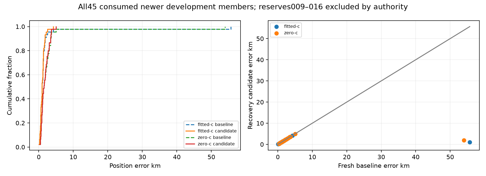

# Completed newer development cohort: one selected rescue among45

All45 frozen newer development recordings have complete matched baseline/candidate
receipts, with90 immutable phase hashes. Membership is001–008 and017–053;
reserved009–016 remain closed and were not accessed. This is consumed development,
not independent validation or a complete193-member conclusion. Reporting used
existing reference ports after choices sealed, without fits, objective calls or
recording reconstruction.

Only member051, `scan-fw-ac11ac00c0676d1b`, changes selected vectors, clocks and
objectives. The other44 are exactly identical to their own fresh baseline in both
c arms. There are no paired position regressions, missing inputs/evaluations or
candidate-level fallbacks. All180 operational endpoints qualify (45 × two phases
× two arms); raw recovered-region failures remain separately visible.

|Arm|Phase|Mean km|Median km|p95 km|Worst km|
|---|---|---:|---:|---:|---:|
|Fitted-c|Fresh B7 baseline|2.271230|0.915968|2.444009|55.685054|
|Fitted-c|Recovery candidate|1.056687|0.915968|2.084591|4.204489|
|c=0|Fresh B7 baseline|2.908188|1.472280|3.628392|53.945451|
|c=0|Recovery candidate|1.752225|1.472280|3.547434|5.001511|

The mean/tail gains come entirely from the already consumed ac11 rescue:
55.685→1.031 km fitted and53.945→1.927 km c=0. The unchanged medians and exact44
endpoint parity prevent claiming a broad typical-error improvement. The resulting
means remain above1 km, and above the0.4 km research objective. The
[ac11 replay report](AC11_FULL107_REPLAY.md) documents prior105/103 exact replay
parity and its changed regional satellite bank.

Eleven members trigger eleven recovered regions; all eleven calibrations qualify.
Of66 reached regional finals,57 qualify:27 fitted and30 zero-c, with nine raw
nonqualifications retained. Only ac11 becomes an operational winner. Ordinary
baseline alternatives are preserved; no failed regional start is hidden by
reporting only selected convergence.

|Arm|Mean RMS Hz baseline→candidate|Mean effective signal windows baseline→candidate|
|---|---:|---:|
|Fitted-c|64.9785→63.8048|2670.9982→2697.4256|
|c=0|118.5028→117.6097|2596.1774→2622.2670|

These frequency summaries are descriptive and separate from accuracy. The sole
changed winner also changes regional bank/support, so its lower objective or RMS
alone cannot establish better localization. All other frequency diagnostics are
baseline-exact. Matched c arms retain observations, policies, priors and budgets;
the zero-c static and RF-time locks remain unchanged.

[All45 identities, statuses, recovery qualifications, paired metrics and90 phase hashes](NEWER45_COMPLETE_SNAPSHOT.json).
[Artifact integrity](newer45-complete-integrity.json).
The figure is reproducible with `plot_newer.py` from the sealed reporting snapshot.
