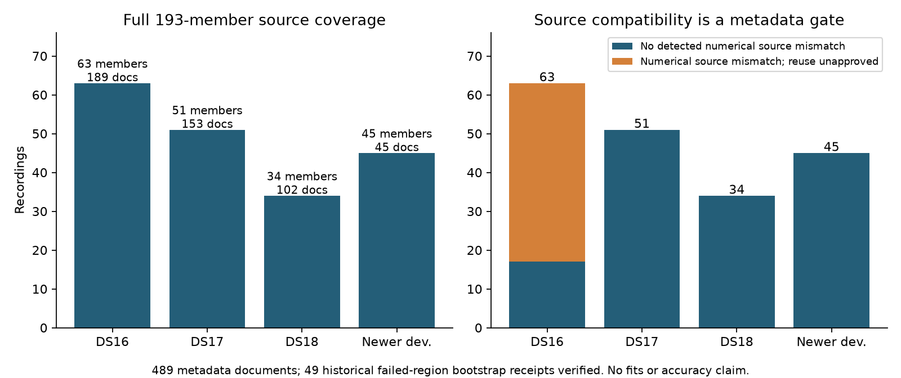

# Full-cohort generic recovery source preflight

This metadata-only preparation accounts for **193 recordings**: all63 DS16,51 DS17,34 DS18 and45 newer development members. It preserves the original48/added15 DS16 loader distinction and historical/newer exposure metadata. All reserves remain closed. No fit, objective evaluation, reference-error extraction or production checkpoint writes occurred.

`source-plan.json` binds489 sanitized documents: three regional passes for each historical member and45 newer operational documents. Original archived documents/publication hashes remain authoritative; sanitized copies contain configuration, input/evidence/causal-TLE identities, retained satellite numbers and grid metadata. The original full bank receipt is hash-bound instead of duplicated. Reference coordinates, position errors and operational selected-position fields are omitted.

All148 historical members have a hash-bound **actual iteration85 result endpoint**, complete with both B7 arm presences. The iteration85 protocol's `result_source` points to upstream loader ancestry, usually iteration51; it is recorded separately and is not itself the B7 endpoint. This corrects the naming ambiguity in the first iteration104 metadata field without changing any scientific result.

All444 historical regional documents agree on their nonmissing input, evidence, prior, score, causal TLE and retained bank identities. The S14/S27 generated baseline documents omit bank and snapshot metadata; those missing fields are explicitly recorded and their matching original publication supplies the full reconstruction binding. No field is inferred from receiver reference coordinates.

`source_adapters.py` provides exact-key `original_point` and `failure_point` readers. It uses public `RegionalCheckpointStore.get`, or the frozen `ExperimentCheckpoints.get` adapter with its exact cache binding and baseline/config signatures. All49 historical pass-level calibration-failure bootstrap/coarse receipts were reread successfully and their canonical hashes checked. This supplies actionable lean trigger inputs without copying association matrices or full receipt payloads. Runtime physical-model verification remains mandatory before cache reuse.

The historical baseline documents each record400 sampled points. Full original coarse coverage has not been reharvested; a recorded point is not automatically an available or compatible cache receipt. The already verified five-case iteration105 snapshots have400/400 available coarse points each and can be reused only under unchanged source/input/model and recovery policy. The remaining40 development recordings need their own exact bindings before broad replay. Newer publication coverage remains39 old hard60 and6 B7; old hard60 endpoints cannot substitute for matched B7 baselines.

**Current numerical source compatibility blocks automatic reuse for46 DS16 members.** Their regional documents record differing `analysis/regional_position_fit.py` and `application/hard60_runner.py` hashes relative to the current implementation. All444 historical documents differ in the renderer hash, which is a separate nonnumeric discrepancy. Historical DS17/DS18 and the other17 DS16 members have no detected numerical source mismatch; all45 newer sources match numerical code. Metadata agreement alone is insufficient: reconstructed observations, bank order and coarse objective must still verify.



The numerical mismatch affects exactly46 members and46 documents, each an ordinary DS16 baseline document; the two other regional documents for those members have current numerical source identities. Source-document counts are189 DS16,153 DS17,102 DS18 and45 newer development (489 total). The visualization uses only saved metadata. `artifact-integrity.json` hashes every report/script/receipt/PNG and all489 sanitized documents. No old-coarse alias is approved by this metadata report; a separate code audit and frozen policy would be required.

The lean next step is to freeze an explicit reuse policy: retain all ordinary regional candidates; verify compatible exact checkpoint stages and use local immutable overlays for missing work; apply the same recovery trigger to every ordinary retained calibration failure. The46 older-source DS16 members require an explicit audited compatibility decision or fresh current-policy baseline stages. Their archived B7 endpoints remain available for comparison, but are not automatically interchangeable with current production-stage caches. No silent key aliases or score/reference-guided exclusions are permitted.

[The source-history review](SOURCE_REVIEW.md) traces the difference to the addition
of current coarse recovery. [The narrow old-coarse proposal](OLD_COARSE_PROPOSAL.md)
and its eight metadata tests define prerequisites for considering reuse of only
the original bootstrap/coarse points. This would still execute current recovery
and regional stages. No completed old regional pipeline is treated as equivalent;
runtime model verification and a separately frozen driver remain required.

```sh
sudo -n env PYTHONPATH=src:. .venv/bin/python reports/2026_10_09_position_error_iter107/source_plan.py
sudo -n env PYTHONPATH=src:. .venv/bin/python reports/2026_10_09_position_error_iter107/source_preflight.py
env PYTHONPATH=src:. .venv/bin/python reports/2026_10_09_position_error_iter107/test_source_plan.py
```

Preparation and preflight succeeded:193 unique members,489 sanitized document hashes,49 historical failed-region receipts verified. Two synthetic tests pass. `source-preflight.json` preserves plan/script hashes. No large checkpoint archive is generated; source receipts remain hash-bound external inputs read through their documented ports.
