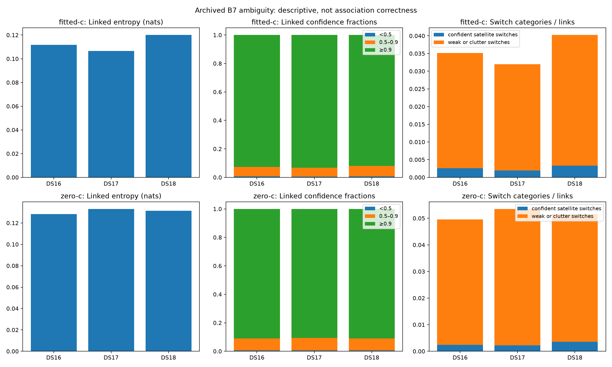

# Limited ambiguity opportunity; a bounded trial only

All148 recordings completed both matched arms, with no missing member or input
failure:63 DS16,51 DS17 and34 DS18. All2,314 frozen hashes match. The audit
reconstructed every saved B7 score exactly, matched prediction gradients exactly,
and recovered the independent score after row packing within7.28e-12. There was
no optimizer call, positive-persistence evaluation or position-accuracy change.

Across429,788 observations,187,506 (43.63%) belong to eligible linked segments.
The remaining242,282 remain independent. Every observation appears exactly once.
Grouping uses only existing bootstrap memberships and receiver/channel/exact-RF/
time-gap rules; no reference position selects a track, bank or hypothesis.

| Descriptive linked evidence | Fitted c | c=0 |
|---|---:|---:|
| Linked rows with maximum categorical probability ≥0.9 | 92.70% | 90.86% |
| Linked rows below0.9 | 13,679 | 17,130 |
| Mean linked entropy, nats | 0.11174 | 0.13075 |
| Changed labels / eligible adjacent pairs | 6,311 /179,540 (3.52%) | 9,231 /179,540 (5.14%) |
| Satellite switches with both ends ≥0.9 | 449 | 465 |

Most linked rows already have a concentrated conditional distribution, and fewer
than half of all observations are linked. For fitted c, below0.9 linked rows are
only3.18% of all observations. This limits the obvious opportunity for identity
persistence; it does not establish that the confident labels are correct or that
the remaining rows are unimportant for geometry. A wrong bank/region can be
confident. Switches may be genuine crossings, emitter changes or clutter, rather
than mistakes to suppress.

The evidence supports at most a small, separately frozen conditional trial of
the [marginal-preserving prototype](../2026_10_09_position_error_iter109/README.md),
not a broad parameter sweep, deployment or expectation that this alone reaches
0.4 km. That prototype removes the original transition's marginal-label bias;
it does not validate persistence as a physical assumption. A future trial must
use one global predeclared setting, matched c arms and unchanged observations,
banks, priors, ordinary starts and budgets, with position regressions assessed
separately from sequence-score changes. No setting is selected by this report.

The full193 region-recovery comparison has resumed on both workers. Its first
four cases were trigger-negative and unchanged; remaining cases still need
completion. This audit does not update the last measured standalone pooled B7
mean of1.317354 km, and the0.4 km objective remains unmet.

All data are consumed development data, including the DS18 prior24 and other10;
there is no new independent-validation claim. DS16 includes the original48 and
additional15. The inherited archived-error equality check is provenance-only,
as disclosed in the frozen measurement protocol and dependency audit. Runtime
cost summed across records is1,728.14 seconds; it is not concurrent wall time or
embedded cost. No RF collection, reserve access or production change occurred.

[Full tables and all-member coverage](RESULTS.md), [summary](summary.json),
[independent audit](REPORT_AUDIT.md) and all148 individual `results/*.json`
receipts are published together. The report integrity manifest binds the raw
receipts, plot, summary and reporting sources.
