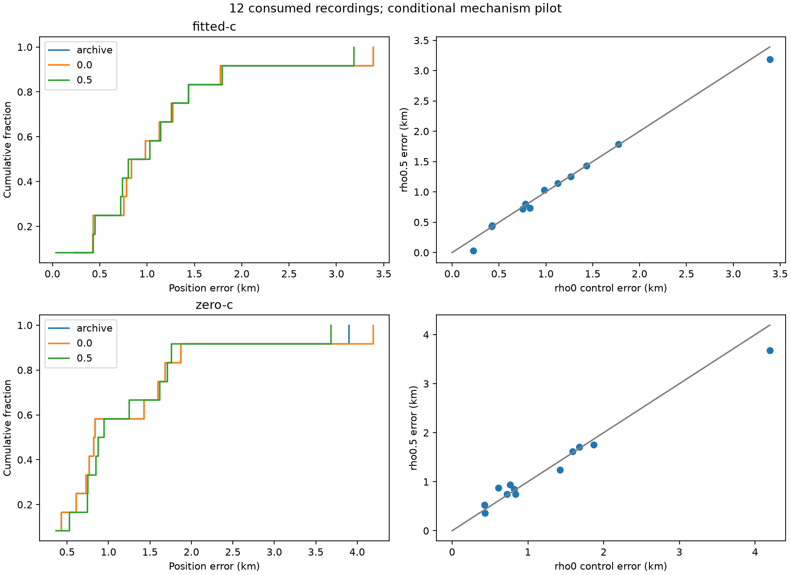

# Conditional persistence pilot

Full matched12 coverage: True.
Consumed development only; no replacement members or validation claim.

| Group | Arm | Model | n | Mean km | Median km | p95 km | Worst km |
|---|---|---|---:|---:|---:|---:|---:|
| DS16 | fitted-c | archive | 4 | 1.0265 | 1.0541 | 1.6776 | 1.7747 |
| DS16 | fitted-c | 0.0 | 4 | 1.0265 | 1.0541 | 1.6776 | 1.7747 |
| DS16 | fitted-c | 0.5 | 4 | 0.9979 | 1.0838 | 1.6924 | 1.7899 |
| DS16 | zero-c | archive | 4 | 0.9636 | 0.8267 | 1.4795 | 1.5929 |
| DS16 | zero-c | 0.0 | 4 | 0.9636 | 0.8267 | 1.4795 | 1.5929 |
| DS16 | zero-c | 0.5 | 4 | 1.0217 | 0.8601 | 1.5052 | 1.6164 |
| DS17 | fitted-c | archive | 4 | 0.8680 | 0.8049 | 1.3439 | 1.4345 |
| DS17 | fitted-c | 0.0 | 4 | 0.8680 | 0.8049 | 1.3439 | 1.4345 |
| DS17 | fitted-c | 0.5 | 4 | 0.8549 | 0.7688 | 1.3390 | 1.4339 |
| DS17 | zero-c | archive | 4 | 1.1845 | 1.2211 | 1.8411 | 1.8699 |
| DS17 | zero-c | 0.0 | 4 | 1.1845 | 1.2211 | 1.8411 | 1.8699 |
| DS17 | zero-c | 0.5 | 4 | 1.2312 | 1.3228 | 1.7471 | 1.7545 |
| DS18 | fitted-c | archive | 4 | 1.4576 | 1.0092 | 3.0710 | 3.3893 |
| DS18 | fitted-c | 0.0 | 4 | 1.4576 | 1.0092 | 3.0710 | 3.3893 |
| DS18 | fitted-c | 0.5 | 4 | 1.3965 | 0.9868 | 2.8936 | 3.1828 |
| DS18 | zero-c | archive | 4 | 1.6197 | 1.0755 | 3.5271 | 3.8979 |
| DS18 | zero-c | 0.0 | 4 | 1.6936 | 1.0755 | 3.7781 | 4.1932 |
| DS18 | zero-c | 0.5 | 4 | 1.5085 | 0.9946 | 3.3174 | 3.6830 |
| Pooled | fitted-c | archive | 12 | 1.1174 | 0.9058 | 2.5013 | 3.3893 |
| Pooled | fitted-c | 0.0 | 12 | 1.1174 | 0.9058 | 2.5013 | 3.3893 |
| Pooled | fitted-c | 0.5 | 12 | 1.0831 | 0.9147 | 2.4167 | 3.1828 |
| Pooled | zero-c | archive | 12 | 1.2560 | 0.8267 | 2.7825 | 3.8979 |
| Pooled | zero-c | 0.0 | 12 | 1.2806 | 0.8267 | 2.9154 | 4.1932 |
| Pooled | zero-c | 0.5 | 12 | 1.2538 | 0.9079 | 2.6223 | 3.6830 |

| Member | Result | Controller | Exit | Error |
|---|---|---|---|---|
| DS16-020 | complete | [terminal](controller-claims/DS16-020.json) | 0 | — |
| DS16-024 | complete | [terminal](controller-claims/DS16-024.json) | 0 | — |
| DS16-054 | complete | [terminal](controller-claims/DS16-054.json) | 0 | — |
| DS16-058 | complete | [terminal](controller-claims/DS16-058.json) | 0 | — |
| DS17-006 | complete | [terminal](controller-claims/DS17-006.json) | 0 | — |
| DS17-015 | complete | [terminal](controller-claims/DS17-015.json) | 0 | — |
| DS17-027 | complete | [terminal](controller-claims/DS17-027.json) | 0 | — |
| DS17-031 | complete | [terminal](controller-claims/DS17-031.json) | 0 | — |
| DS18-013 | complete | [terminal](controller-claims/DS18-013.json) | 0 | — |
| DS18-023 | complete | [terminal](controller-claims/DS18-023.json) | 0 | — |
| DS18-024 | complete | [terminal](controller-claims/DS18-024.json) | 0 | — |
| DS18-029 | complete | [terminal](controller-claims/DS18-029.json) | 0 | — |

Frozen gates: `{"checks": {"all48_raw_qualified": true, "fitted_mean": false, "fitted_median": false, "paired_regressions": true, "worst": true, "zero_mean": true, "actual_elapsed": true}, "passed": false, "interpretation": "Mechanism screening only; not independent validation"}`

| Arm | rho | Raw qualified/12 | Failed | Fallback | Median RMS Hz | Max elapsed s |
|---|---:|---:|---:|---:|---:|---:|
| fitted-c | 0.0 | 12/12 | 0 | 0 | 59.93995971236063 | 0.06930534588173032 |
| fitted-c | 0.5 | 12/12 | 0 | 0 | 59.23148058148308 | 21.772970601916313 |
| zero-c | 0.0 | 12/12 | 0 | 0 | 107.64116845873656 | 1.8565174196846783 |
| zero-c | 0.5 | 12/12 | 0 | 0 | 108.0826273877164 | 22.159270595759153 |

Frequency fit uses model-specific responsibilities; sequence NLL is not an accuracy gate. Runtime includes warm-start asymmetry, and the90s deadline is checked between calls. Actual elapsed time above90s fails the reported gate even if the fit qualified. Unavailable iteration counts remain null. Full coverage and separate diagnostics: [summary.json](summary.json).

Recording peak memory was not measured and is unavailable; synthetic109 memory is not substituted. Reported fit elapsed time, recording reconstruction and total time are distinct. Extra reporter/independent-check time is not imputed to a fit.

