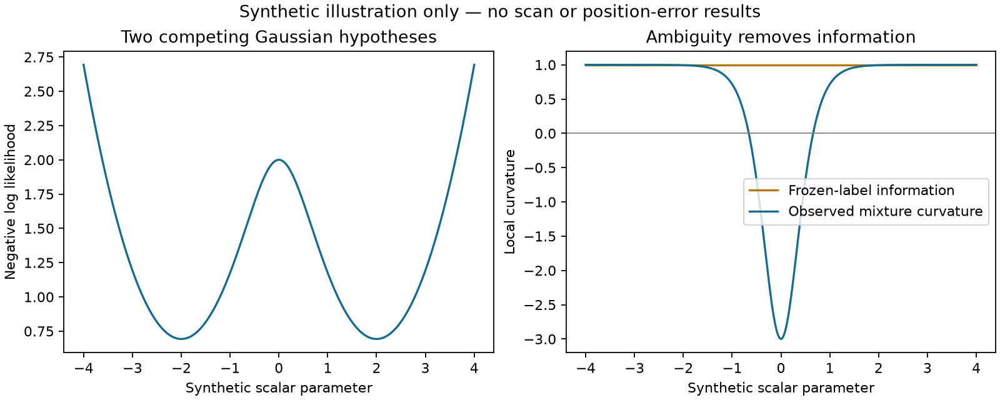

# Geometry and measurement-precision preparation

This iteration supplies tested mathematical diagnostics and an input audit, not
new positioning results. Production B7 is unchanged. No recording was fitted or
evaluated. The preparation documents precede freezing; a separate freeze receipt
records publication readiness once the protocol is sealed. The full193 recovery
comparison still occupies both recording workers; the frozen iteration110
persistence pilot remains next in the queue.

The [remaining-model review](REMAINING_MODELS.md) explains why rescuing catastrophic
search failures alone cannot establish the 0.4 km mean target. It also records
negative evidence from prior changes and uniform frequency-width adjustments.

## What is implemented

The adapter builds the exact local frequency derivatives of ordinary B7 geometry,
timing, receiver clocks, RF stretch and satellite corrections. It keeps every soft
satellite responsibility and respects both c=0 and fixed RF-drift locks. The
observability helper projects position derivatives off the nuisance span using
thin SVD, with explicit scaling and rank tolerances. This measures conditional
data sensitivity, not calibrated position uncertainty. Actual priors and active
bounds are not silently counted as measurement information.

Freezing satellite labels is optimistic. A separate locally affine mixture
curvature helper subtracts the categorical score covariance, including the
zero-score clutter component. Ambiguity can make observed local curvature
negative even when the frozen-label information is positive. Negative eigenvalues
are not clipped into an apparent covariance. Orbit second derivatives, visibility
changes and wrap discontinuities remain outside this local approximation.

This illustration uses two synthetic Gaussian hypotheses; its horizontal axis is
an arbitrary scalar parameter, not kilometres or a scan-derived position. It is
an explanation of the approximation, not evidence of an accuracy improvement.
The [mathematical review](ADAPTER_REVIEW.md) details the limits and permitted use.

## What the measurement inputs support

The [input audit](MEASUREMENT_INPUT_AUDIT.md) finds measured CFO, detector margins,
timing and reconstructible sample support, but no calibrated per-window CFO
variance or SNR. The projected uncertainty is a fixed frequency allowance plus
capture timing uncertainty. It must not be repurposed as measured precision.

An orbit-blind repeatability screen is feasible in principle, using nonoverlapping
same-lane observations and locally affine-path-cancelling differences. Curvature,
clock changes, spectral switching and selection effects remain confounders. A
predictive check on whole recording groups is needed before defining one global
weighting rule; no per-scan reference-error tuning or missing-member exclusion is
permitted. Existing datasets remain consumed development data.

The next step is to specify a bounded recording audit after reviewing these
diagnostics, not to deploy an uncalibrated weighting model. No accuracy benefit is
yet quantified and the 0.4 km objective remains unmet.

Initial validation: all24 synthetic tests passed under the production numerical interpreter.
They cover prediction derivatives, c=0/fixed-RF locks, exact confounding, nuisance
rescaling, affine-mixture Hessian finite differences, ambiguity, clutter and input
validation. Rendering the illustration exposed a probability-sum roundoff edge
case; the helper now accepts a documented1e-12 tolerance without renormalizing
values or clipping curvature. The regression test includes a normalized pair
whose floating-point sum exceeds one and rejects substantive excess. The PNG was
generated and visually inspected. These checks qualify the diagnostic code, not
its usefulness or accuracy on recordings.

## Bounded audit preparation

The prepared audit uses the exact twelve members already selected by iteration110,
retains the full148 authority, and evaluates both ordinary archived B7 endpoints
without any optimization. It does not replace the full193 position comparison.

A [shape-only preflight](SHAPE_PREFLIGHT.json) found that the original dense
workspace estimate exceeded512 MiB on three selected members. The revised
diagnostic compresses weighted position and nuisance columns together by thin QR
in blocks of4096 rows, then performs nuisance projection on the small factor.
It preserves the quadratic information and uses the original row count for rank
tolerances. Global column normalization preserves invariance to nuisance units.
No member or observation is removed to satisfy the resource limit.

All12 shapes now pass the same512 MiB estimated-workspace guard; the largest
estimate is300.45 MiB. These are algorithmic workspace estimates, not measured
recording-process peak memory or embedded benchmarks. Dense prediction Jacobians
still exist; this is a bounded reduction of intermediate memory, not a completely
streaming RF pipeline.

All35 preparation tests pass, including dense/streamed equivalence, confounding,
rank deficiency, scaling, zero weights, matched arms and input/resource failures.
The [draft protocol](DRAFT_PROTOCOL.md) documents the scope and remaining limits.
No recording audit has run.
