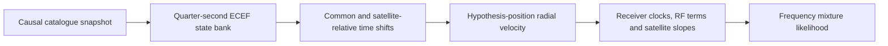

# Orbit-model source and prior-experiment audit

This is a source/report review, not a new measurement, root-cause finding,
protocol, or proposed deployment. No recordings, reserve outcomes, reference
errors, or new numerical fits were inspected. The useful distinction is between
catalogue provenance, interpolation error, orbital uncertainty, and frequency
nuisance flexibility. They have already received different tests.

## What B7 actually represents

- **Causal catalogue selection:** the operational CLI chooses the latest archive
  collection strictly before capture start minus 505 seconds. Selection uses
  collection time, not each satellite's element epoch or estimated accuracy.
  The archive verifies the selected payload digest. This is a reproducibility
  and causality rule, not an orbit-uncertainty model. See
  [regional_position.py](../../src/leo/cli/regional_position.py) and
  [tle_archive.py](../../src/leo/operations/tle_archive.py).
- **Fixed orbital-state bank:** catalogue candidates are propagated to ECEF
  position and velocity on 0.25-second nodes, with time support for the allowed
  shifts. The bank uses a conservative whole-search-prior visibility screen;
  visibility is subsequently evaluated at each hypothesis position. The bank
  carries satellite numbers, nodes, positions and velocities, without an
  element-age-dependent covariance. See
  [regional_position_bank.py](../../src/leo/analysis/regional_position_bank.py).
- **Timing rather than general state correction:** the predictor queries each
  satellite at observation time plus a common and satellite-relative time
  shift. Position and velocity are interpolated separately; predicted frequency
  is minus RF frequency divided by light speed times line-of-sight ECEF radial
  velocity. The timing Jacobian differentiates that interpolator. A shift
  moves along this particular propagated state curve; it is not an independent
  radial, cross-track, or three-component velocity perturbation. See
  [regional_position_score.py](../../src/leo/analysis/regional_position_score.py).
- **Existing frequency flexibility:** final B7 adds satellite-common linear
  frequency slopes in an orthonormal zero-sum basis, with Gaussian basis-scale
  sigma 0.5 Hz/s. Time centers come from ordinary fitted responsibilities.
  The generic correction class supports offsets too, but operational B7 uses
  slope-only. Receiver clocks and static/time-dependent RF terms are separate
  existing blocks. These are frequency corrections, not inferred physical
  orbital-state errors. See
  [hard60_b7.py](../../src/leo/application/hard60_b7.py),
  [hard60_satellite_correction.py](../../src/leo/analysis/hard60_satellite_correction.py)
  and [hard60_slope_prior.py](../../src/leo/analysis/hard60_slope_prior.py).

The concrete omission in this inspected path is **explicit epoch/update-
conditioned orbital uncertainty**, including radial/cross-track/velocity
components independent of the timing curve. Its absence does not establish
that it causes the remaining position errors, or that adding those parameters
would help. A state perturbation's frequency signature can overlap position,
clock, timing and existing satellite-slope signatures.

## What was tested already

| Earlier evidence | Finding and limit |
|---|---|
| [Direct-SGP4 interpolation audit](../2026_09_23_long_training_selected_interpolation_audit/README.md) | At sealed ordinary selections, 3,212 old view-track comparisons gave median 0.027751 Hz and maximum 0.073822 Hz shape RMS after per-track constant removal. This audited a **one-second** cache, not today's B7 quarter-second implementation. It supports separating numerical interpolation from catalogue/model error; it is not a current B7 accuracy bound. |
| [Causal catalogue-update variability](../2026_09_23_causal_orbit_variability/README.md) | Immediately adjacent snapshots had identical elements for all 880 candidates. A bounded search found an earlier changed boundary with 858 common candidates and 22 missing; median changes were 57.327 m radial, 2,693.805 m along-track and 95.608 m cross-track, with about 58.6–58.8 Hz three-epoch Doppler-shape RMS after constant removal. These are differences between catalogue solutions, **not errors against orbital truth or calibrated prior widths**. No replacement-catalogue position improvement was established. |
| [Actual element-age diagnostic](../2026_09_23_train_orbit_age_diagnostic/REPORT.md) | Actual epochs were recovered for 151 old TRAIN sessions. In the paired subset, ages spanned 0.207–3.150 days; residual-slope associations were weak (Pearson −0.216, within-stratum −0.183). The report explicitly rejects inferring a scalar age correction or causality from this association. |
| [Causal per-NORAD phase-rate experiment](../2026_09_24_ds1_orbit_arm/REPORT.md) | An age-multiplied orbital-phase rate was already implemented with Earth rotation held at receive time plus global timing. Four bounded runs improved frequency criteria and passed direct replay checks but did not recover a new position. The report also retains negative blind-transfer evidence. This is not an untested idea and was not full DS16/17/18 B7 validation. |
| [Satellite offset/slope pilot](../2026_10_08_position_error_iter24/README.md) and [119-recording follow-up](../2026_10_08_position_error_iter25/README.md) | Constant offsets alone improved frequency fit while worsening position. A 1 Hz/s slope candidate improved pooled mean from 1.001464 to 0.953968 km but worsened the worst case from 2.762679 to 3.905388 km and failed cohort gates. More satellite-specific flexibility is not automatically better localization. |

In this bounded review I found no completed matched full-DS16/17/18 B7 trial
replacing the orbit-state source or using element-age-dependent orbital priors.
That is a scoped inventory statement, not a claim that no other historical
experiment exists. The light-time/frame question already appears in
[iteration 106 preparation](../2026_10_09_position_error_iter106/PREPARATION.md)
and should not be relabelled as a new discovery here.

## Potential bounded diagnostic

Before changing a position model, a reference-free **prediction-space audit**
could measure what current B7 leaves unexplained by its existing nuisance
directions:

1. Keep every ordinary archived B7 candidate bank, hypothesis position and both
   matched c arms fixed. Compare the existing interpolator with direct
   propagation of the exact same pinned element set at the same shifted query
   times and coordinate-frame convention. Do not conflate an interpolation
   check with a different physical timing convention.
2. Separately compare the pinned catalogue with a globally bounded search for
   earlier **changed-element** causal snapshots. Report unchanged, missing and
   invalid candidates explicitly, retaining full recording membership. Archive
   collection age and parsed element age must remain distinct fields.
3. Measure the component of the resulting frequency differences outside the
   current position/clock/timing/satellite-slope Jacobian span. Report rank and
   conditioning as well as unprojected differences. This is a local
   identifiability diagnostic; unpenalized span removal does not imply that
   B7's bounded, regularized nuisance blocks can absorb that difference in a
   fit. Catalogue disagreement still does not tell us which source is better.

The same documented policy must cover all DS16/17/18 members and both c arms,
with input failures counted. Using ordinary hypothesis coordinates to compute
geometry is legitimate; using known receiver coordinates to select satellites,
snapshots or weights is not. No policy should select the better catalogue by
reference error. Any later source-replacement experiment needs a separately
frozen causal global selection rule, matched observations/banks/priors/search
budgets, explicit membership differences, and frequency effects reported
separately from evaluation-only position errors. No improvement expectation or
new protocol is asserted by this note.

The timing conventions need particular care: current B7 shifts the query along
an ECEF trajectory, whereas the older phase-rate experiment explicitly held
Earth rotation at receive time plus global timing. Those are different models.
A future comparison must identify that difference rather than attributing every
changed prediction to element age. This source-level distinction supplies no
measured position benefit and does not change the already frozen experiment queue.
