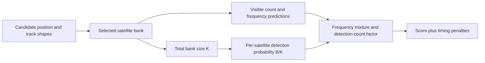

# Coarse-grid bank and score comparability

Source/math audit only. No recording objective evaluations, fits, new outcome
inspection, production changes or reference-guided selections were performed.
The motivating [sealed DS18-022 audit](../2026_10_09_position_error_iter107/DS18_022_GRID_AUDIT.md)
reports differing banks and poor score rank near the reference, but those facts
do not by themselves identify a normalization bug.

## What stays fixed, and what changes

[run_hard60](../../src/leo/application/hard60_runner.py) passes the **same full
PositionObservations object** to each coarse-point objective. It does not score
only matched tracks or divide by their count. The bootstrap uses at most 12
samples per track for initialization, but the subsequent likelihood includes
every original window once. Receiver/time/RF design centers therefore also stay
fixed across coarse points. Sigma, alias interval, detection budget, clutter
rate and timing-prior scales stay fixed.

There are two distinct bank selections:

1. The [regional bank](../../src/leo/analysis/regional_position_bank.py) retains
   propagated satellites potentially visible anywhere in the search-prior disk.
   This creates the shared discovery inventory, with explicit invalid and
   outside-prior exclusions.
2. [bootstrap_position](../../src/leo/analysis/regional_position_bootstrap.py)
   selects a smaller bank **at each candidate point**. For each orbit-blind
   track it tests timing shifts −20 to +20 s in 2 s steps, robustly removes a
   constant frequency offset, and chooses the best shape match. Candidates
   require at least 90% visibility on sampled track rows; accepted matches
   require shape RMS below 2,000 Hz. The bank is the unique set of those best
   matches, with matches required on both receivers and at least two distinct
   satellites. Candidate-point geometry and observed frequency shapes affect
   this selection. No known receiver coordinates are arguments to this code.

Thus coarse scores share observations and measurement units, but compare
**different, data-selected candidate models**: identities, candidate count,
visibility, initialization and relative-timing dimension can all differ. They
are not merely evaluations of one fixed-bank objective at different positions.
Using candidate positions for geometry is allowed; using evaluation truth to
construct these banks would be leakage. No such truth dependency is present in
the inspected bootstrap/bank path.

## Exact score dependence



From [hard60_score.py](../../src/leo/analysis/hard60_score.py), let K be total
bank size, B the fixed detection budget, q=B/K, m_n the visible count for window
n, lambda the fixed clutter rate, A the fixed alias width, and phi_ns the
wrapped Gaussian density (nearest image in the narrow-width implementation).
Then

```
p0_n = exp(-lambda) * (1-q)^m_n
H_n  = lambda/A + sum_s visible_ns * q/(1-q) * phi_ns
L_n  = p0_n/(1-p0_n) * H_n
score = -sum_n log(L_n)
        + tau^2/(2*sigma_common^2)
        + sum_s relative_shift_s^2/(2*sigma_relative^2)
```

Responsibilities normalize H_n, not the entire score. With
`C_n=lambda+m_n*q/(1-q)`, write

```
L_n = D_n * normalized_identity_mixture_n
D_n = p0_n/(1-p0_n) * C_n
```

The implemented factor integrates to D_n over frequency, not generally one.
Under the Poisson-clutter plus independent Bernoulli-detection interpretation,
D_n is the probability of exactly one detection conditional on at least one.
Consequently, replacing L_n with only a normalized identity mixture silently
removes a detection-count term. Whether the upstream observation-selection
mechanism warrants that statistical assumption is a separate modeling question;
this source audit does not prove it wrong. The same decomposition was already
derived in [iteration 108](../2026_10_09_position_error_iter108/INDEPENDENT_LIMIT.md).

**Appending a wholly invisible satellite is not score-invariant.** K increases,
q decreases, while m_n and all previous predictions remain fixed. Both H_n and
p0_n change whenever visible candidates exist. Signal/clutter responsibilities
can change too. If every candidate is invisible on a row, that row's factor is
independent of K. Appending a visible candidate whose frequency has negligible
Gaussian density can additionally change m_n and therefore p0_n even when its
direct contribution to H_n is effectively zero. Neither effect is a hidden
change in observation count or clutter interval.

There is no fixed direction of the overall score change: detection normalization
and signal-mixture contributions compete. Bank size alone cannot explain the
DS18-022 ranking quantitatively. With physically preserved zero-sum relative
shifts and new shifts zero, the quadratic timing penalty itself is unchanged;
arbitrary coefficient copying between different zero-sum bases would not
preserve that state. The code uses penalized optimization, not integrated
model evidence with dimension-dependent Gaussian normalizers or an Occam
factor. Different timing dimensions are therefore another explicit modeling
difference, not proof of an omitted arithmetic constant in its stated objective.

## This mechanism was already isolated

[Iteration 41](../2026_10_08_position_error_iter41/README.md) constructed a
reference-free regional inventory with banks of 21–38 satellites and a union
of 145. [Iteration 42](../2026_10_08_position_error_iter42/README.md) reproduced
native scores, isolated q normalization at fixed columns, and then scored the
common bank. Its synthetic checks explicitly established that normalization-only
scoring equals appending invisible columns. The recovered branch's fitted-c
score disadvantage shrank from 1,698.436 to 919.347 under normalization-only
and to 400.921 under the common bank; the winning branch did not change.

[Iteration 46](../2026_10_08_position_error_iter46/README.md) then refit both
branches using that common bank and a shared receiver-clock frame. The
qualified zero-c winner remained wrong; fitted-c attempts failed independent
stationarity, so no qualified fitted-c conclusion was available. These older
experiments are not current B7 full-cohort validation. The recovered seed was
diagnostic/previously reference-guided even though the bank union itself was
reference-free. Its favorable position must not be treated as an operational
start or independently validated result.

## Finding and remaining question

The established finding is **bank-dependent detection weighting within a
data-selected coarse candidate model**, not a newly identified implementation
defect. Full observations, clutter support and score formula are consistent
across coarse points; the candidate prior is intentionally not invariant to
bank membership. Differing banks alone are not a bug, and correcting this
dependency has not previously demonstrated a complete rescue.

A useful next diagnostic would test coarse **refinement/ranking** under a
globally specified reference-free common-bank policy, starting from ordinary
grid points. It would need to
account for added timing states and preserve physical nuisance predictions,
full observations, both c arms, budgets, and failures. A fixed-vector
decomposition can isolate score terms but cannot establish what a new search
would select. No new policy, denominator, seed or experiment is frozen here.
