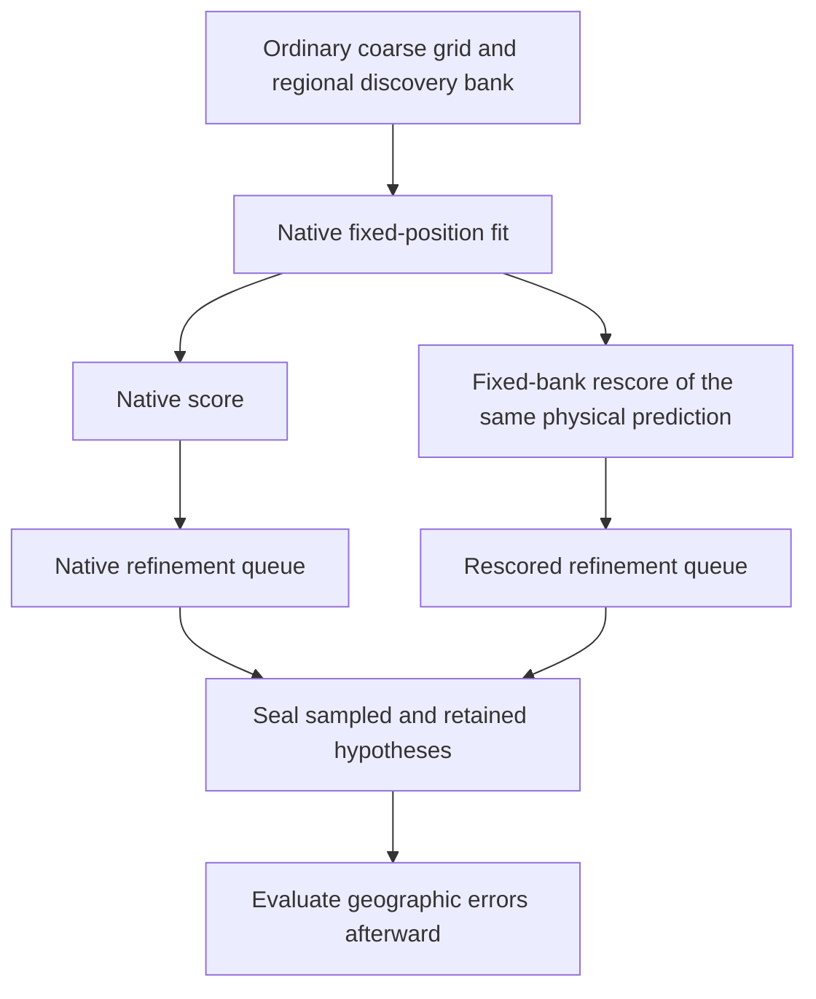

# Draft: change the refinement score, not the starting locations

Recommendation: a **paired 400-point search replay with fixed-bank rescoring
used only for queue priority and coarse retention**. This is a draft design,
not a frozen protocol or authorization to run. It targets an earlier decision
than the common-bank final-fit experiments: which ordinary cells receive the
remaining fine-grid evaluations.

## One controlled intervention

Start each search from every ordinary 40 km center inside the existing prior
disk, as [hierarchical_search](../../src/leo/analysis/regional_position_search.py)
already does. Do not insert the reference-nearest saved point, a recovered
diagnostic solution, or any reference-derived location. Keep the existing
40/20/10/5 km hierarchy, nearest-edge priority, 400-point budget, coordinate
tie-breaks, and three-region retention policy.

For every requested point, run the unchanged ordinary bootstrap and native-bank
fixed-position fit. The two search policies differ only in the scalar returned
to the queue:

- **Native:** the ordinary fitted native-bank objective.
- **Fixed-bank rescore:** evaluate that same fitted physical prediction against
  the entire already-built, reference-free regional discovery bank. Preserve
  old satellites' physical relative shifts; new satellites receive zero relative
  shift and the fitted common shift. Preserve receiver/RF predictions and the
  native quadratic timing penalty exactly. Do not optimize additional timing
  coefficients. The detection denominator is the same discovery-bank size at
  every point.

This uses the [regional bank](../../src/leo/analysis/regional_position_bank.py)
already screened over the whole search prior, rather than a union chosen after
examining promising results. It applies unchanged to DS16/17/18 and newer
recordings. Added candidates remain subject to ordinary hypothesis visibility.
The rescore is a restricted plug-in score, **not a fully optimized common-bank
likelihood**; initialization and native fitting still depend on the bootstrap
bank. That limitation is deliberate and must remain visible in interpretation.

Save a normalization-only decomposition at the same point: native predictions
and visibility, but the fixed discovery-bank denominator. This adds no fit and
separates weight/count effects from added candidates' frequency contributions.
As [iteration 113's audit](COARSE_BANK_SCORE_AUDIT.md) explains, these effects
need not have a fixed sign.

## Matched controls and bounded cost

Run native and rescore-guided searches in both c arms. At any requested point,
both arms start from identical ordinary bootstrap physical parameters except
for the required c=0 lock; observations, native bank, priors and fit budgets
match. Coarse models have the static RF coefficient only; do not invent RF-time
coefficients at this stage. A deterministic point/arm cache permits exact reuse
across policies, with source/input/model checks. The fitted-c native trace must
reproduce its archived baseline before interpreting any difference; zero-c
search is an explicit research control, since standard discovery is fitted-c.

Keep the existing coarse cap of 5 seconds and 200 iterations per fit, plus the
existing 5-second bootstrap allowance; 400 points per policy/arm is a hard
search cap, not a claim of constant execution time. Across four searches the
upper bound is 1,600 point-arm fits before reuse. Keep the normal checkpointed
500-second slices and an explicit proposed aggregate cap of 12 slices per
recording across the comparison; stop and report incomplete coverage if reached.
These are proposed research ceilings, not measured embedded performance.

A deployed candidate, if eventually justified, would run only its ordinary
fitted-c search, with the same 400-point cap and one extra fixed-state score per
point. It adds no optimized dimensions. Stream fixed-bank predictions in fixed
candidate batches (for example 64) to avoid retaining an observation-by-full-
bank tensor: aggregate signal sums and visible counts before taking logs.
Measure this overhead separately; the bank may be large and no cheap-runtime
claim is established. A synthetic streamed-versus-dense parity test and timing-
transport test are prerequisites to any freeze.

## What it can distinguish

On the common initial coarse lattice, compare the two scalar orderings and
their actual decomposition without optimization or position differences. Then
record every queue pop, parent/child, evaluated point, rank, convergence status,
and deferred cell for both completed trajectories. Cross-rescore the union of
evaluated points under both policies at their own native fitted states. This
shows whether changing the score causes different refinement, or whether a
new fine location is useful under both scores once sampled. Evaluate reference
distance only after these operational receipts are sealed; never feed it back
into the queue or region choice.

- If initial rankings and explored/retained regions scarcely change, the
  specific hypothesis that this bank-rescore intervention materially changes
  search allocation is falsified on the tested recordings.
- If allocation changes but the selected hypotheses do not improve after
  evaluation, altered normalization/allocation is insufficient. Better
  frequency fit alone is not a success.
- If a newly sampled fine point outranks old alternatives under **both** scores,
  yet native search never evaluated it, that demonstrates a search-allocation
  miss relative to that sampled inventory. It does not prove a global optimum
  or establish a sub-kilometre solution.
- If the same candidate locations reverse order only under rescoring, that
  isolates a ranking-model effect, rather than attributing everything to finer
  spacing. Both mechanisms may occur together.

A negative result cannot rule out failure of the bootstrap/native fit itself,
unexplored minima outside both 400-point traces, or a fully optimized common-
bank model. Do not expand the budget or seed an evaluated good region after
seeing the outcome. A downstream position-accuracy claim would require a
separately matched continuation of the ordinarily selected regions; this draft
search discriminator alone makes none.

## Why this is not a repeat, and what validation remains

[Iteration 41](../2026_10_08_position_error_iter41/README.md) broadened retained
regions from a native-ranked coarse inventory; its budget was informed by a
consumed diagnostic rank. [Iteration 42](../2026_10_08_position_error_iter42/README.md)
rescored completed regional/joint solutions using their union bank.
[Iteration 46](../2026_10_08_position_error_iter46/README.md) refit supplied
ordinary and diagnostic recovered joint starts. None of those tests changed
the live hierarchical queue using one fixed discovery bank before fine-grid
allocation. This draft does, without importing their recovered start.

DS18-022 motivates the mechanism and is consumed development data. DS16/17/18
are also consumed; an unchanged global rule and complete reporting across them
test regressions, not independent validation. Any later extension to newer
recordings must declare whole-recording membership and exposure before jobs,
retain failures without replacements, and use randomized whole-group validation
as previously required. No chronological or unseen claim follows merely from a
new label. This draft creates no new selection, protocol, recording access,
numerical job, source change, or deployment.
