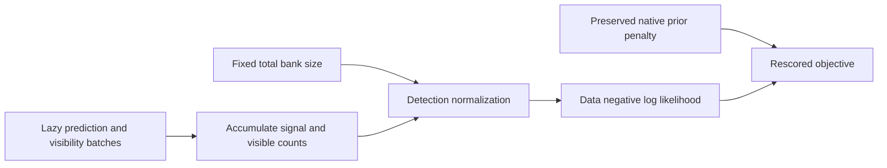

# Synthetic fixed-bank rescoring prototype

This implements only the mathematical building blocks of the
[iteration 113 draft](../2026_10_09_position_error_iter113/SEARCH_COMPARISON_DRAFT.md).
No recording inputs, orbit evaluations, position fits, search execution or new
protocol freeze occurred. Production and previously frozen sources are unchanged.



[fixed_bank.py](fixed_bank.py) streams prediction/visibility column batches using
the existing narrow-Gaussian hard60 likelihood. It accumulates signal density
and visible counts before applying the original detection normalization. Total
candidate count is explicit and fixed. Supplying fewer columns is intentionally
the normalization-only diagnostic, equivalent to padding invisible candidates;
the return includes supplied versus denominator column counts. A future driver
must require equality when claiming a full-bank score and bind column identities.
This primitive cannot identify duplicated or omitted satellite IDs from arrays.

The caller supplies the preserved original prior penalty separately. The scorer
returns data NLL, penalty and total without re-estimating priors or adding
dimension penalties. It adds no optimized parameters and rejects widths above
the production narrow-Gaussian threshold instead of silently approximating them.

The timing helper embeds physical relative shifts in a superset bank, assigning
zero relative shift to new candidates and retaining common timing unchanged.
It returns the new zero-sum basis coefficients and checks their reconstruction.
Missing old IDs, duplicate IDs, non-zero-sum shifts, an infeasible common shift
or infeasible total timing are rejected. It never recenters or clips a state.
The numerical tolerance is 1e-10 seconds; it is not an extra fitting allowance.

## Synthetic verification

Twelve tests pass against the actual production dense likelihood. Independent
parent verification reran all twelve after setting `rel=0` on dense/streamed
parity assertions, so the stated absolute tolerance is actually enforced:

- Dense/streamed parity across batches of 1, 2, 7 and 64 with changing visibility,
  including an entirely invisible row; absolute NLL tolerance 1e-10.
- Invisible additions equal denominator-only scoring, while differing from the
  original smaller-bank score.
- A visible candidate far outside Gaussian support changes the detection factor
  even though its direct signal density is negligible.
- Reordered/expanded banks preserve all old physical timing shifts, give new
  candidates zero relative timing and preserve the quadratic timing penalty.
- Invalid timing states, incompatible banks, nonfinite predictions and excess
  supplied columns fail explicitly.

No mismatch in the draft's mathematical premise was found. Equality is within
floating-point summation tolerance, not a promise of bitwise equality between
different batch orders. This verifies scoring algebra, not accuracy, propagation
cost, prior calibration, or whether the common-bank model is appropriate.

## Synthetic scoring cost only

[benchmark.py](benchmark.py) generates synthetic batches with fixed size 64;
[synthetic-cost.json](synthetic-cost.json) preserves all three timings and peak
tracemalloc readings. NumPy 2.4.6, one OpenBLAS thread:

| Windows | Candidates | Median seconds | Peak traced bytes |
|---:|---:|---:|---:|
| 3,000 | 150 | 0.007359 | 9,457,952 |
| 10,000 | 500 | 0.073525 | 31,522,016 |

The measurements include synthetic batch construction and score aggregation,
but **exclude orbit propagation, input loading and optimization**. They are not
embedded-hardware or recording-runtime measurements. Workspace scales as
O(windows × batch size), plus O(windows) accumulators; input batches must remain
lazy to realize this bound. A future actual predictor may allocate its own
additional arrays, which this benchmark does not measure.

Run from the repository root with `PYTHONPATH=src:.`:

```bash
.venv/bin/python -m pytest -q reports/2026_10_09_position_error_iter114/test_fixed_bank.py
OPENBLAS_NUM_THREADS=1 .venv/bin/python reports/2026_10_09_position_error_iter114/benchmark.py
```

Ruff passes. An operational search adapter and recording evaluation remain
unimplemented; the prototype alone establishes no localization improvement.
