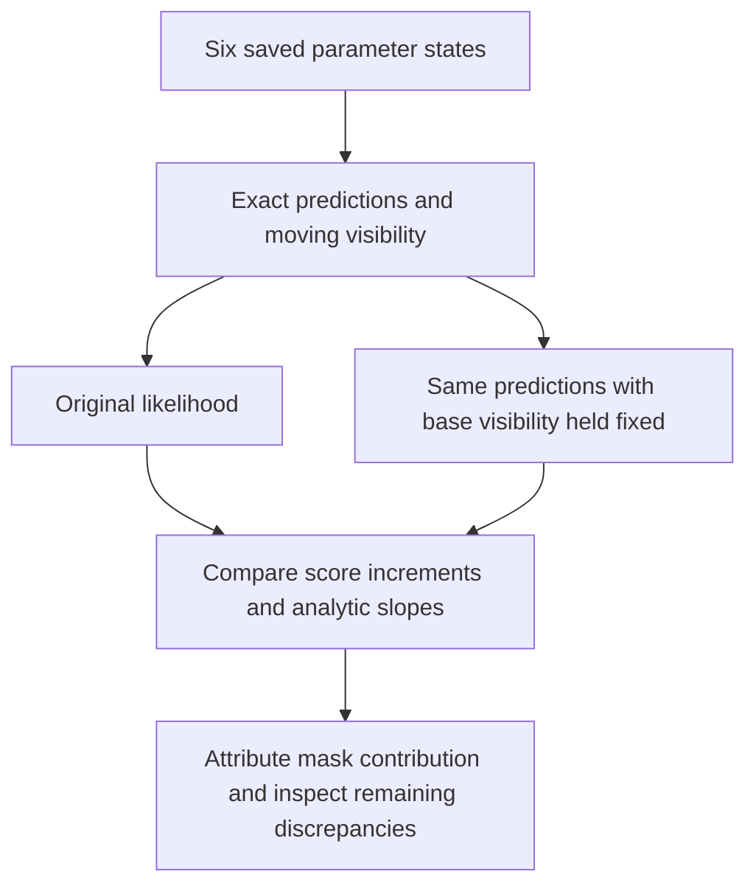

# Bounded diagnostic replay of DS17-033's timing-score jump

Draft only: no recording reconstruction, prediction, objective evaluation, fit or
selection has run. Implementation and source binding remain pending. Execution
must wait for a free worker slot after the scheduled pilots; do not displace the
two live107 workers. No additional user permission is needed within this scope.

Replay at most six already saved vectors: the unchanged failed prefit, its saved
common-timing positive/negative curvature probes, and the three saved Newton
dampings. Use the original107 member/source binding, original bootstrap/bank,
prior, score, fixed position and receiver baseline. Reconstruct through the
existing93/102/105 ports used by107, never by guessing storage paths. Verify
the original objective and all saved vector/objective identities before diagnosis.
No extra perturbations, optimizer, reseeding or reference-coordinate access is
needed. Limit one single-thread worker to120 seconds including reconstruction;
retain a failed/partial receipt if the bound is reached. Six full objective calls
plus the explicitly counted fixed-mask decomposition calls below are the maximum.

## Actual source paths and competing explanations

`hard60_score.predict_orbits` calls the bound native `_regional_orbits.predict`.
The C++ predictor uses query=receive_time+satellite_shift, floor interpolation cell
indices and linear interpolation of both position and velocity. It analytically
differentiates those piecewise-linear states, including velocity slope. The Python
`regional_position_score.predict_orbits` mirrors this construction. Crossing a
node can change the derivative but the interpolated state should remain continuous.
An interpolation-only finite score jump of0.148 under a10-microsecond change is
therefore not expected without a coincident mask/branch or implementation issue.

Visibility is the binary sign of direction dot observer-up. Its mask multiplies
Gaussian signal and changes the visible-count detection normalization in
`hard60_score.likelihood`. Ordinary derivatives freeze this mask. A horizon
crossing can therefore create an actual score discontinuity unseen by the
continuous frequency gradient. This is currently the most plausible source-level
hypothesis, not established evidence: saved probes do not contain masks.

`circular` wraps residuals at±ALIAS_HZ/2. The nearest Gaussian has the same density
on the two sides of that boundary, and at sigma125 Hz the density there underflows
to zero while positive clutter remains. A mere winding-index switch should not
produce an appreciable likelihood jump in this regime. Still record branch
changes to falsify that explanation rather than dismissing them by assertion.

## Minimum observables and exact decomposition

For every replayed vector record source/vector hashes, objective, common/relative
timing penalties, NLL, full KKT already saved versus freshly reconstructed,
prediction and derivative maximum differences, and counts rather than huge arrays:

- Visibility flips versus base, split visible→invisible and inverse; affected row
  and satellite indices, elevation margins and their predicted timing motion.
- Interpolation lower-cell changes, query distance to node boundaries, and
  predicted-frequency/timing-derivative changes for affected components.
- Winding-index changes and distance to circular half-alias boundary.
- Per-row NLL differences, visible counts and changes in detection normalization
  versus Gaussian/clutter mixture-density contributions. Retain the largest
  contributions by absolute NLL change under a fixed top10 rule.

Compute full NLL directly from the exact frozen likelihood. Also evaluate the same
six saved predictions with the **base visibility mask held fixed**: at most six
additional likelihood calls, no orbit calls or fits. Decompose row NLL into
`−log_detection−log(sum(pi*emission))`, preserving detection/clutter normalization.
Do not compare a differently normalized score. The difference between moving-mask
and fixed-mask deltas isolates visibility's exact contribution, including its
normalization effects. The fixed-mask result is diagnostic, never an operational
replacement likelihood or winner.

The stored timing derivative should predict the sign and small magnitude of the
two probe increments if no visibility or interpolation boundary intervenes.
Compare their central and one-sided score slopes with analytic gradient[7], and
compare per-component prediction finite differences with the native timing
derivative. Use existing saved step sizes exactly; report cell-crossing cases
separately instead of assigning their central difference to one cell's derivative.

## Falsification and next interpretation

Visibility explanation is supported if mask changes account for the excess score
jump and fixed-mask score/prediction slopes agree. It is falsified if no mask
changes occur or the fixed-mask discontinuity remains unexplained. Interpolation
is supported by cell changes and a kink consistent with one-sided derivatives,
but a state discontinuity would be a predictor bug to isolate synthetically.
Alias is supported only by a measurable density contribution at branch changes;
branch counts alone are insufficient. Analytic-gradient error remains plausible
if masks, cells and branches are unchanged yet fixed-mask directional derivatives
disagree materially beyond score roundoff and the declared probe truncation error.

Publish all six saved states and every failure, with full107 closure/native module
hash checks and inherited protocol linkage. Do not inspect truth errors or choose
new steps based on them. This plan can distinguish a legitimate nonsmooth score
barrier from an implementation derivative defect; it cannot establish that
recovering this region improves localization.
