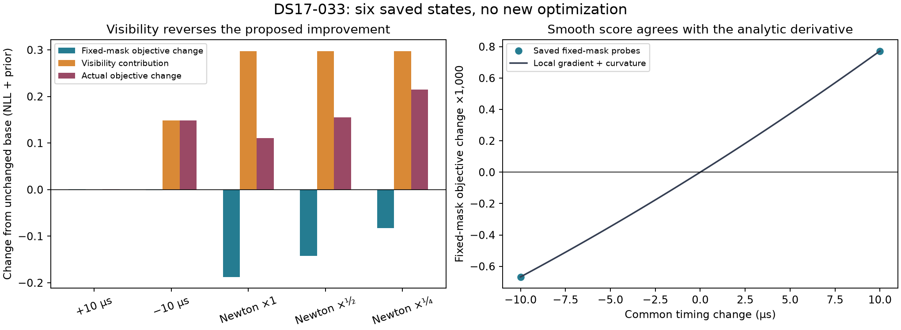

# DS17-033: a visibility discontinuity rejects the saved Newton steps

**The saved Newton steps improve the continuous frequency/prior part of the
score, but crossing the binary visibility boundary adds a larger detection-
normalization penalty.** This explains rejection of these three proposals under
the unchanged objective. It is not a floating-point acceptance problem or
evidence that a better geographic solution was recovered.

All six predeclared saved states completed in **12.999 seconds**, with exactly
six full-objective and six fixed-mask likelihood calls, no optimizer calls and
no new parameter proposals. This report uses only that sealed result; it adds
no recording reconstruction or model evaluations. The consumed member is
DS17-033, `scan-fw-faf66389f66f36c5`, at its ordinary fixed-position failed
prefit. No reference coordinates or position errors enter this diagnosis.

## Exact score decomposition

The unchanged base objective is **31813.200764497222**: data NLL
31658.826406919165 plus prior penalty 154.37435757805724. For each saved state,
the diagnostic evaluates identical predictions with the base visibility held
fixed, then compares that with the original moving-visibility likelihood.
Priors remain identical between these two evaluations of the same state.

| Saved state | Actual objective change | Fixed-mask objective change | Added visibility cost | Added / removed visible cells | Changed interpolation cells | Changed alias windings |
|---|---:|---:|---:|---:|---:|---:|
| Base | 0 | 0 | 0 | 0 / 0 | 0 | 0 |
| Common timing +10 µs | +0.000772400 | +0.000772400 | 0 | 0 / 0 | 4 | 0 |
| Common timing −10 µs | +0.148165822 | −0.000667288 | +0.148833110 | 1 / 0 | 0 | 0 |
| Newton ×1 | +0.110270398 | −0.187395823 | +0.297666221 | 2 / 0 | 562 | 1 |
| Newton ×½ | +0.155627848 | −0.142038373 | +0.297666221 | 2 / 0 | 278 | 0 |
| Newton ×¼ | +0.214686796 | −0.082979425 | +0.297666221 | 2 / 0 | 135 | 0 |

All changes are relative to the same unchanged base; lower objective is better.
For every row, actual change = fixed-mask change + visibility cost, within
floating-point reporting precision. The full Newton proposal's smooth gain of
0.187395823 is outweighed by a 0.297666221 visibility cost, producing the actual
0.110270398 increase. The smaller dampings still cross both visibility events,
so their smaller smooth gains do not avoid the penalty.

The −10 µs probe changes observation/satellite index `(2659, 7)` from invisible
to visible. Every Newton proposal also changes `(2660, 7)`. These are zero-based
indices in the frozen observations and selected bank, not new associations.
The full Newton proposal changes one alias winding at `(562, 12)`; the two
smaller dampings change none yet suffer the same visibility penalty.

| Saved state | Detection-normalization NLL change | Gaussian/clutter density NLL change | Prior change |
|---|---:|---:|---:|
| +10 µs | 0 | +0.000772820 | −0.000000421 |
| −10 µs | +0.148833110 | −0.000667709 | +0.000000421 |
| Newton ×1 | +0.297666221 | −0.034130474 | −0.153265348 |
| Newton ×½ | +0.297666221 | −0.065373324 | −0.076665050 |
| Newton ×¼ | +0.297666221 | −0.044638807 | −0.038340619 |

Across all six states, the isolated mask contribution equals the change in the
detection-normalization term to within **3.64×10⁻¹² NLL**. There is no measurable
compensating density contribution from newly visible candidates at this
precision. This is stronger evidence than simply observing a changed mask.

The source mechanism is explicit in
[hard60_score.py](../../src/leo/analysis/hard60_score.py): with bank size K,
q=B/K and visible count m, `p0=exp(-lambda)*(1-q)^m`; the NLL includes
`-log(p0)+log(1-p0)` as well as the Gaussian/clutter density. The binary horizon
mask changes m discretely. Ordinary frequency derivatives differentiate within
the current mask; they do not represent that jump. The original likelihood is
therefore correctly rejecting these steps under its current definition.

## Derivative and alternative explanations

The base analytic common-timing gradient is **71.9843948375 NLL/s**. The central
score difference from the two saved ±10 µs probes, with base visibility held
fixed, is **71.9843877959 NLL/s**, differing by **7.04×10⁻⁶ NLL/s**. The saved
gradient difference gives local curvature approximately **1,051,115.869 NLL/s²**,
which explains the unequal magnitudes of the two small smooth score changes.

The prediction finite-difference audit has **34,757 components** whose masks,
interpolation cells and alias branches remain stable. Their maximum timing-
derivative discrepancy is **2.91×10⁻⁵ Hz/s**. Across all components, including
cell crossings, the maximum is 0.03146 Hz/s. This supports the local analytic
derivative; it is not evidence for a large gradient-implementation error.

Most directly, the negative timing probe has **zero interpolation-cell or alias
changes**, yet its visibility-normalization jump is sufficient to explain the
reversal. Thus neither interpolation-cell changes nor alias switching is needed
to cause that failure. The Newton proposals have many cell changes, but the
fixed-mask scores improve and the isolated visibility term explains their
observed objective increases. This does not prove every derivative or every
other failure case correct.

## Limits and implications

This is a causal explanation of the **saved step rejection**, not a new
qualified solution, a position improvement, or a diagnosis of all dataset errors.
The diagnostic does not record horizon margins, exact crossing times or a fresh
full constrained KKT value. The common-gradient reductions alone do not certify
convergence. Holding visibility fixed was diagnostic; promoting that score or
loosening the production acceptance threshold would change the experiment.

Future work can consider explicitly handling visibility events during proposed
steps, or a separately justified smooth detection model. Neither has been
implemented or validated here. Any model change needs matched c=0/fitted-c
controls and full failure accounting; this six-state fitted-prefit mechanism
audit is not a substitute for that comparison. Production remains unchanged.

## Integrity and artifacts

All **5,581 frozen source/input hashes** match. The result and attempt receipts
match the frozen protocol, member and upstream protocol. Every saved vector
digest and objective is verified, and all score decompositions close within
absolute 1e-9. The standalone plot was rendered and visually inspected.

- [Raw sealed result](result.json)
- [Derived table and integrity receipt](summary.json)
- [Reproducible arithmetic-only reporter](report.py)
- [Frozen protocol](protocol.json), SHA256 `206a0c255c766303a6f82342b9065590a6d95bc5f667b2a29f359a939cde2558`
- Result SHA256 `4d5e064278e0a74c9f98855d8c89560f238b662fb38a6f90a65102649c96ad02`

The preparation README and FREEZE document remain unchanged as historical frozen
artifacts; this report records completion.
