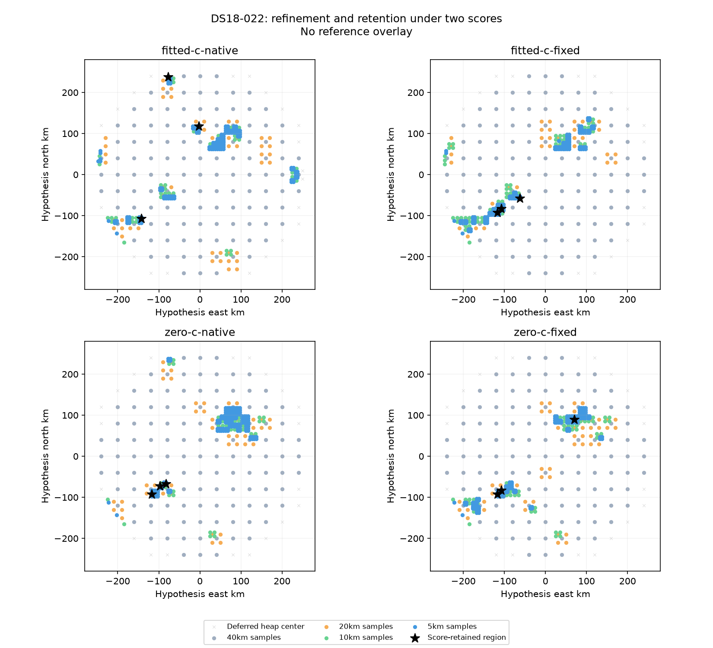
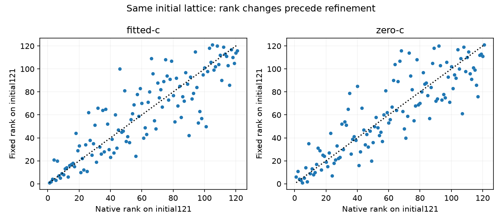

# Search-only checkpoint

Terminal status: complete. Finished/claimed slices: 2/2; known finished elapsed: 828.033s.

| Queue | Sealed | Sampled | Depth0/1/2/3 | Unqualified | Failed | Deferred |
|---|---|---:|---|---:|---:|---:|
| fitted-c-native | True | 400 | 121/59/73/147 | 27 | 0 | 267 |
| fitted-c-fixed | True | 400 | 121/49/85/145 | 23 | 0 | 265 |
| zero-c-native | True | 400 | 121/55/70/154 | 19 | 0 | 266 |
| zero-c-fixed | True | 400 | 121/61/78/140 | 18 | 0 | 272 |

Unfinished slice duration is not imputed. A live fit-status event can precede its evaluated-point event; counts need not agree mid-write. Deferred-cell counts are heap entries, not area coverage. Initial-grid rank comparisons are complete only after both initial grids seal and their domains agree. This checkpoint reads no reference coordinates or operational winner errors and makes no position claim.

All four queues sealed at 400 points; native fitted trace reproduced its frozen 400-point/score baseline. No point-evaluation exceptions occurred. Independent coarse qualification failures remain in search under the ordinary policy.

| Discovery arm | Initial ranks changed | Mean/max absolute change | Sample overlap | Fixed-only samples |
|---|---:|---:|---:|---:|
| fitted-c | 114/121 | 13.157/54 | 283/400 | 117 |
| zero-c | 119/121 | 13.289/48 | 306/400 | 94 |

| Queue | Retained hypotheses (east,north km; spacing km) |
|---|---|
| fitted-c-fixed | (-107.5,-82.5;5); (-117.5,-92.5;5); (-62.5,-57.5;5) |
| fitted-c-native | (-77.5,237.5;5); (-142.5,-107.5;5); (-2.5,117.5;5) |
| zero-c-fixed | (70,90;20); (-117.5,-92.5;5); (-107.5,-82.5;5) |
| zero-c-native | (-82.5,-67.5;5); (-117.5,-92.5;5); (-97.5,-72.5;5) |

The fixed score reorders the same 121 initial points and changes fine-grid discovery and retained hypotheses. This establishes a queue/retention effect, not improved localization. Native/fixed raw scores are not comparable as evidence of improvement. Fixed is a restricted whole-bank plug-in rescore, not a refit.

The 828.033s is persisted elapsed across two slices, including replay and rescoring. Native fitted coarse receipts and seeds reuse historical work; this is not four fresh equal-wall-time analyses or an embedded-speed benchmark.

A bounded symmetric downstream test is warranted. Primary comparison: fitted-native versus fitted-fixed discovery, with both final c arms in each branch. Zero-discovery queues are separate sensitivities, not c=0 counterfactuals to fitted discovery. Preserve all three retained regions and apply identical recovery. No native/fixed union or favorable-region selection is justified. See [continuation plan](CONTINUATION_PLAN.md).

[Sealed metadata and receipt hashes](SEARCH_SNAPSHOT.json). This reporting code read no reference coordinates/errors, recording inputs or positioning winner outcomes and performed no model evaluations or fits.
