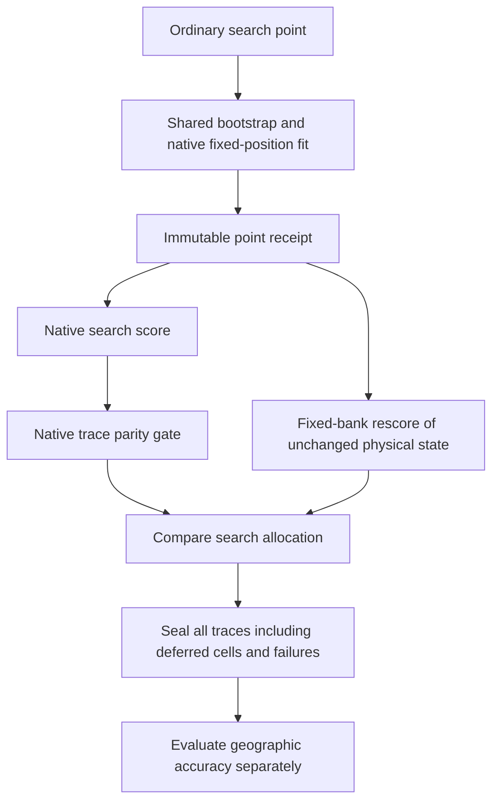

# Fixed-bank search preparation: reviewed, not yet executable on recordings

The parent reran all 25 synthetic tests under the production Python environment:
25 passed in 1.31 seconds. Independent review checked timing transport, native
score reproduction, production search ordering and durable resume accounting.
No recording fit or objective evaluation was performed for this preparation.

Review caught and corrected three reporting/validation weaknesses: failed point
rescoring could otherwise leave an apparently successful search; a nonfinite
archived score could bypass the baseline difference check; and unexpected cached
statuses needed explicit rejection. Regression tests cover these cases, along
with interrupted-claim refusal and successful replay without refitting cached
points. Deadlines remain soft between operations, and actual elapsed time is
carried across slices rather than reset.

This remains unfrozen preparation. The original coarse-receipt importer and a
reviewed full source/input closure are still required. A fresh fit that fails
archived native parity must not be accepted by relaxing the comparison. There is
no measured position improvement or embedded runtime result here. Production B7
is unchanged; the 0.4 km mean-error goal remains unmet.
