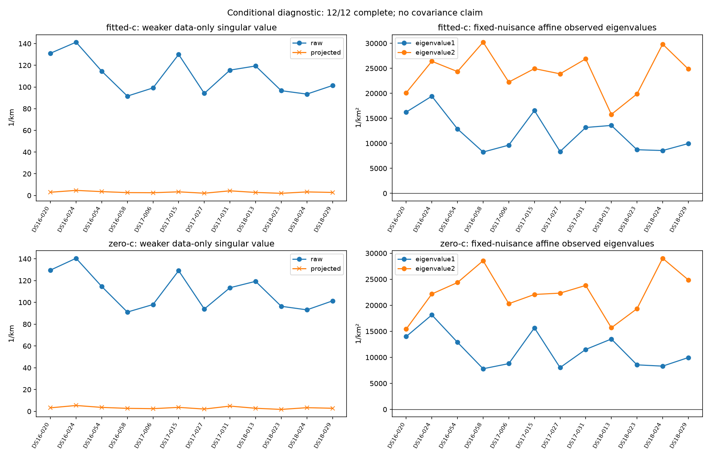

# Conditional endpoint observability diagnostic

Frozen random12 conditional diagnostic; potential148 authority retained; consumed development, not full148 or position-accuracy evaluation

Coverage 12/12; failures {'resource': 0, 'other': 0, 'missing': 0}.

Plots show complete receipts only; missing or failed members are not imputed. Full12 distributions are withheld unless all12 complete. Priors remain separate, bounds are omitted, and observed eigenvalues fix nuisance and omit nonlinear frequency second derivatives. Fixed-nuisance observed blocks and nuisance-relaxed complete-label projections have different conditioning and are not interchangeable. No inverse, covariance, accuracy or full148 claim.

Sum of terminal receipt elapsed costs 151.403s; concurrent wall time unavailable.

|Member|Dataset|Status|Failure|
|---|---|---|---|
|DS16-020|DS16|complete||
|DS16-024|DS16|complete||
|DS16-054|DS16|complete||
|DS16-058|DS16|complete||
|DS17-006|DS17|complete||
|DS17-015|DS17|complete||
|DS17-027|DS17|complete||
|DS17-031|DS17|complete||
|DS18-013|DS18|complete||
|DS18-023|DS18|complete||
|DS18-024|DS18|complete||
|DS18-029|DS18|complete||

[All matrices, distributions and explicit status coverage](summary.json)
