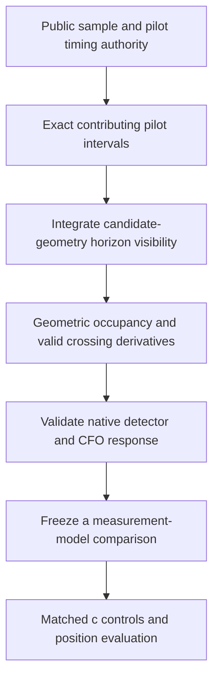

# Finite-support visibility: synthetic preparation, not a position result

The parent ran all ten synthetic tests under production Python: ten passed in
1.28 seconds. They cover coherent soft-likelihood derivatives, binary-limit
agreement, horizon geometry and exact interval occupancy, including sparse gaps
and interpolation-knot timing derivatives. No recording fit was performed.

The current implementation reaches geometric occupancy for supplied intervals.
Reconstruction of exact intervals from the public evidence and validation of
the actual estimator response remain outstanding. Occupancy is not itself a
calibrated detection probability. A bounding support interval must not replace
the sparse contributing pilot intervals silently.

No angular smoothing width was chosen. The finite measurement support offers
a physical time scale, but does not automatically make the model differentiable
at every contact. The prototype explicitly withholds derivatives at horizon
contacts. Production contracts, B7 and its convergence gate remain unchanged.

See [source and geometry audit](GEOMETRY_AUDIT.md),
[measurement support](INTEGRATION_SUPPORT.md), and [alternatives](PROPOSAL.md).
This preparation does not establish a localization gain or achievement of the
0.4 km mean-error goal.
