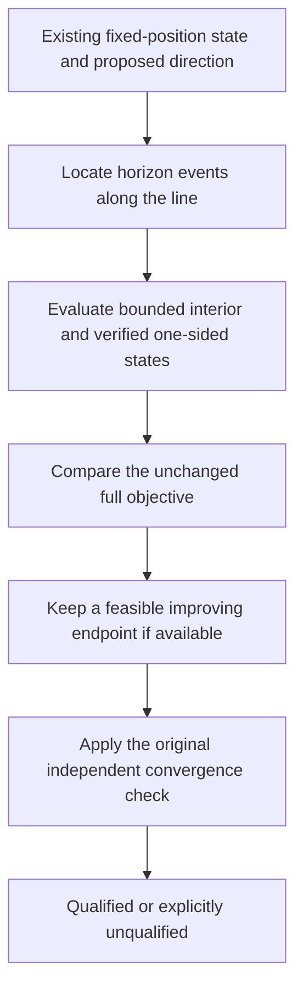

# Preserve the hard horizon: event-aware steps, with an explicit qualification limit

The narrow useful experiment is an **event-aware line search during fixed-
position calibration**. It can search for a better feasible step under the
unchanged score. It cannot generally make a horizon-edge sequence satisfy the
existing smooth KKT threshold, and it must not claim to do so.



This is source/math preparation plus five synthetic tests. No recording
predictions, objectives, fits, new RF, parameter selection or protocol freeze
occurred. The only real-data motivation is the
[sealed iteration115 diagnosis](../2026_10_09_position_error_iter115/RESULTS.md):
two visibility events add 0.297666221 NLL, overcoming the full Newton proposal's
0.187395823 fixed-mask improvement. That proves rejection of those saved steps,
not that event handling improves position or typical residual errors.

## Why fixed-position event geometry can be simple

The [predictor](../../src/leo/analysis/regional_position_score.py) interpolates
ECEF position linearly, then tests the sign of line-of-sight direction dot
observer-up. For a fixed observer, the same sign is given by

```
h_ns(alpha) = (r_s(t_n + shift_s + alpha * delta_shift_s) - receiver) · up
```

The omitted range divisor is strictly positive. Within each orbital interpolation
cell, h is affine in alpha. Interpolation-knot fractions are known from the
query-time path, so each segment's zero can be solved directly; the nearest
event is the minimum positive root over all observation/satellite components.
Tangent contacts and identically zero segments require explicit handling, not
an assumption that every zero changes side. The same observation can have
multiple events along a long proposal.

[event_line.py](event_line.py) implements this scalar piecewise-linear root
primitive and open-cell inventory. It is not a recording adapter or optimizer.
It rejects invalid/unsupported paths rather than extrapolating. Computation
scales with components and crossed interpolation segments; no dense Hessian is
needed for event discovery. Actual cost for the production bank remains
unmeasured. With receiver position released, receiver/up depend nonlinearly on
alpha, so this exact affine construction no longer applies; do not silently
extend this prototype to final spatial fitting.

Native floating-point visibility classification remains authoritative. An
algebraic root can differ at roundoff from the native normalized-dot test.
Before interpreting a one-sided state, verify its actual mask. Merely calling
`nextafter` on alpha is not a guarantee that interpolated geometry changes side.
If a safe side cannot be established within the predeclared budget, report an
unresolved event instead of moving the boundary or changing the score.

## Minimal general step policy

1. Keep the existing saved state, Newton direction, physical bounds, priors and
   whole objective. Clip the proposed alpha interval to the existing physical
   feasibility interval; this does not clip fitted parameters or recenter clocks.
2. Locate horizon events within that interval. Split only the scalar line into
   visibility cells. A bounded within-cell line search may use the ordinary
   continuous derivatives and exact likelihood. Interpolation derivatives can
   still have kinks; do not claim a globally quadratic smooth function.
3. Evaluate verified one-sided states and candidate interior minima under the
   **original moving-mask objective**, including detection normalization. A
   crossing may be accepted only if its actual endpoint beats the current
   accepted state within the existing fixed score-comparison tolerance. The
   path between endpoints need not be monotone, but an uphill endpoint is not
   accepted merely because its frozen-mask score improves.
4. Retain the best feasible state and all rejected/capped attempts. Keep the
   existing independent full projected-KKT threshold of 0.001 unchanged.
   Event-boundary flags supplement it; they do not turn an unqualified state
   into a success. A bounded initial prototype could stop after two encountered
   events and at most 16 new full-score calls per direction, charging these
   against the existing rescue budget rather than adding hidden retries. These
   are draft ceilings, not frozen or empirically selected parameters.

The new hypothesis is whether a smaller in-cell step or a different interior
point beyond an event yields a lower original objective and ultimately a
qualified state. It is falsified as a rescue on a case if all admitted states
remain unqualified or no original-score improvement is available within the
fixed budget. Even a qualified calibration would still require ordinary
downstream selection and matched c arms before claiming localization benefit.

## Why a different boundary certificate cannot be smuggled into KKT

The hard score can be discontinuous. Clarke stationarity requires local
Lipschitz continuity and cannot be invoked across a finite jump. Treating a
visibility boundary as an ordinary active physical constraint can also invent
a certificate: visibility cells are not additional constraints in the original
optimization problem.

A simple counterexample is

```
F(x) = (x - 1)^2 + 2 * indicator(x >= 0.2),  x in [0, 1].
```

Approaching 0.2 from below improves F toward 0.64, but F(0.2)=2.64 and the
left derivative tends to −1.6. The global infimum is not attained. No finite
near-boundary point can satisfy a 0.001 smooth-gradient gate, and relabelling
the boundary as active does not fix the mathematical problem. This exactly
illustrates a possibility, **not a proof that DS17-033 has no local minimizer**.

A correct discontinuous local-minimum check would account for every adjacent
mask region and feasible direction: downward jumps invalidate local minimality,
upward jumps do not, and directions staying in the same region require the
appropriate smooth stationarity condition. At intersecting event surfaces,
checking one Newton line is insufficient. Such a new qualification definition
would require its own reviewed proof/tests and separately reported status; it
is not part of this minimal proposal. For now the honest outcomes remain
qualified under the original full gate, or unqualified with event diagnostics.

## Contrast with physically calibrated smooth detectability

[Iteration118](../2026_10_09_position_error_iter118/PROPOSAL.md) instead changes
the measurement model: p=q*v with continuous detectability v, consistently in
both signal odds and no-detection normalization, with the visibility derivative
included. That may yield a continuous optimization problem, but only a
physically defensible global response/uncertainty rule justifies its width.
Position-error tuning, per-scan widths or an arbitrary logistic smoothing scale
would not provide that justification. Below-estimated-horizon mass also needs
an explicit occultation/uncertainty interpretation.

Event-aware search preserves current RF/geometry assumptions and their
discontinuities; it adds solver work but no detection-width parameter. Smooth
detectability changes assumptions and may remove the pathological boundary,
but needs independent physical calibration and matched-model validation.
Neither is presently a demonstrated positioning improvement.

## Synthetic evidence and next gate

Five tests pass: exact interior root versus interpolation knot; reversed-time
multiple events; tangent/flat-boundary detection; an original-score improving
crossing that reaches an interior stationary point; and the nonattained-infimum
counterexample plus invalid-support rejection. The tests use explicit synthetic
piecewise-linear margins and scalar quadratics, not recordings or optimizers.
Ruff passes.

Before any real trial, freeze a fixed-position-only adapter and all budgets,
test its horizon signs against the unchanged native predictor, and compare
ordinary versus event-aware rescue from identical ordinary starts in both c
arms. Keep all failure/boundary cases, independent-KKT flags and runtime. No
soft-width choice, reference-guided seed or production change is authorized by
this note.
