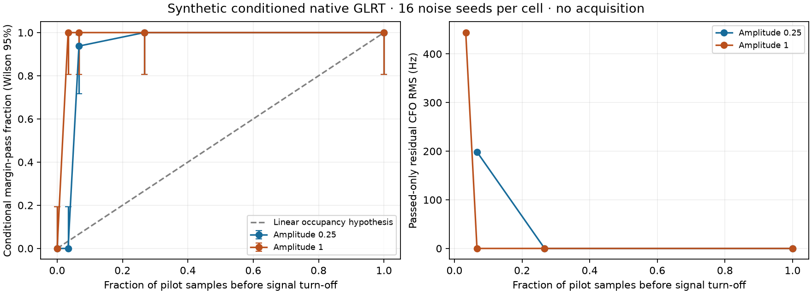

# Linear occupancy is not supported by this conditioned native screen

The [predeclared protocol](SYNTHETIC_PROTOCOL.md) was published at
`26aa5bc8c` before execution. All **160/160** calls completed, with **zero
failed calls**, using exactly the declared cutoffs, amplitudes and noise seeds.
No blind acquisition, recording input, positioning fit, new RF or model tuning
was performed. This is a conditional synthetic measurement result, not a
localization or operational detection result.

The rule is the adaptive conditioned margin `exact-control >= .025`;
the separate native `.175` exact-score floor is not applied. Epoch, acquired
CFO and fractional offset are supplied as zero. Signal turns off once while
complex receiver noise remains unchanged over the full 20 ms probe.

| Pilot occupancy | Signal multiplier .25: passes/16 | Signal multiplier 1: passes/16 |
|---:|---:|---:|
| 0% | 0 | 0 |
| 3.34% | 0 | 16 |
| 6.67% | 15 | 16 |
| 26.67% | 16 | 16 |
| 100% | 16 | 16 |

Wilson 95% intervals: 0/16 gives **[0%, 19.36%]**; 15/16 gives
**[71.67%, 98.89%]**; 16/16 gives **[80.64%, 100%]**. The serialized upper
endpoint for 16/16 is `1.0000000000000002` from roundoff; the table displays
100%, without altering the raw receipt. Seeds are reused across cells, so
cell estimates are correlated; the two noise-only cells are identical draws,
not 32 independent noise trials.

At full support both levels pass 16/16. The proposed linear occupancy law would
therefore predict approximately 6.67% conditional pass fraction at one-burst
support, whereas the observed fractions are 93.75% and 100%. At 3.34% support,
changing amplitude alone changes the observed fraction from 0% to 100%.
These fixed settings do not support using occupancy alone as the linear
detectability law `p=q*v`. No formal multiple-comparison rejection test was
predeclared; this is the promised descriptive mechanism screen. It supplies
neither a replacement curve nor a physically calibrated SNR law.

Admission also does not guarantee precise CFO. At amplitude 1 and 3.34%
support, all 16 pass, but only eight return the injected zero-CFO bin; seven
return a neighboring ±443.892 Hz bin and one returns +1331.676 Hz. Their RMS
residual is 443.892 Hz. At amplitude .25 and 6.67% support, 15 pass: twelve
return zero and three return ±443.892 Hz, yielding passed-only RMS about
198.52 Hz. One additional +443.892 Hz output fails the margin rule. With
26.67% and full support both levels return zero in every trial. Zero here
means the injected bin won; it is not a measured sub-bin uncertainty.
Noise-only outputs span roughly −110 to +87 kHz but all fail admission.
The plot leaves passed-only CFO metrics undefined where no trials passed;
it does not zero-fill those cells. All unfiltered CFO histograms are retained
in the raw result.

## Cost and integrity

- Total elapsed: **0.8111 s**, including **0.5602 s** native library build.
- Sum of 160 native calls: **0.02602 s**; median **0.1650 ms**, maximum
  **0.4529 ms**. These are warm, conditioned synthetic calls on this host,
  not full scanner or embedded acquisition costs.
- All **74 frozen source hashes** verified, complete expected 160-cell/seed
  membership checked, margin arithmetic and verdicts checked, library digest
  matched the execution receipt. No retry or additional estimator calls.
- [Raw rows and all cell histograms](synthetic-result.json),
  [verification and SHA256 digests](synthetic-verification.json),
  [compiler command/source receipt](synthetic-presence.so.build.json),
  [exclusive execution claim](synthetic-started.json).

Result SHA256:
`d597e6c297261373715b4470e2abf40381d855e991eae647a3601d0889fe28e3`.
Protocol SHA256:
`51209f658ece963d8740cfc28bfdbbb6ae5d0612e16c70286103bfc84c11585f`.
Compiled library SHA256:
`f473f283a6e5d8aca6235d3f521b4e77e8d54a0b576266f678630eb011544ea1`.
The local binary is retained but need not be published; source/build/hash
provenance is published. No frozen estimator or protocol sources changed.

The supported next conclusion is limited: geometric occupancy may supply a
finite observation-support scale, but its mapping to admission and CFO error
depends on signal/noise conditions and coherent support. Blind acquisition,
fractional bracketing, candidate competition, fading and physical occultation
remain outside this screen. Do not replace the hard-mask positioning model
with a linearly occupied detection model on this evidence.
