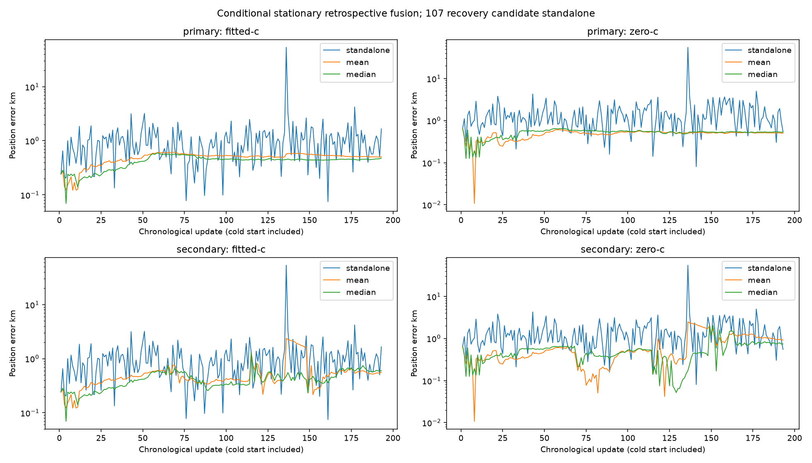
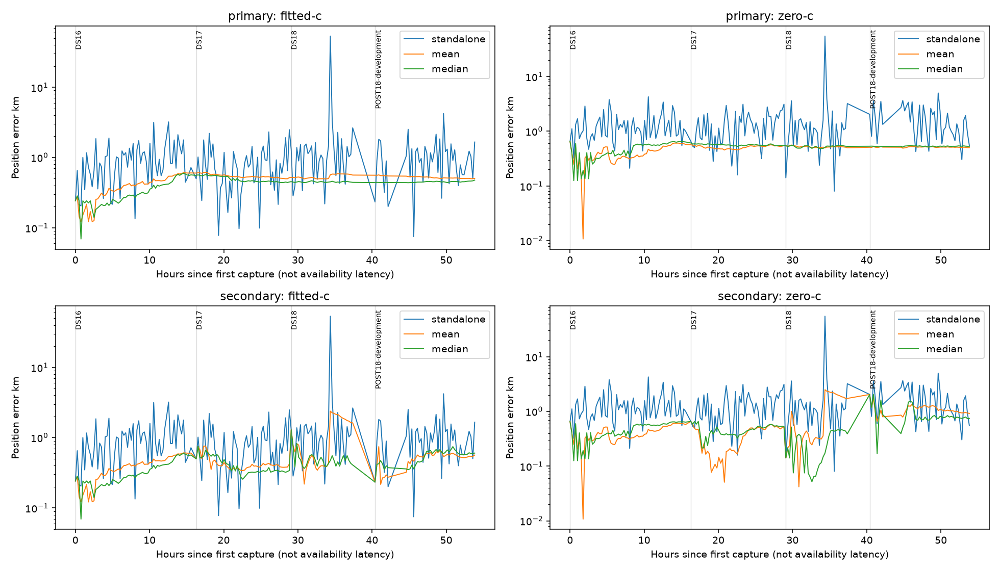

# Conditional stationary causal replay

All 193 updates are included, with zero outages in either arm. This is a capture-order retrospective replay on consumed development data; stationarity is hypothetical, and online availability is unverified. Standalone means iteration107's research recovery candidate, not deployed B7. No frequency fit or single-scan algorithm changed.

|Full-cohort fitted-c method|Mean error km|Median error km|
|---|---:|---:|
|Standalone recovery candidate|1.2548|0.8926|
|Cumulative mean, one hypothetical episode|0.4882|0.5186|
|Cumulative coordinate median, one hypothetical episode|0.4206|0.4477|
|Cumulative coordinate median, dataset cold starts|0.4276|0.4024|

Fusion is a different multi-scan estimator with additional measurements and warm-up. Its 0.4206 km mean does not achieve or redefine the 0.4 km standalone goal. Dataset resets are predetermined artificial comparators, not proven installation changes. No parameter was selected from these errors.

|Reset|Dataset|Arm|Method|Count|Mean km|Median km|p95 km|Worst km|
|---|---|---|---|---:|---:|---:|---:|---:|
|primary|full|fitted-c|standalone|193|1.2548|0.8926|2.2358|53.4007|
|primary|full|fitted-c|mean|193|0.4882|0.5186|0.6001|0.6146|
|primary|full|fitted-c|median|193|0.4206|0.4477|0.5584|0.5946|
|primary|full|zero-c|standalone|193|1.6841|1.1501|3.4265|54.8321|
|primary|full|zero-c|mean|193|0.4787|0.5113|0.5666|0.6494|
|primary|full|zero-c|median|193|0.5156|0.5408|0.6204|0.6494|
|primary|DS16|fitted-c|standalone|63|0.9736|0.8349|2.0343|3.2048|
|primary|DS16|fitted-c|mean|63|0.3922|0.4140|0.6009|0.6067|
|primary|DS16|fitted-c|median|63|0.3273|0.2919|0.5740|0.5946|
|primary|DS16|zero-c|standalone|63|1.3138|1.0750|2.9373|4.2636|
|primary|DS16|zero-c|mean|63|0.4039|0.3816|0.6055|0.6494|
|primary|DS16|zero-c|median|63|0.4600|0.4512|0.6438|0.6494|
|primary|DS17|fitted-c|standalone|51|0.8191|0.6963|2.0590|2.4836|
|primary|DS17|fitted-c|mean|51|0.5443|0.5321|0.6069|0.6146|
|primary|DS17|fitted-c|median|51|0.4916|0.4659|0.5594|0.5690|
|primary|DS17|zero-c|standalone|51|1.3269|1.3599|2.8741|3.1250|
|primary|DS17|zero-c|mean|51|0.5141|0.5267|0.5572|0.5671|
|primary|DS17|zero-c|median|51|0.5642|0.5635|0.5886|0.6102|
|primary|DS18|fitted-c|standalone|34|2.6917|1.1225|2.9035|53.4007|
|primary|DS18|fitted-c|mean|34|0.5352|0.5192|0.5831|0.5882|
|primary|DS18|fitted-c|median|34|0.4492|0.4500|0.4584|0.4666|
|primary|DS18|zero-c|standalone|34|2.8158|1.1302|3.7015|54.8321|
|primary|DS18|zero-c|mean|34|0.5197|0.5182|0.5443|0.5591|
|primary|DS18|zero-c|median|34|0.5240|0.5319|0.5502|0.5540|
|primary|POST18-development|fitted-c|standalone|45|1.0567|0.9160|2.0846|4.2045|
|primary|POST18-development|fitted-c|mean|45|0.5234|0.5167|0.5562|0.5652|
|primary|POST18-development|fitted-c|median|45|0.4493|0.4475|0.4615|0.4763|
|primary|POST18-development|zero-c|standalone|45|1.7522|1.4723|3.5474|5.0015|
|primary|POST18-development|zero-c|mean|45|0.5125|0.5118|0.5240|0.5250|
|primary|POST18-development|zero-c|median|45|0.5320|0.5316|0.5421|0.5502|
|secondary|full|fitted-c|standalone|193|1.2548|0.8926|2.2358|53.4007|
|secondary|full|fitted-c|mean|193|0.5502|0.4292|1.7291|2.3800|
|secondary|full|fitted-c|median|193|0.4276|0.4024|0.6641|1.2937|
|secondary|full|zero-c|standalone|193|1.6841|1.1501|3.4265|54.8321|
|secondary|full|zero-c|mean|193|0.6577|0.4876|1.8784|2.4899|
|secondary|full|zero-c|median|193|0.5240|0.4981|0.9073|2.0384|
|secondary|DS16|fitted-c|standalone|63|0.9736|0.8349|2.0343|3.2048|
|secondary|DS16|fitted-c|mean|63|0.3922|0.4140|0.6009|0.6067|
|secondary|DS16|fitted-c|median|63|0.3273|0.2919|0.5740|0.5946|
|secondary|DS16|zero-c|standalone|63|1.3138|1.0750|2.9373|4.2636|
|secondary|DS16|zero-c|mean|63|0.4039|0.3816|0.6055|0.6494|
|secondary|DS16|zero-c|median|63|0.4600|0.4512|0.6438|0.6494|
|secondary|DS17|fitted-c|standalone|51|0.8191|0.6963|2.0590|2.4836|
|secondary|DS17|fitted-c|mean|51|0.4313|0.4006|0.7112|0.7587|
|secondary|DS17|fitted-c|median|51|0.4049|0.3397|0.6008|0.7514|
|secondary|DS17|zero-c|standalone|51|1.3269|1.3599|2.8741|3.1250|
|secondary|DS17|zero-c|mean|51|0.3487|0.4050|0.5702|0.6571|
|secondary|DS17|zero-c|median|51|0.4568|0.4514|0.6215|0.6571|
|secondary|DS18|fitted-c|standalone|34|2.6917|1.1225|2.9035|53.4007|
|secondary|DS18|fitted-c|mean|34|1.0738|0.6976|2.2246|2.3800|
|secondary|DS18|fitted-c|median|34|0.5067|0.4726|0.7890|1.2937|
|secondary|DS18|zero-c|standalone|34|2.8158|1.1302|3.7015|54.8321|
|secondary|DS18|zero-c|mean|34|1.0010|0.4000|2.3102|2.4899|
|secondary|DS18|zero-c|median|34|0.2616|0.2276|0.4638|0.5176|
|secondary|POST18-development|fitted-c|standalone|45|1.0567|0.9160|2.0846|4.2045|
|secondary|POST18-development|fitted-c|mean|45|0.5105|0.5411|0.6291|0.7441|
|secondary|POST18-development|fitted-c|median|45|0.5340|0.5796|0.6746|0.7444|
|secondary|POST18-development|zero-c|standalone|45|1.7522|1.4723|3.5474|5.0015|
|secondary|POST18-development|zero-c|mean|45|1.1038|1.0538|1.3403|2.0384|
|secondary|POST18-development|zero-c|median|45|0.8880|0.7887|1.5967|2.0384|

Standalone parity maximum 0 km. Full per-update values and membership: [evaluation.json](evaluation.json).

Cumulative means and medians reuse more scans; their errors never replace mean standalone error. Coordinate median is chart-dependent, no covariance is claimed, and no moving or polar generalization is supported. Shared biases and incorrect stationarity remain risks. The inference engine supports held-state outages, but this reporter requires present standalone endpoints for parity; the actual frozen cohort has zero outages, so no outage error is imputed.
