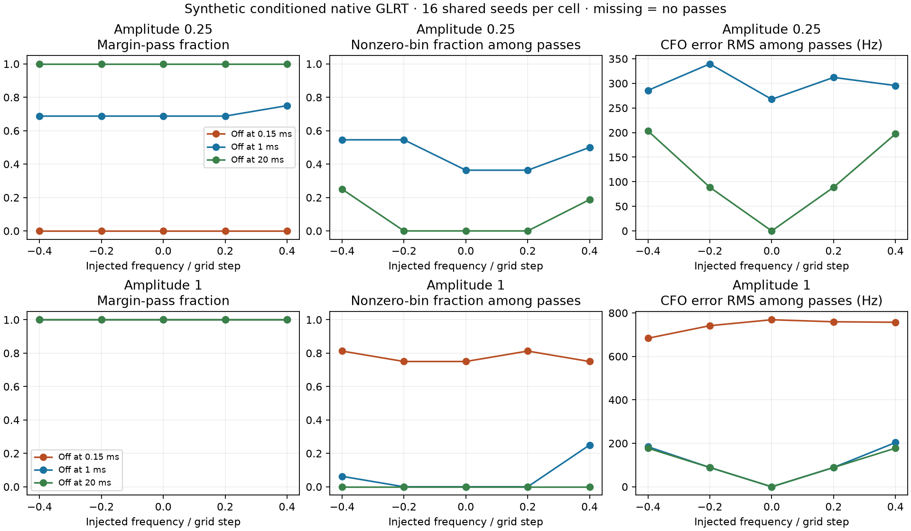

# Off-grid errors depend on support and signal level

The exact **480-call** protocol published at `7a3d0a0bc` completed with **zero
failures**, no retries and no extra native calls. All 74 frozen source hashes
and the complete phase/amplitude/cutoff/seed product were verified. No recording,
orbit, positioning, RF collection or production change was involved.

All five injected frequencies lie inside the nearest-bin-zero cell. The
high-amplitude full-support case returns bin0 for **80/80** calls, exactly the
ordinary rounding pattern: error equals minus the injected frequency.
Other cases show additional peak-bin mistakes, even among margin-passing
measurements. These are estimator errors, not new physical alias branches.

| Signal multiplier | Signal turns off | Passes /80 | Nonzero bins among passes |
|---:|---:|---:|---:|
| .25 | .15 ms | 0 | undefined |
| .25 | 1 ms | 56 | 26/56 |
| .25 | 20 ms | 80 | 7/80 |
| 1 | .15 ms | 80 | 62/80 |
| 1 | 1 ms | 80 | 5/80 |
| 1 | 20 ms | 80 | 0/80 |

These pooled counts are descriptive: the same 16 noise seeds are reused over
five phases, so 80 rows are not 80 independent noise realizations. The
[all-30-cell table](ALL_CELLS.md) reports each cell separately with Wilson95
admission intervals; [summary.json](summary.json) retains unconditional and
admitted-only signed bias/RMS and complete estimated-bin histograms. Raw
[480 admitted/rejected rows](result.json) retain injected and estimated CFO,
frequency error, exact/control score, margin and execution time.

At amplitude1 with only .15 ms of signal, all five phase cells pass16/16,
but their error RMS ranges **684–769 Hz**. At amplitude.25 with full support,
extra-bin errors occur only near the tested ±.4-bin phases (four and three
cases respectively); central phases return bin0. Thus a passing margin does
not establish a narrow CFO error law, and a global symmetric ±one-bin mixture
is not identified by this small simulation. Positive sample bias in the short,
strong-burst cells shares the same noise realizations across phases; it is not
evidence for a population-wide physical frequency bias. The tested phase range
does not include half-bin ties or physical wrap seams.

The earlier [120](../2026_10_09_position_error_iter120/SYNTHETIC_RESULTS.md)
used different seeds and only injected bin0. Its per-cell counts need not recur
with these new seeds. No amplitude, cutoff, phase or seed was adjusted after
inspection. No universal mixture weights, visibility-to-detection curve or
measurement-variance calibration were fitted. This supports investigating a
measurement error model conditional on estimator support and signal conditions;
it does not justify deploying a broad-tail positioning likelihood or predict
better localization. Blind acquisition, fractional bracketing, candidate
competition and physical fading/occultation remain untested here.

Execution took **1.6416 s** including **.5277 s** build time. Summed native call
time was **.06521 s** (median **.1348 ms**, maximum **.3046 ms**). These are
conditioned synthetic host timings, not embedded or full acquisition costs.
The binary hash matches120's source-built binary. The local binary is retained
without requiring publication; [build metadata](native.so.build.json),
[exclusive claim](started.json), raw result and summary hashes document the run.

Result SHA256:
`47da4c33501e3f4939cb1fd9d24f551a1acd4e8de9c62b1ac1f5d22742fa4cf6`.
Protocol SHA256:
`137450b92cdb4642072a6d89e9f7fb9b67eae6fd948f7d0a91fcd4cabdcad59a`.
Library SHA256:
`f473f283a6e5d8aca6235d3f521b4e77e8d54a0b576266f678630eb011544ea1`.
