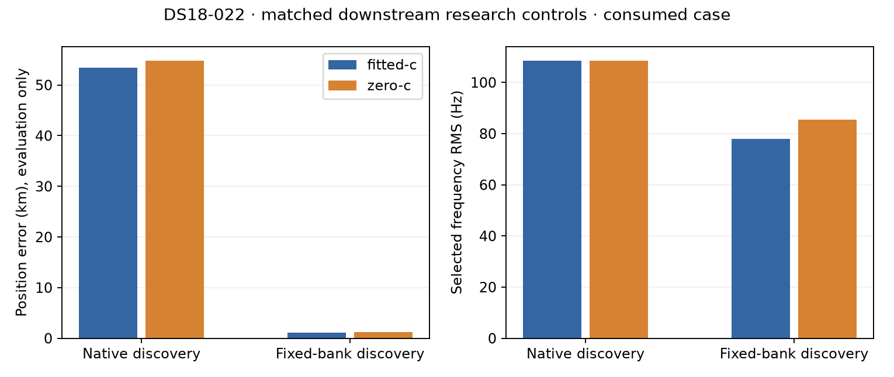

# DS18-022: fixed-bank discovery reaches a substantially better final position

Both frozen research branches completed. Continuing the fixed-bank discovery
regions reduced fitted-c position error from **53.401km to1.122km**, and zero-c
error from **54.832km to1.196km**. Reference coordinates were opened only after
both branches sealed; they did not select discovery regions or operational winners.

| Final arm | Native discovery error, km | Fixed-bank discovery error, km | Native RMS, Hz | Fixed RMS, Hz |
|---|---:|---:|---:|---:|
| Fitted c |53.400741|1.122252|108.564524|77.874385|
| c=0 |54.832123|1.196334|108.488118|85.429185|

The frequency improvement is reported separately from position accuracy. Final
objectives were32495.829052 versus26561.853104 for fitted c, and32510.791249 versus
26633.743307 for c=0. Those raw scores use different region-specific satellite banks
and must not be interpreted as a calibrated cross-bank comparison or as the reason
position improved. The position conclusion comes from sealed endpoint evaluation.

Native selected retained-1, centered at(-142.5,-107.5)km; fixed selected retained-0,
centered at(-107.5,-82.5)km. Each branch used its own ordinary regional winner rule
and fitted-led shared start/support for both final c arms, followed by unchanged B7
stages. All four selected B7 endpoints passed the unchanged independent KKT0.001
gate: native fitted9.7933e-6, native zero2.6624e-5, fixed fitted7.6004e-5 and fixed
zero1.2098e-4. No unqualified fit was substituted as a selected endpoint.

All three calibrations and associations completed in each branch. Native regional
finals qualified13/18 (fitted9/9, zero4/9); fixed qualified16/18 (fitted7/9, zero9/9).
The seven unqualified regional fits remain in raw receipts and were excluded from
regional winner selection. All24 joint-stage arm fits across B3/B4/B4W/B5/C6/B7
qualified. No stage exception, branch failure, fallback or unfinished claim occurred.

Each branch completed in one slice: native43.405s, fixed44.546s, including corpus
reconstruction and downstream processing. Search was already completed separately
in iteration116 (828.033s total across four discovery queues, with historical
fitted coarse reuse). These figures are not four fresh search runtimes or an
embedded-performance benchmark.

This is a **single already-consumed conditional case**, not independent validation
or a full-cohort improvement. Both branches deliberately used the same direct
retained-region calibration path, rather than deployed ordinary calibration. Each
used exactly its three frozen fitted-discovery regions; no native/fixed union,
additional retention passes or ground-truth seeds were introduced. Zero-discovery
sensitivity remains deferred. The result supports further matched reference-free
testing of comparable search scores; it does not establish a deployment default.

The compact [summary](DOWNSTREAM_SUMMARY.json) preserves every region's qualification
counts, selected arms, frequency metrics, slice totals and bound evaluation authority.
[Reporting code](publish_downstream.py) regenerates summary/PNG from sealed receipts
using the same public evaluation port; it contains no fit or objective calls.
Raw receipts are retained locally and supplied as a deterministic archive separately
from frozen numerical sources. The integrity manifest records all raw-file hashes,
source/input verification and archive readback verification. Extract only the archive's
controlled `results/` paths into this report directory; never extract an untrusted
archive without checking its manifest and path names first.
