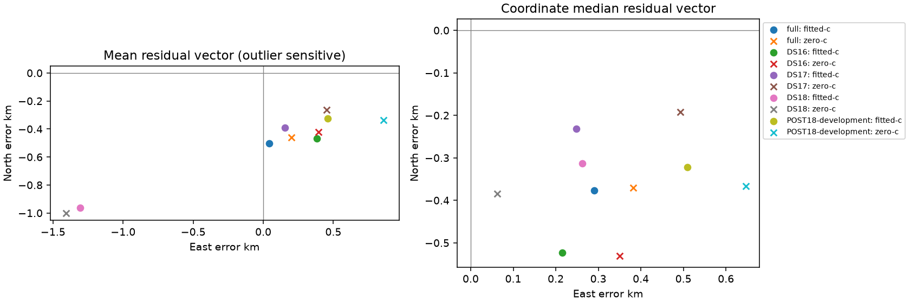

# Shared southward component remains in both c arms

All 193 consumed development endpoints are included. The fixed chart originates at the first ordinary fitted-c selected endpoint, never at truth. These are descriptive evaluation vectors, not corrections or causal identification.

|Dataset|Arm|Count|Mean east/north km|Median east/north km|RMS norm km|
|---|---|---:|---|---|---:|
|full|fitted-c|193|0.0426, -0.5015|0.2907, -0.3772|4.0171|
|full|zero-c|193|0.1994, -0.4613|0.3816, -0.3700|4.2834|
|DS16|fitted-c|63|0.3807, -0.4670|0.2147, -0.5232|1.1647|
|DS16|zero-c|63|0.3939, -0.4202|0.3506, -0.5309|1.5448|
|DS17|fitted-c|51|0.1542, -0.3926|0.2486, -0.2315|0.9951|
|DS17|zero-c|51|0.4510, -0.2618|0.4933, -0.1918|1.5441|
|DS18|fitted-c|34|-1.3051, -0.9631|0.2618, -0.3130|9.2441|
|DS18|zero-c|34|-1.4069, -1.0021|0.0625, -0.3842|9.5136|
|POST18-development|fitted-c|45|0.4610, -0.3246|0.5099, -0.3217|1.2749|
|POST18-development|zero-c|45|0.8558, -0.3361|0.6466, -0.3660|2.0643|

The full fitted median residual vector is (+0.291 east, -0.377 north) km; c=0 is (+0.382, -0.370) km. Every dataset has a southward median component in both arms. Turning c off does not remove that shared component, which argues against attributing the displacement solely to fitted c. It does not distinguish timing/orbit geometry, hardware bias, selection or other common model errors.

Full paired fitted-minus-zero mean displacement is (-0.157, -0.040) km. The full mean residual vectors are strongly affected by the retained DS18 failure; all members remain included. Coordinate median and mean describe different estimators, and vector RMS is not an uncertainty estimate.

**Algebraic coupling:** displacement d = e_fitted - e_zero exactly. Residual/displacement cosine computed from these same endpoints is mechanically coupled, not independent causal evidence. Its alignment cannot establish c-caused bias or identify a physical correction.

No clock features, weak-direction alignment or baseline-to-candidate displacement were evaluated: gauges and coordinate transport were not admitted. No frequency fit, model call, optimizer, new correction, reserve inspection or standalone accuracy improvement occurred. Full signed vectors and paired quantities: [evaluation.json](evaluation.json).
