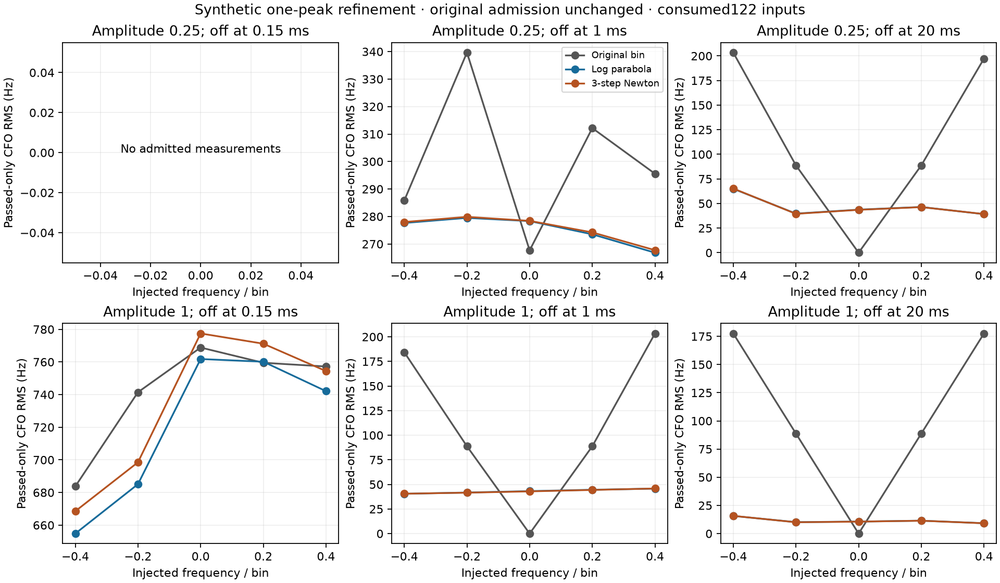

# Cheap refinement removes much rounding error, but not partial-burst tails

All **480 matched native calls** completed after protocol publication
`c4de5d9d1`. Both refinements used the same actual native winning bin and
unchanged admission for every input. There were **zero native/Python/baseline
parity failures**; all **79 frozen source hashes** verified. No extra trials,
tuning, recording input, positioning or production change occurred.

| Signal multiplier | Signal off | Admitted n | Original CFO RMS Hz | Log parabola | Three-step Newton |
|---:|---:|---:|---:|---:|---:|
| .25 | .15 ms | 0 | undefined | undefined | undefined |
| .25 | 1 ms | 56 | 301.06 | 275.06 | 275.54 |
| .25 | 20 ms | 80 | 138.61 | 47.78 | 47.76 |
| 1 | .15 ms | 80 | 742.77 | 722.08 | 735.28 |
| 1 | 1 ms | 80 | 135.00 | 43.17 | 43.10 |
| 1 | 20 ms | 80 | 125.55 | 11.66 | 11.63 |

Full-support improvement is substantial in this conditional synthetic test.
Very short, strong bursts retain large CFO errors: interpolation cannot fix
an incorrect coarse peak. At injected bin zero, rounding previously returned
exactly the signal frequency in several cells; refinement exposes random
continuous peak displacement and can worsen those individual cases. No
variant is selected per cell or per measurement.

Among the **376 originally admitted measurements**, pooled RMS changes
377.10→350.88Hz (parabola) and356.71Hz (Newton). But p95 absolute error worsens
887.78→967.91/991.34Hz. Worst absolute error improves1686.79→1482.46/1510.27Hz.
Parabola has **263 improvements and105 regressions exceeding1Hz**; Newton has
264 and110. Largest individual absolute-error increases are217.03/221.12Hz.
The1Hz reporting threshold is descriptive, not a predeclared promotion gate.
All480 unconditional rows are retained: RMS slightly worsens13419.38→
13427.06Hz for either refinement because rejected noise-dominated estimates
remain arbitrary. No admission or tail failure is hidden.

The [all30-cell table](ALL_CELLS.md) records paired regressions. The complete
[summary](summary.json) supplies unconditional/admitted bias, RMS, p95, worst,
and all16 seed-group metrics; [raw results](result.json) preserve every original
row, both estimates and acceptance reasons. The same16 noise seeds are shared
over30 conditions, so480 rows are not independent trials. Across each seed's
originally admitted conditions, mean RMS gain is39.25Hz with sample SD36.17Hz
for parabola (range−26.41 to86.92;13/16 positive), and34.46Hz with SD39.20Hz
for Newton (range−32.76 to86.67;12/16 positive). These are descriptive group
dispersions, not independent geographic or RF validation. Each seed's number
of admitted conditions can differ, and mean seed gain is not pooled RMS gain.

Parabola proposals were accepted466/480 times;14 retained the original bin
because exact power decreased. Newton completed its three-step budget387
times and stopped on a decreasing proposal93times; such stopping may retain
an earlier accepted step, so it does **not** mean93 unchanged outputs. Actual
step counts and reasons remain in every raw row. No acceptance tolerance was
changed after observing results.

Total run time was **2.440s** including build/preparation. Native calls summed
.07189s (median.1480ms); Python correlation reconstruction .44299s (median
.9070ms); both refinements together .05893s (median.1203ms). These Python
research costs include reconstruction and spectrum formation; they do not
measure the incremental cost of reusing arrays inside a native scanner.
No embedded-speed claim or native ABI change is made.

Source/build integrity is recorded in [summary.json](summary.json),
[build receipt](native.so.build.json) and [exclusive claim](started.json).
Result SHA256:
`56dbcac4e7055f4d3495b961f98d29476e337b633a6696e7a4f8daee9070cbca`.
Protocol SHA256:
`58a088a42f656e9451a49983d6d0eed367aec9ca44e16673241c65984adaace2`.
The unchanged native binary digest is
`f473f283a6e5d8aca6235d3f521b4e77e8d54a0b576266f678630eb011544ea1`.

These are consumed122 synthetic inputs. Both fixed variants should next face
new noise seeds without parameter changes, before any existing-recording
re-extraction. The earlier continuous-refinement work already established
within-alias benefits; this result adds evidence for a cheaper approximation,
not a new universal measurement floor or proven position improvement.
