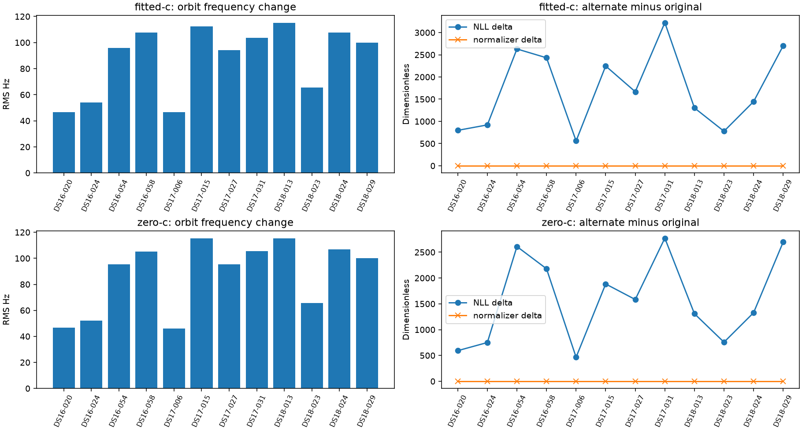

# Relative orbital phase versus ECEF query timing

Coverage 12/12 complete; 0 failed. Full12 metrics withheld unless all12 complete. No optimizer ran and endpoints were unchanged.

|Arm|Quantity|Median|Min|Max|
|---|---|---:|---:|---:|
|fitted-c|nll_delta|1556.5|559.66|3223.08|
|fitted-c|normalizer_delta|0|0|0|
|fitted-c|prediction_delta_rms_hz|97.8302|46.5337|114.991|
|fitted-c|visibility_changed|0|0|0|
|zero-c|nll_delta|1455.72|465.722|2771.71|
|zero-c|normalizer_delta|0|0|0|
|zero-c|prediction_delta_rms_hz|97.7042|46.1492|115.229|
|zero-c|visibility_changed|0|0|0|

Original objective parity max 0.0; summed receipt costs 141.388s, not parallel wall time.

This is a different physical timing convention, not a demonstrated bug fix. Relative phase undoes constant-rate Earth rotation while common timestamp timing remains unchanged. Priors cancel at fixed endpoints. Alternative NLL and frequency changes do not establish better position accuracy or choose the physical model. Visibility derivatives are omitted; temporal data gradients are not complete objective stationarity tests. Precision GMST curvature and direct propagation are outside this approximation. No known receiver coordinates entered.

|Member|Status|Failure|
|---|---|---|
|DS16-020|complete||
|DS16-024|complete||
|DS16-054|complete||
|DS16-058|complete||
|DS17-006|complete||
|DS17-015|complete||
|DS17-027|complete||
|DS17-031|complete||
|DS18-013|complete||
|DS18-023|complete||
|DS18-024|complete||
|DS18-029|complete||
