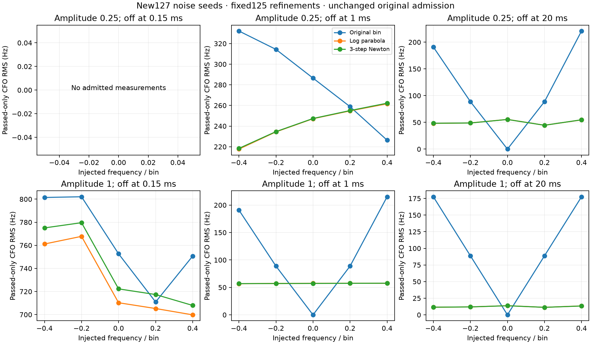

# Fixed refinements improve CFO RMS on new synthetic noise

The independently seeded480-call replication completed after protocol
publication `d9e97a7f4`, with **zero failures or native/Python parity mismatches**.
All83 frozen source hashes verified. Exactly seeds127000..127015 were used,
with both125 refinements unchanged. No additional trials, tuning, recording
reads, positioning fits or production changes occurred.

| Signal multiplier | Turn-off | Original passes | Original RMS Hz | Log parabola | Three-step Newton |
|---:|---:|---:|---:|---:|---:|
| .25 | .15 ms | 0/80 | undefined | undefined | undefined |
| .25 | 1 ms | 61/80 | 286.66 | 243.48 | 243.87 |
| .25 | 20 ms | 80/80 | 142.11 | 50.53 | 50.57 |
| 1 | .15 ms | 80/80 | 764.35 | 729.44 | 741.09 |
| 1 | 1 ms | 80/80 | 140.37 | 57.27 | 57.27 |
| 1 | 20 ms | 80/80 | 125.55 | 12.43 | 12.40 |

Admission remains the original native margin verdict for both refinements.
The new noise replicates the full-support benefit and persistent short-burst
tails observed in125. This is independent-noise replication in the **same
fixed simulation family**, not independent real-RF or location validation.

Among381 admitted rows, pooled RMS384.08→349.96Hz for parabola and355.11Hz
for Newton. P95 absolute error799.01→710.23/726.49Hz and worst1775.57→
1618.99/1653.62Hz improve in this run. In125 p95 worsened, so these trials do
not demonstrate uniform tail improvement. Parabola has264 improvements and109
regressions exceeding1Hz; Newton267 and112. Largest individual absolute-error
increases are212.52/221.95Hz. The reporting threshold is descriptive, not a
promotion criterion. Across all480 rows, including the original rejects,
RMS18437.46→18448.08/18447.32Hz slightly worsens; large arbitrary estimates
from noise-dominated rejected windows remain visible in the summary.

The same16 seeds are reused across30 cells. Reported80-row groups therefore
are not80 independent trials. Across each independent seed's admitted
conditions, mean RMS gain is47.97Hz with sample SD22.75Hz for parabola
(range−6.69 to87.77Hz), and43.49Hz with SD25.19Hz for Newton
(range−10.26 to88.72Hz). Both improve15/16 seed groups. These are descriptive
group dispersions, not confidence bounds on field localization. Different
seed groups have different numbers of admitted conditions.

Parabola accepts472/480 proposals and retains baseline for8 exact-power
decreases. Newton reaches its three-step limit402 times and stops on a
decreasing proposal78 times; the latter may retain an earlier accepted step,
not necessarily baseline. The same acceptance rules and iteration limits
were used without changes. Neither method repairs an incorrect coarse peak.

[All30 phase cells](ALL_CELLS.md) show paired regressions; [summary.json](summary.json)
contains unconditional/admitted bias, RMS, p95, worst,16 seed groups and
fallback reasons. [Raw result](result.json) and [append-only rows](rows.jsonl)
contain all480 original and refined outputs; exact membership and equality
between both artifacts verified. No missing metric is zero-filled.

Total elapsed **2.648s**, including **.545s** build. Summed native calls:
.07200s (median.1485ms); Python correlation reconstruction:.41902s
(median.8573ms); both refinements:.05762s (median.1184ms). These are host
research timings, not incremental embedded costs. [Build receipt](native.so.build.json)
and [exclusive claim](started.json) preserve execution provenance. No binary
publication is required; local native binary hash matches125.

Result SHA256:
`5cc07acc0e998c7b09346a0eb1fc77c65b263b8bd866c6f1cc27668a06771807`.
Protocol SHA256:
`a4228b2c4ea8dda1ba5c676670c0d02f230abc4f07d9babf45676806c809f860`.
Library SHA256:
`f473f283a6e5d8aca6235d3f521b4e77e8d54a0b576266f678630eb011544ea1`.

No promotion claim follows. Both estimators remain fixed research candidates;
the next authorized preparation is original-observation IQ re-extraction with
unchanged selection, admission and required baseline parity. No128 IQ reads
have been made.
