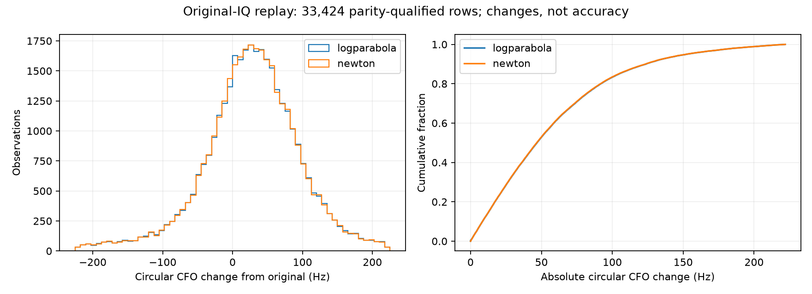

# Original-observation CFO replay

All twelve consumed-development recordings retain their original observation membership. No position fit, reference error, reacquisition or admission change occurred.

**DS18-029 failed for 1,782 of its 2,771 observations**: 1,768 visit counter/count mismatches and 14 out-of-range reader requests. The other 989 rows passed. The adapter treated sparse event IDs as retained-visit ordinals. Public metadata shows the first difference at ordinal715→event718; mapping through the manifest predicts exactly every failed row. Guards prevented scoring the wrong IQ. All eleven other members passed. These failures remain in the frozen receipts; [the separately proposed successor](../2026_10_10_position_error_iter134/README.md) does not erase them. Full twelve-member positioning is unavailable from128 alone.

| Member | Original rows | Parity passed | Other outcomes | Elapsed seconds |
|---|---:|---:|---:|---:|
| DS16-020 | 3515 | 3515 | 0 | 42.85 |
| DS16-024 | 3406 | 3406 | 0 | 132.42 |
| DS16-054 | 3073 | 3073 | 0 | 101.39 |
| DS16-058 | 2921 | 2921 | 0 | 100.61 |
| DS17-006 | 2389 | 2389 | 0 | 83.22 |
| DS17-015 | 3378 | 3378 | 0 | 128.45 |
| DS17-027 | 2648 | 2648 | 0 | 38.29 |
| DS17-031 | 3011 | 3011 | 0 | 104.83 |
| DS18-013 | 2609 | 2609 | 0 | 32.70 |
| DS18-023 | 2549 | 2549 | 0 | 30.92 |
| DS18-024 | 2936 | 2936 | 0 | 103.94 |
| DS18-029 | 2771 | 989 | 1782 | 74.88 |

Only rows passing exact frozen baseline parity contribute to change summaries. Any failures remain listed in summary.json and raw receipts; they are not replaced. Circular changes and representation wraps are reported separately. Smaller or nonzero changes do not establish more accurate real-corpus frequency estimates, and no localization gain is claimed.

| Refiner | RMS change Hz | Median absolute Hz | p95 Hz | Maximum Hz | Wraps |
|---|---:|---:|---:|---:|---:|
| logparabola | 73.932 | 46.871 | 152.504 | 221.923 | 84 |
| newton | 73.725 | 46.673 | 152.221 | 221.946 | 84 |

Timing includes reading and replay; per-row scorer elapsed is available separately. Peak RSS was not measured. The 1,200-second cap is soft and checked between calls. Runtime is not an embedded-device speed claim.
