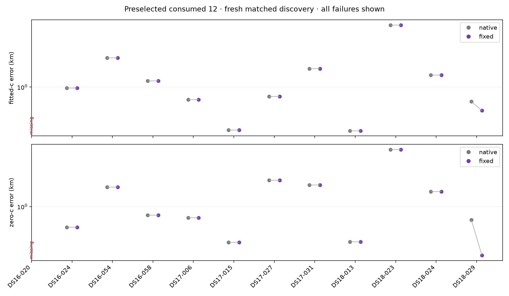

# Fresh native versus fixed-bank discovery on the preselected twelve

Consumed conditional development, not independent validation. Both policies use the same fresh 400-point discovery budget, three retained regions and symmetric downstream calibration. Fitted-c discovery feeds matched fitted-c and zero-c finals. This research control differs from deployed B7 and has no archived parity claim.

All twelve members are terminal. Missing endpoints remain explicit; the original DS16-020 admission failure is preserved. Any separately budgeted successor is a separate experiment. Frequency fit and objective are descriptive and are not used to infer position improvement across differing banks.

| Dataset | Arm | Paired / members | Native mean / median / p95 / worst km | Fixed mean / median / p95 / worst km | Regressions >0.1 km |
|---|---|---:|---|---|---:|
| DS16 | fitted-c | 3 / 4 | 1.2943 / 1.1271 / 1.7100 / 1.7747 | 1.2943 / 1.1271 / 1.7100 / 1.7747 | 0 |
| DS16 | zero-c | 3 / 4 | 1.0060 / 0.8169 / 1.5153 / 1.5929 | 1.0060 / 0.8169 / 1.5153 / 1.5929 | 0 |
| DS17 | fitted-c | 4 / 4 | 0.8680 / 0.8049 / 1.3439 / 1.4345 | 0.8680 / 0.8049 / 1.3439 / 1.4345 | 0 |
| DS17 | zero-c | 4 / 4 | 1.1845 / 1.2211 / 1.8411 / 1.8699 | 1.1845 / 1.2211 / 1.8411 / 1.8699 | 0 |
| DS18 | fitted-c | 4 / 4 | 1.4576 / 1.0092 / 3.0710 / 3.3893 | 1.4273 / 0.9487 / 3.0710 / 3.3893 | 0 |
| DS18 | zero-c | 4 / 4 | 1.6197 / 1.0755 / 3.5271 / 3.8979 | 1.5166 / 0.9279 / 3.5271 / 3.8979 | 0 |
| all12 | fitted-c | 11 / 12 | 1.1987 / 0.9812 / 2.5820 / 3.3893 | 1.1876 / 0.9812 / 2.5820 / 3.3893 | 0 |
| all12 | zero-c | 11 / 12 | 1.2941 / 0.8169 / 2.8839 / 3.8979 | 1.2566 / 0.8169 / 2.8839 / 3.8979 | 0 |

Metrics with missing pairs describe the available paired subset only; full-member metrics are withheld.

Selected endpoints: 44/44 qualified. Retained calibrations: 66/66 qualified. Regional finals: 381/396 qualified. Joint-stage attempts: 253/254 qualified. Unqualified intermediate/regional attempts remain explicit; a completed branch does not mean every attempt qualified.

Sum of recorded phase elapsed times: shared search 6234.555s, native continuation 719.962s, fixed continuation 706.342s; total 7660.859s. Native/fixed searches share durable point fits, so this is not two independent search runtimes or an embedded-speed benchmark. Pending/resume invocation times and their byte hashes are included. Phases without measured invocation time: 0. Whole-controller wall time is unmeasured; process imports/hash checks/startup outside the recorded timers are excluded. The separately budgeted iteration 131 successor is excluded.

Maximum positive paired regression (fitted-c): 1.86966002458e-07 km (0.186966 mm). All positive differences, including roundoff-scale differences, remain counted in the summary.

Maximum positive paired regression (zero-c): 5.6386466496e-08 km (0.056386 mm). All positive differences, including roundoff-scale differences, remain counted in the summary.

DS18-029 fitted-c: selected native stage B7, fixed stage B1. Position error 0.750741 → 0.629712 km; frequency RMS 58.628 → 89.331 Hz. These endpoints differ in stage and potentially association/bank; this is not a matched completed-B7 stage improvement or evidence that better frequency fit explains position gain.

DS18-029 zero-c: selected native stage B7, fixed stage B3. Position error 0.725230 → 0.312646 km; frequency RMS 60.091 → 67.367 Hz. These endpoints differ in stage and potentially association/bank; this is not a matched completed-B7 stage improvement or evidence that better frequency fit explains position gain.

Unqualified joint stage: DS18-029 fixed B3 fitted-c. Its earlier qualified candidate was preserved by the frozen policy.

| Member | Search | Native | Fixed | Fitted-c delta km | Zero-c delta km |
|---|---|---|---|---:|---:|
| DS16-020 | failed | not-run-search-failed | not-run-search-failed | missing | missing |
| DS16-024 | complete | complete | complete | +0.0000 | +0.0000 |
| DS16-054 | complete | complete | complete | +0.0000 | +0.0000 |
| DS16-058 | complete | complete | complete | +0.0000 | +0.0000 |
| DS17-006 | complete | complete | complete | +0.0000 | +0.0000 |
| DS17-015 | complete | complete | complete | +0.0000 | +0.0000 |
| DS17-027 | complete | complete | complete | +0.0000 | +0.0000 |
| DS17-031 | complete | complete | complete | +0.0000 | +0.0000 |
| DS18-013 | complete | complete | complete | +0.0000 | +0.0000 |
| DS18-023 | complete | complete | complete | +0.0000 | +0.0000 |
| DS18-024 | complete | complete | complete | +0.0000 | +0.0000 |
| DS18-029 | complete | complete | complete | -0.1210 | -0.4126 |

Positive delta means fixed-bank regression. Full frequency metrics, qualification counts, failure reasons and phase elapsed times are retained in [the compact summary](PILOT_SUMMARY.json). Raw receipts remain local; their byte hashes are published, not a remote raw-data reproduction bundle.

The original DS16-020 failed search cost 7.292978472s and is included in the recorded search total. [Iteration 131](../2026_10_09_position_error_iter131/RESULTS.md) separately reports its added 975.329897197s successor cost; none of its endpoints replace the missing pair here.

The modest mean change comes from one available pair; typical errors and the worst case remain essentially unchanged. This consumed conditional pilot does not establish broad typical improvement, a new full-193 mean, or a case for deploying fixed-bank discovery. A fresh full-cohort search is not implied by these results.
