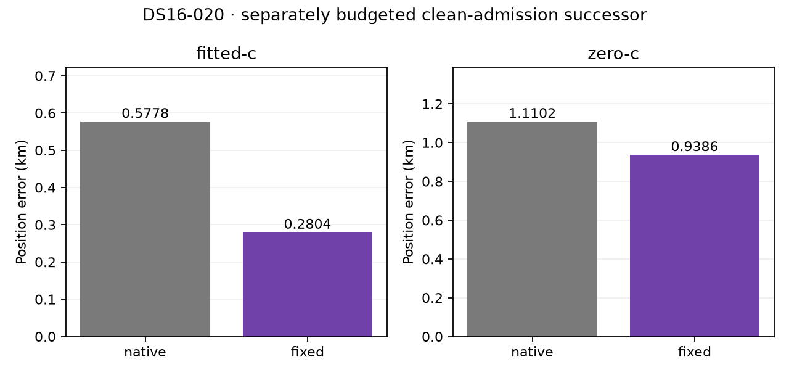

# DS16-020: separately budgeted clean-admission successor

All three successor phases are complete. Iteration 129's original admission failure and both skipped branches remain unchanged. This consumed one-member experiment is reported separately; it does not fill iteration 129's missing pair or establish generalization.

| Arm | Native error km | Fixed error km | Fixed minus native km | Native / fixed frequency RMS Hz | Native / fixed objective |
|---|---:|---:|---:|---|---|
| fitted-c | 0.577794 | 0.280393 | -0.297401 | 74.505 / 69.972 | 40447.878340 / 39293.319663 |
| zero-c | 1.110248 | 0.938627 | -0.171621 | 147.701 / 145.825 | 41530.672687 / 41412.460206 |

Positive delta means a fixed-bank regression. Objectives/frequency fit are descriptive: discovery, regions and fitted-led support may differ across policies. No cross-policy objective winner was selected. Both final c arms have matched observations, priors and search budgets within each policy.

Actual saved phase time: search 730.372s, native 116.838s, fixed 128.120s; total 975.330s. This added successor cost is separate from the original iteration 129 failure (7.292978472s). Original plus successor actual cost is 982.622875669s; the scheduled iteration 135 intermission is not charged as compute time.

All four selected B7 endpoints independently qualified at the unchanged 0.001 KKT gate. All six retained calibrations qualified. Regional final qualification was 15/18 for native and 17/18 for fixed; joint-stage qualification was 12/12 and 11/12. The fixed zero-c B4 intermediate failed qualification; its final B7 endpoint qualified. Every unqualified attempt remains reported, without selection as an endpoint. All 36 regional final attempts and joint-stage qualifications are retained in [the compact summary](SUMMARY.json). Raw receipts remain local, with hashes published; no remote raw replay bundle is claimed. References were accessed only after both successor branches sealed.
