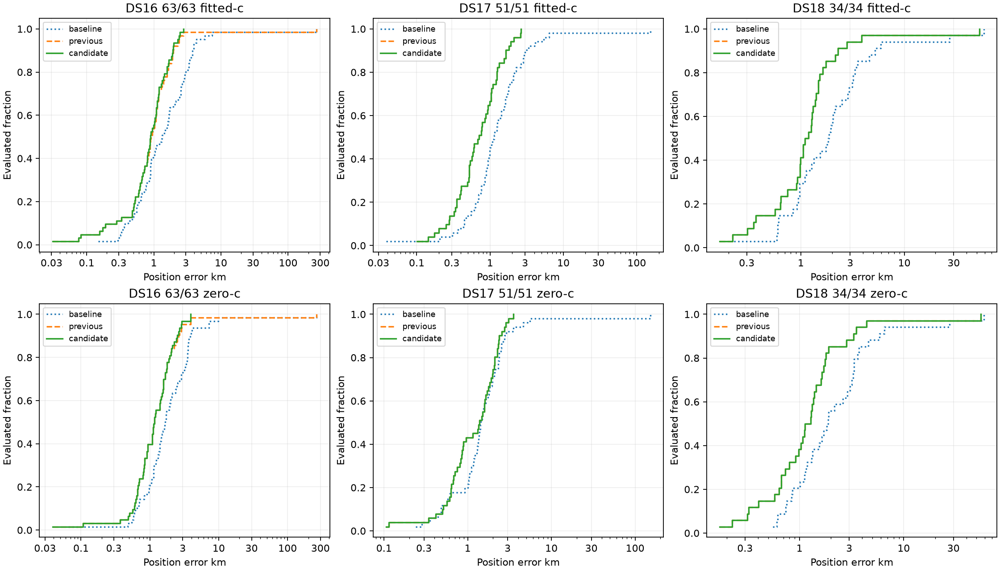

# Iteration 51: uniform additive region policy, 148/148 completed

This is a descriptive completion checkpoint at 2026-10-09T01:19:59.229153+00:00.
All 63 DS16, 51 DS17 and 34 DS18 members remain in the denominator. Pending,
unstarted and failed members are listed explicitly; subset means are not
full-dataset results. No new independent validation claim is made.

## Position error on the matched completed subset

| Dataset evaluated/full | Arm | Model | Mean km | Median km | p95 km | Worst km |
|---|---|---|---:|---:|---:|---:|
| DS16 63/63 | fitted-c | baseline | 5.964 | 1.322 | 4.286 | 265.277 |
| DS16 63/63 | fitted-c | previous | 5.224 | 0.909 | 2.377 | 265.789 |
| DS16 63/63 | fitted-c | candidate | 1.017 | 0.885 | 2.238 | 2.751 |
| DS16 63/63 | zero-c | baseline | 6.355 | 1.660 | 6.890 | 264.604 |
| DS16 63/63 | zero-c | previous | 5.484 | 1.161 | 2.875 | 261.743 |
| DS16 63/63 | zero-c | candidate | 1.363 | 1.161 | 2.846 | 3.903 |
| DS17 51/51 | fitted-c | baseline | 4.477 | 1.132 | 4.789 | 152.840 |
| DS17 51/51 | fitted-c | previous | 0.864 | 0.708 | 2.009 | 2.635 |
| DS17 51/51 | fitted-c | candidate | 0.864 | 0.708 | 2.009 | 2.635 |
| DS17 51/51 | zero-c | baseline | 4.585 | 1.434 | 4.048 | 151.707 |
| DS17 51/51 | zero-c | previous | 1.417 | 1.388 | 2.794 | 3.519 |
| DS17 51/51 | zero-c | candidate | 1.417 | 1.388 | 2.794 | 3.519 |
| DS18 34/34 | fitted-c | baseline | 4.422 | 1.852 | 13.381 | 58.694 |
| DS18 34/34 | fitted-c | previous | 2.739 | 1.140 | 3.168 | 53.140 |
| DS18 34/34 | fitted-c | candidate | 2.739 | 1.140 | 3.168 | 53.140 |
| DS18 34/34 | zero-c | baseline | 4.618 | 1.856 | 13.926 | 58.727 |
| DS18 34/34 | zero-c | previous | 2.918 | 1.209 | 3.818 | 54.922 |
| DS18 34/34 | zero-c | candidate | 2.918 | 1.209 | 3.818 | 54.922 |

## Historical subset and exposure accounting

These groups are frozen by prior inventory bindings, never selected by outcomes.
The original 48 and added 15 exhaust DS16. DS18's prior-registry group contains
the 24 previously consumed recordings; the other 10 had no registry match, which
does not prove they were unseen. All evaluated members are now consumed research.
Incomplete groups below remain partial; no subgroup substitutes for a full dataset.

| Group evaluated/full | Arm | Model | Mean km | Median km | p95 km | Worst km |
|---|---|---|---:|---:|---:|---:|
| DS16 original 48 48/48 | fitted-c | baseline | 1.886 | 1.518 | 4.186 | 7.314 |
| DS16 original 48 48/48 | fitted-c | previous | 1.057 | 1.013 | 2.168 | 2.751 |
| DS16 original 48 48/48 | fitted-c | candidate | 1.057 | 1.013 | 2.168 | 2.751 |
| DS16 original 48 48/48 | zero-c | baseline | 2.245 | 1.631 | 6.109 | 9.870 |
| DS16 original 48 48/48 | zero-c | previous | 1.347 | 1.163 | 2.769 | 3.903 |
| DS16 original 48 48/48 | zero-c | candidate | 1.347 | 1.163 | 2.769 | 3.903 |
| DS16 added 15 15/15 | fitted-c | baseline | 19.016 | 1.041 | 82.334 | 265.277 |
| DS16 added 15 15/15 | fitted-c | previous | 18.558 | 0.733 | 81.448 | 265.789 |
| DS16 added 15 15/15 | fitted-c | candidate | 0.892 | 0.733 | 1.908 | 2.445 |
| DS16 added 15 15/15 | zero-c | baseline | 19.506 | 1.929 | 82.056 | 264.604 |
| DS16 added 15 15/15 | zero-c | previous | 18.724 | 1.115 | 80.537 | 261.743 |
| DS16 added 15 15/15 | zero-c | candidate | 1.416 | 1.115 | 2.744 | 2.877 |
| DS18 prior registry 24 24/24 | fitted-c | baseline | 5.486 | 1.809 | 24.052 | 58.694 |
| DS18 prior registry 24 24/24 | fitted-c | previous | 3.293 | 1.122 | 3.545 | 53.140 |
| DS18 prior registry 24 24/24 | fitted-c | candidate | 3.293 | 1.122 | 3.545 | 53.140 |
| DS18 prior registry 24 24/24 | zero-c | baseline | 5.728 | 1.767 | 24.465 | 58.727 |
| DS18 prior registry 24 24/24 | zero-c | previous | 3.546 | 1.209 | 4.247 | 54.922 |
| DS18 prior registry 24 24/24 | zero-c | candidate | 3.546 | 1.209 | 4.247 | 54.922 |
| DS18 no prior registry match 10 10/10 | fitted-c | baseline | 1.870 | 1.945 | 3.359 | 3.538 |
| DS18 no prior registry match 10 10/10 | fitted-c | previous | 1.411 | 1.247 | 2.561 | 2.794 |
| DS18 no prior registry match 10 10/10 | fitted-c | candidate | 1.411 | 1.247 | 2.561 | 2.794 |
| DS18 no prior registry match 10 10/10 | zero-c | baseline | 1.955 | 2.025 | 3.488 | 3.603 |
| DS18 no prior registry match 10 10/10 | zero-c | previous | 1.409 | 1.230 | 3.080 | 3.291 |
| DS18 no prior registry match 10 10/10 | zero-c | candidate | 1.409 | 1.230 | 3.080 | 3.291 |

| Group | Arm | Better/worse/tied | Failed/not reached | Fallbacks |
|---|---|---:|---:|---:|
| DS16 original 48 | fitted-c | 0/0/48 | 1/0 | 1 |
| DS16 original 48 | zero-c | 0/0/48 | 1/0 | 1 |
| DS16 added 15 | fitted-c | 1/0/14 | 0/0 | 0 |
| DS16 added 15 | zero-c | 1/0/14 | 0/0 | 0 |
| DS18 prior registry 24 | fitted-c | 0/0/24 | 0/0 | 0 |
| DS18 prior registry 24 | zero-c | 0/0/24 | 0/0 | 0 |
| DS18 no prior registry match 10 | fitted-c | 0/0/10 | 0/0 | 0 |
| DS18 no prior registry match 10 | zero-c | 0/0/10 | 0/0 | 0 |

Baseline is deployed bounded-recovery hard60 (including qualified historical
replays). Previous is the frozen joint-clock/RF-time/satellite-slope research
candidate. Candidate retains baseline, sep25 and sep50 regions and selects each
arm by eligible regional score, then runs the same downstream model. Original
choices are never discarded because of their reference error.

## Paired changes and frequency fit

| Dataset | Arm | Better/worse/tied | Failed/not reached | Fallbacks | RMS base/previous/new Hz |
|---|---|---:|---:|---:|---:|
| DS16 | fitted-c | 1/0/62 | 1/0 | 1 | 90.17/70.18/69.25 |
| DS16 | zero-c | 1/0/62 | 1/0 | 1 | 120.25/104.15/103.69 |
| DS17 | fitted-c | 0/0/51 | 0/0 | 0 | 79.96/64.88/64.88 |
| DS17 | zero-c | 0/0/51 | 1/0 | 1 | 130.49/122.87/122.87 |
| DS18 | fitted-c | 0/0/34 | 0/0 | 0 | 101.06/75.65/75.65 |
| DS18 | zero-c | 0/0/34 | 0/0 | 0 | 116.13/93.90/93.90 |

Position ties use 1 m tolerance. Frequency RMS is separate from localization;
objectives from different models/banks are not treated as position accuracy.
c=0 and fitted-c retain matched observations, candidate sets, priors, seeds and
budgets within each stage; c=0 also locks RF-time terms. Failed final fits use
only the frozen convergence fallbacks, whose exact receipts remain in results/.

The policy adds computation: the identical ordered 400-point grid is reused,
but new regional calibrations/fits are required. Some older scans had no sep25
replay, so this uniform policy computes missing sep25 as well as sep50. This is
not an equal-total-compute comparison. Each result records archived/new replay
status, borrowed stages and elapsed time. DS16-046 reuses its already consumed
sep50 diagnostic; its success is not relabeled independent validation.

The protocol includes every frozen member, authority/exposure metadata, source
hashes and bindings. DS18 authority and seal remain unchanged. No readiness or
quality filter changes membership. Production, public contracts, golden fixtures,
QNAP data and RF collection are unchanged. Results do not promote a new default.

DS16-020/S14 and DS16-035/S27 initially failed output serialization with missing
bank metadata in their corrected historical baseline documents. The immutable
failures remain in results/. Separately frozen iteration64 retries source only
bank/snapshot metadata from the matching original input document, with digest
and bank-ID checks. Completed retries enter the comparison without changing the
numerical policy; summary.json retains original attempts and completion sources.

## Full membership and outcomes

| Member | Session | Outcome | Fitted-c new km | Zero-c new km | Exposure |
|---|---|---|---:|---:|---|
| DS16-001 | scan-fw-ba4cd19379329520 | complete  | 0.154 | 0.908 | not_matched_in_reviewed_registry_not_unseen_claim |
| DS16-002 | scan-fw-a326fb07c0e9b6e2 | complete  | 0.885 | 1.389 | previously_evaluated_consumed |
| DS16-003 | scan-fw-1ad7f3926e9a03e5 | complete  | 0.082 | 0.623 | previously_evaluated_consumed |
| DS16-004 | scan-fw-3ad2719629e7c60d | complete  | 0.884 | 2.036 | previously_evaluated_consumed |
| DS16-005 | scan-fw-194e6f064a898b85 | complete  | 1.071 | 1.774 | previously_evaluated_consumed |
| DS16-006 | scan-fw-e90e71153f3be029 | complete  | 0.522 | 0.640 | previously_evaluated_consumed |
| DS16-007 | scan-fw-0b8d0887b97b192b | complete  | 1.278 | 0.821 | previously_evaluated_consumed |
| DS16-008 | scan-fw-59521cec45054a41 | complete  | 0.880 | 1.075 | not_matched_in_reviewed_registry_not_unseen_claim |
| DS16-009 | scan-fw-99f3c2befba57d44 | complete  | 0.623 | 2.877 | not_matched_in_reviewed_registry_not_unseen_claim |
| DS16-010 | scan-fw-aa77506012889211 | complete  | 0.189 | 0.845 | previously_evaluated_consumed |
| DS16-011 | scan-fw-8e8033677042ba97 | complete  | 0.839 | 0.369 | not_matched_in_reviewed_registry_not_unseen_claim |
| DS16-012 | scan-fw-9284d4f6ce040d80 | complete  | 1.826 | 1.563 | previously_evaluated_consumed |
| DS16-013 | scan-fw-330829d1e597d288 | complete  | 0.733 | 1.566 | not_matched_in_reviewed_registry_not_unseen_claim |
| DS16-014 | scan-fw-dbf401c02543f194 | complete  | 0.909 | 0.485 | previously_evaluated_consumed |
| DS16-015 | scan-fw-392b4f493b7c3c0e | complete  | 0.615 | 1.408 | not_matched_in_reviewed_registry_not_unseen_claim |
| DS16-016 | scan-fw-3b61d64df77251ca | complete  | 0.173 | 1.926 | previously_evaluated_consumed |
| DS16-017 | scan-fw-5fab2b5974ce6bfb | complete  | 1.200 | 1.774 | previously_evaluated_consumed |
| DS16-018 | scan-fw-13998828c952f265 | complete  | 1.034 | 0.792 | previously_evaluated_consumed |
| DS16-019 | scan-fw-96d70bdc5aef38ed | complete  | 1.985 | 2.592 | previously_evaluated_consumed |
| DS16-020 | scan-fw-151ee2be70b82235 | complete  | 0.076 | 0.664 | previously_evaluated_consumed |
| DS16-021 | scan-fw-389713be72cd8450 | complete  | 0.278 | 0.799 | previously_evaluated_consumed |
| DS16-022 | scan-fw-79f5280d20dd9e65 | complete  | 0.597 | 3.903 | previously_evaluated_consumed |
| DS16-023 | scan-fw-356acff46cd12764 | complete  | 1.165 | 2.687 | not_matched_in_reviewed_registry_not_unseen_claim |
| DS16-024 | scan-fw-0e40d0535caa0b16 | complete  | 1.030 | 0.039 | previously_evaluated_consumed |
| DS16-025 | scan-fw-6ad6175fa731231e | complete  | 0.501 | 0.662 | previously_evaluated_consumed |
| DS16-026 | scan-fw-320fa74020b04d85 | complete  | 1.127 | 2.052 | previously_evaluated_consumed |
| DS16-027 | scan-fw-84eb24f335b96c64 | complete  | 1.122 | 1.081 | previously_evaluated_consumed |
| DS16-028 | scan-fw-6cfa779ffd41637a | complete  | 1.333 | 1.450 | previously_evaluated_consumed |
| DS16-029 | scan-fw-d3b1edc33cb8210d | complete  | 0.860 | 1.131 | previously_evaluated_consumed |
| DS16-030 | scan-fw-de9320ef0602bad8 | complete  | 1.398 | 1.580 | previously_evaluated_consumed |
| DS16-031 | scan-fw-9f4e8b72d567c0bb | complete  | 0.721 | 0.700 | previously_evaluated_consumed |
| DS16-032 | scan-fw-eb9ba03847cd10fb | complete  | 1.558 | 1.499 | previously_evaluated_consumed |
| DS16-033 | scan-fw-0ffe1eede92820a9 | complete  | 0.031 | 0.107 | previously_evaluated_consumed |
| DS16-034 | scan-fw-90722ab71ea4e7bd | complete  | 1.186 | 1.115 | not_matched_in_reviewed_registry_not_unseen_claim |
| DS16-035 | scan-fw-2917f7344e48ba39 | complete  | 1.879 | 1.885 | previously_evaluated_consumed |
| DS16-036 | scan-fw-a8fbd8c43834a765 | complete  | 1.081 | 1.161 | previously_evaluated_consumed |
| DS16-037 | scan-fw-9061ae11d2702df3 | complete  | 1.150 | 1.165 | previously_evaluated_consumed |
| DS16-038 | scan-fw-d6e344d47603fb34 | complete  | 1.421 | 1.394 | previously_evaluated_consumed |
| DS16-039 | scan-fw-6f9e553db123bebd | complete  | 0.996 | 1.117 | previously_evaluated_consumed |
| DS16-040 | scan-fw-fedf239661900a5a | complete  | 0.478 | 0.504 | previously_evaluated_consumed |
| DS16-041 | scan-fw-85f7398f9b9461ec | complete  | 1.679 | 1.667 | not_matched_in_reviewed_registry_not_unseen_claim |
| DS16-042 | scan-fw-a52fc8f717bd9f76 | complete  | 0.472 | 0.809 | not_matched_in_reviewed_registry_not_unseen_claim |
| DS16-043 | scan-fw-c937db2e26dad0aa | complete  | 2.751 | 3.880 | previously_evaluated_consumed |
| DS16-044 | scan-fw-64163dfbcc531a50 | complete  | 0.795 | 0.604 | previously_evaluated_consumed |
| DS16-045 | scan-fw-58975d3328a47507 | complete  | 0.588 | 0.695 | not_matched_in_reviewed_registry_not_unseen_claim |
| DS16-046 | scan-fw-c6c51bfeb6a7c3d9 | complete  | 0.798 | 2.128 | not_matched_in_reviewed_registry_not_unseen_claim |
| DS16-047 | scan-fw-98990902df445215 | complete  | 0.669 | 0.843 | not_matched_in_reviewed_registry_not_unseen_claim |
| DS16-048 | scan-fw-7e51f48fa65d6f81 | complete  | 0.657 | 0.902 | previously_evaluated_consumed |
| DS16-049 | scan-fw-3bf66f35e3a07685 | complete  | 1.567 | 1.665 | previously_evaluated_consumed |
| DS16-050 | scan-fw-7e6fe9f57ae2562c | complete  | 2.445 | 2.500 | not_matched_in_reviewed_registry_not_unseen_claim |
| DS16-051 | scan-fw-899e83e995c96cdf | complete  | 2.389 | 2.437 | previously_evaluated_consumed |
| DS16-052 | scan-fw-7b796c5b898df6bf | complete  | 0.940 | 0.932 | previously_evaluated_consumed |
| DS16-053 | scan-fw-a88b75d9a4cad4ff | complete  | 0.816 | 1.214 | previously_evaluated_consumed |
| DS16-054 | scan-fw-4dbadefb5dadb59d | complete  | 1.901 | 1.756 | previously_evaluated_consumed |
| DS16-055 | scan-fw-5e190e43f0c8c9e2 | complete  | 0.527 | 0.594 | not_matched_in_reviewed_registry_not_unseen_claim |
| DS16-056 | scan-fw-8d94198baa058d67 | complete  | 2.266 | 2.864 | previously_evaluated_consumed |
| DS16-057 | scan-fw-6aa645776351507d | complete  | 1.633 | 2.240 | previously_evaluated_consumed |
| DS16-058 | scan-fw-4099ab8ea46fad71 | complete  | 1.083 | 0.672 | previously_evaluated_consumed |
| DS16-059 | scan-fw-aeea3ef6d81d637f | complete  | 1.941 | 0.930 | previously_evaluated_consumed |
| DS16-060 | scan-fw-19a8822932068f7a | complete  | 0.329 | 1.540 | previously_evaluated_consumed |
| DS16-061 | scan-fw-f8a93156e16bf663 | complete  | 0.509 | 0.560 | previously_evaluated_consumed |
| DS16-062 | scan-fw-ecb0b93df67421a9 | complete  | 0.682 | 1.090 | previously_evaluated_consumed |
| DS16-063 | scan-fw-82df8e587b0af01b | complete  | 0.783 | 1.204 | previously_evaluated_consumed |
| DS17-001 | scan-fw-94a135be557220a2 | complete  | 0.522 | 0.668 | previously_evaluated_consumed |
| DS17-002 | scan-fw-d52ab5a4255e6b69 | complete  | 1.048 | 0.638 | previously_evaluated_consumed |
| DS17-003 | scan-fw-0b7f58e4a4c5f248 | complete  | 0.605 | 0.626 | previously_evaluated_consumed |
| DS17-004 | scan-fw-489095a9b5fac6fa | complete  | 0.281 | 0.828 | previously_evaluated_consumed |
| DS17-005 | scan-fw-3556024e5a9aca59 | complete  | 1.814 | 1.758 | previously_evaluated_consumed |
| DS17-006 | scan-fw-ede4e78d97eba2b8 | complete  | 0.877 | 0.875 | previously_evaluated_consumed |
| DS17-007 | scan-fw-489c6a2a9c099f1f | complete  | 0.521 | 0.853 | previously_evaluated_consumed |
| DS17-008 | scan-fw-f6399482c82aa4ae | complete  | 2.616 | 2.256 | previously_evaluated_consumed |
| DS17-009 | scan-fw-3aeb80c956be3aa4 | complete  | 1.098 | 0.954 | previously_evaluated_consumed |
| DS17-010 | scan-fw-a8c6131bf5668000 | complete  | 1.631 | 2.105 | previously_evaluated_consumed |
| DS17-011 | scan-fw-b730e91a3bc15f50 | complete  | 0.776 | 0.417 | previously_evaluated_consumed |
| DS17-012 | scan-fw-90cf9bd2e3bdf17a | complete  | 0.389 | 1.345 | previously_evaluated_consumed |
| DS17-013 | scan-fw-3998f1ce91552465 | complete  | 0.100 | 0.342 | previously_evaluated_consumed |
| DS17-014 | scan-fw-80e0b5ff0c2281bd | complete  | 0.491 | 0.893 | previously_evaluated_consumed |
| DS17-015 | scan-fw-02fa8ae90161a54e | complete  | 0.336 | 0.501 | previously_evaluated_consumed |
| DS17-016 | scan-fw-cd431e86366d1a4c | complete  | 1.232 | 1.323 | previously_evaluated_consumed |
| DS17-017 | scan-fw-edfd1d12c2197eb2 | complete  | 0.401 | 0.704 | previously_evaluated_consumed |
| DS17-018 | scan-fw-9cc717ef20e35ab4 | complete  | 0.143 | 0.851 | previously_evaluated_consumed |
| DS17-019 | scan-fw-311f43e4ce6623c9 | complete  | 0.353 | 1.829 | previously_evaluated_consumed |
| DS17-020 | scan-fw-70960ed5154a66f4 | complete  | 0.320 | 2.840 | previously_evaluated_consumed |
| DS17-021 | scan-fw-9842f56a548dce0a | complete  | 1.337 | 1.513 | previously_evaluated_consumed |
| DS17-022 | scan-fw-e8dab4957e0fa180 | complete  | 0.771 | 0.564 | previously_evaluated_consumed |
| DS17-023 | scan-fw-ae430bd782cebf78 | complete  | 0.922 | 0.682 | previously_evaluated_consumed |
| DS17-024 | scan-fw-56d44c8114c78a9e | complete  | 0.174 | 0.630 | previously_evaluated_consumed |
| DS17-025 | scan-fw-69d773d8350f9180 | complete  | 0.250 | 2.261 | previously_evaluated_consumed |
| DS17-026 | scan-fw-ba074a45b06c3191 | complete  | 0.349 | 0.106 | previously_evaluated_consumed |
| DS17-027 | scan-fw-2c2cda36cd4299ab | complete  | 0.708 | 1.582 | previously_evaluated_consumed |
| DS17-028 | scan-fw-c7bfee3d5232d446 | complete  | 1.205 | 1.701 | previously_evaluated_consumed |
| DS17-029 | scan-fw-bac72677cbb520e7 | complete  | 0.755 | 3.081 | previously_evaluated_consumed |
| DS17-030 | scan-fw-57dc40c858e08df6 | complete  | 0.850 | 0.747 | previously_evaluated_consumed |
| DS17-031 | scan-fw-4a25a326be928fc1 | complete  | 1.548 | 1.974 | previously_evaluated_consumed |
| DS17-032 | scan-fw-a4acf9fc066cdde8 | complete  | 0.600 | 2.366 | previously_evaluated_consumed |
| DS17-033 | scan-fw-faf66389f66f36c5 | complete  | 0.581 | 1.891 | previously_evaluated_consumed |
| DS17-034 | scan-fw-21c4ca5e190aee20 | complete  | 0.677 | 1.148 | previously_evaluated_consumed |
| DS17-035 | scan-fw-89a46fa06eca3443 | complete  | 0.275 | 0.609 | previously_evaluated_consumed |
| DS17-036 | scan-fw-c60687ebcb2a8600 | complete  | 1.254 | 1.471 | previously_evaluated_consumed |
| DS17-037 | scan-fw-f19be4ee7443fdb4 | complete  | 1.639 | 1.578 | previously_evaluated_consumed |
| DS17-038 | scan-fw-de2ffd1076bbed84 | complete  | 1.038 | 0.513 | previously_evaluated_consumed |
| DS17-039 | scan-fw-007104def3cc4fb2 | complete  | 0.991 | 0.114 | previously_evaluated_consumed |
| DS17-040 | scan-fw-bb9c0b011134327c | complete  | 2.635 | 2.109 | previously_evaluated_consumed |
| DS17-041 | scan-fw-d763b0938d2c73d8 | complete  | 0.511 | 0.810 | previously_evaluated_consumed |
| DS17-042 | scan-fw-e1fe8a2e07277387 | complete  | 0.535 | 2.747 | previously_evaluated_consumed |
| DS17-043 | scan-fw-21442a5061e1b639 | complete  | 0.201 | 1.605 | previously_evaluated_consumed |
| DS17-044 | scan-fw-8e758884efd73e9f | complete  | 1.038 | 2.081 | previously_evaluated_consumed |
| DS17-045 | scan-fw-6a03003ca0a65459 | complete  | 0.399 | 1.650 | previously_evaluated_consumed |
| DS17-046 | scan-fw-9a65cd199e826d59 | complete  | 0.936 | 1.388 | previously_evaluated_consumed |
| DS17-047 | scan-fw-82ee62657e29d639 | complete  | 0.562 | 1.997 | previously_evaluated_consumed |
| DS17-048 | scan-fw-85e3bfb9e4cfcd46 | complete  | 1.239 | 2.315 | previously_evaluated_consumed |
| DS17-049 | scan-fw-0faabd2537f4fafd | complete  | 1.917 | 2.566 | previously_evaluated_consumed |
| DS17-050 | scan-fw-4a9c9e031c781aad | complete  | 0.521 | 2.352 | previously_evaluated_consumed |
| DS17-051 | scan-fw-da79d96a4515ec30 | complete  | 2.101 | 3.519 | previously_evaluated_consumed |
| DS18-001 | scan-fw-b299927c33fccc7a | complete  | 1.272 | 0.315 | previously_evaluated_consumed |
| DS18-002 | scan-fw-4e13bed3c09cadff | complete  | 0.305 | 0.406 | previously_evaluated_consumed |
| DS18-003 | scan-fw-c351a2d8f24c4455 | complete  | 0.365 | 1.314 | previously_evaluated_consumed |
| DS18-004 | scan-fw-0014cc103687b490 | complete  | 1.310 | 3.518 | previously_evaluated_consumed |
| DS18-005 | scan-fw-65e29ebee6f2a036 | complete  | 0.905 | 0.732 | previously_evaluated_consumed |
| DS18-006 | scan-fw-3d984efc721d4bc6 | complete  | 1.523 | 1.793 | previously_evaluated_consumed |
| DS18-007 | scan-fw-adcdd076e48cb2d8 | complete  | 0.219 | 0.633 | previously_evaluated_consumed |
| DS18-008 | scan-fw-db6e1b4079322617 | complete  | 1.258 | 1.647 | previously_evaluated_consumed |
| DS18-009 | scan-fw-1317eab1ab1dd263 | complete  | 1.477 | 1.603 | not_matched_in_reviewed_registry_not_unseen_claim |
| DS18-010 | scan-fw-a7930b52d1b01dff | complete  | 1.187 | 1.287 | previously_evaluated_consumed |
| DS18-011 | scan-fw-c5558b9d9ba7691e | complete  | 1.286 | 1.131 | previously_evaluated_consumed |
| DS18-012 | scan-fw-7ce336d48ad3409b | complete  | 1.479 | 1.442 | previously_evaluated_consumed |
| DS18-013 | scan-fw-b8ccfda98272ebe0 | complete  | 0.564 | 0.575 | previously_evaluated_consumed |
| DS18-014 | scan-fw-5b1967c41451a971 | complete  | 1.053 | 1.114 | previously_evaluated_consumed |
| DS18-015 | scan-fw-19235796dc3f06a2 | complete  | 0.743 | 0.800 | previously_evaluated_consumed |
| DS18-016 | scan-fw-818f5d3b8ca6cbbe | complete  | 0.980 | 1.290 | previously_evaluated_consumed |
| DS18-017 | scan-fw-fd728d9087fe35e2 | complete  | 1.375 | 1.355 | previously_evaluated_consumed |
| DS18-018 | scan-fw-f5bf95a1570bece0 | complete  | 1.057 | 1.034 | previously_evaluated_consumed |
| DS18-019 | scan-fw-e43a5641cecd1863 | complete  | 0.165 | 0.172 | previously_evaluated_consumed |
| DS18-020 | scan-fw-a43bbffc6826cdc5 | complete  | 0.977 | 0.914 | previously_evaluated_consumed |
| DS18-021 | scan-fw-f7f863971e4aa0b8 | complete  | 1.624 | 1.764 | previously_evaluated_consumed |
| DS18-022 | scan-fw-f1a32cacd910c005 | complete  | 53.140 | 54.922 | previously_evaluated_consumed |
| DS18-023 | scan-fw-8d37c3b59f1ca7d1 | complete  | 3.862 | 4.376 | previously_evaluated_consumed |
| DS18-024 | scan-fw-d406a510f5473348 | complete  | 1.750 | 1.905 | previously_evaluated_consumed |
| DS18-025 | scan-fw-c17fbfacad538641 | complete  | 0.634 | 0.668 | previously_evaluated_consumed |
| DS18-026 | scan-fw-433aa9c47fea9cac | complete  | 2.277 | 2.824 | not_matched_in_reviewed_registry_not_unseen_claim |
| DS18-027 | scan-fw-1d39b7f1cd0643aa | complete  | 0.990 | 0.326 | not_matched_in_reviewed_registry_not_unseen_claim |
| DS18-028 | scan-fw-6c32f1804f9892a4 | complete  | 2.159 | 1.712 | not_matched_in_reviewed_registry_not_unseen_claim |
| DS18-029 | scan-fw-4a5a8bdd0dd50f2d | complete  | 0.640 | 0.665 | not_matched_in_reviewed_registry_not_unseen_claim |
| DS18-030 | scan-fw-317151cefa87e8ac | complete  | 0.350 | 0.225 | not_matched_in_reviewed_registry_not_unseen_claim |
| DS18-031 | scan-fw-b68bdd7a7011688b | complete  | 1.400 | 1.389 | not_matched_in_reviewed_registry_not_unseen_claim |
| DS18-032 | scan-fw-7c7196b249b7798a | complete  | 0.925 | 0.984 | not_matched_in_reviewed_registry_not_unseen_claim |
| DS18-033 | scan-fw-713a66e116375e5d | complete  | 1.093 | 1.072 | not_matched_in_reviewed_registry_not_unseen_claim |
| DS18-034 | scan-fw-4e603fa090384662 | complete  | 2.794 | 3.291 | not_matched_in_reviewed_registry_not_unseen_claim |
