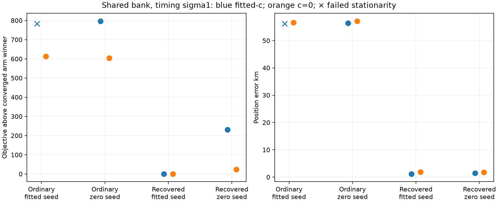

# Iteration 52: common bank plus sigma1 timing selects the recovered DS18 branch

**The recovered branch now wins by objective in both c arms:** 1.151 km fitted-c
and 1.931 km zero-c. Seven of eight refits converge independently. This fixes the
ranking in the controlled diagnostic; it is not yet an operational rescue or a
replacement for the frozen DS18 benchmark result.

## Matched change

Commit `f8391b317` froze the experiment before fitting. Relative satellite timing
sigma changes from 2 seconds to 1 second. The 145-candidate union, ordinary
shared calibration frame, four saved branch/arm starts, common timing sigma3,
joint clock prior, hard60 residual slope bounds, local25km disks and 20-second/
600-iteration per-fit budgets remain identical to iteration46. Both c arms
receive the same four starts and bank. The zero-c coefficient remains locked.

Transported physical nuisance predictions, old prediction columns and visibility
are verified unchanged. Initial scores reproduce iteration42 plus the exact
relative-timing penalty adjustment. All frozen source/input hashes pass.

| Branch | Seed arm | Arm | Converged | Objective | Error km | RMS Hz |
|---|---|---|---|---:|---:|---:|
| ordinary | fitted-c | fitted-c | False | 30029.934 | 56.183557 | 97.932 |
| ordinary | fitted-c | zero-c | True | 30112.101 | 56.607100 | 104.709 |
| ordinary | zero-c | fitted-c | True | 30043.634 | 56.369931 | 98.258 |
| ordinary | zero-c | zero-c | True | 30102.633 | 57.154303 | 104.271 |
| recovered | fitted-c | fitted-c | True | 29246.615 | 1.151112 | 85.273 |
| recovered | fitted-c | zero-c | True | 29498.895 | 1.930915 | 91.121 |
| recovered | zero-c | fitted-c | True | 29476.796 | 1.494244 | 86.802 |
| recovered | zero-c | zero-c | True | 29522.486 | 1.733425 | 91.616 |

## What changed in the ranking

The best converged fitted-c ordinary branch scores 30043.634 at 56.370 km;
the recovered branch scores 29246.615 at 1.151 km, better by **797.020**.
The best zero-c ordinary branch scores 30102.633 at 57.154 km;
the recovered branch scores 29498.895 at 1.931 km, better by **603.738**.
The sole nonstationary ordinary fitted-c result is also worse-scoring than the
recovered winner; its failure is preserved and it remains ineligible.

At fixed starts, combining a common bank with sigma1 already reverses the gap.
This test confirms the reversal survives optimization within both regions.
In iteration46, sigma2's converged zero-c winner was 57.382 km wrong and there
was no qualified fitted-c winner. Under sigma1, both selected winners converge.
Thus the bad ranking was not immutable evidence against the recovered region;
candidate-bank normalization and relative-timing flexibility interact.

Frequency fit is separate from accuracy: selected sigma1 winners have RMS
85.273 Hz fitted-c and 91.121 Hz zero-c. Lower position error is measured directly
against the reference after inference, never used for selection. The zero-c
alternative at 1.733 km loses by objective to the 1.931 km winner, illustrating
that this is score-based selection rather than reference-error cherry-picking.

## Remaining gap to a deployable policy

The recovered starts came from the prior consumed diagnostic sequence. Although
the candidate union originates in the reference-free 32-cell inventory, this
experiment does not show that ordinary regional starts reach the recovered joint
solution. Next test common-bank sigma1 directly from the saved ordinary regional
starts, preserving all eligible regions and matched c arms. Horizon discontinuity
also remains a model issue; one fit still fails stationarity. A smooth detection
taper requires separate gradient qualification before any deployment claim.

The all148 additive-region comparison continues independently in iteration51.
No diagnostic result is substituted into its means. Full membership, exposures,
failures, c ablations and per-dataset regressions remain required. No production,
public-contract, golden-fixture, QNAP or RF-collection changes occurred.

[results.json](results.json) retains all eight fits and transported starts;
[protocol.json](protocol.json) retains the frozen scope, budgets and hashes.
Ruff passes and the rendered visualization was inspected.
