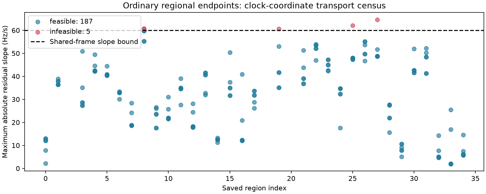

# Iteration 53: ordinary regional starts can enter the common model

All 192 saved final-fit endpoints from the 32 successful ordinary regions passed
frequency-prediction, satellite-visibility, clock-basis and timing transport checks.
**187 satisfy the shared model bounds; 5 exceed
the residual slope bound.** No clipping, optimization or error-based selection was
performed. This removes a preparation obstacle to testing ordinary starts; it does
not yet demonstrate an operational rescue of the DS18 failure.

The census includes association, zero-timing and own-continuation endpoints from
both source arms, including nonconverged endpoints. Every successful region has
six endpoints. The three original calibration failures remain failures in
iteration 41; this audit does not recover or silently exclude them. The common
145-satellite bank, ordinary calibration frame, joint-clock prior and relative
timing sigma1 follow iteration 52. Ordinary calibration knots initialize clocks;
no recovered joint-clock solution is used. Relative satellite timings are padded
with zero for added candidates. Position references are not used in this census.

The five violations concern residual slope relative to the common affine clock
frame, not total physical LNB drift. The transport itself is prediction preserving.
Different calibration frames can make equivalent physical predictions have
different residual slopes, so a hard residual bound is coordinate dependent.

## Infeasible transported starts

| Region | Source arm | Start | Max absolute slope Hz/s |
|---|---|---|---:|
| 8 | zero-c | zero-timing | 60.772867 |
| 8 | fitted-c | zero-timing | 60.649174 |
| 19 | fitted-c | zero-timing | 60.647902 |
| 25 | fitted-c | zero-timing | 62.104868 |
| 27 | zero-c | zero-timing | 64.632865 |

## Scope and next test

This is consumed DS18 diagnostic research, not unseen validation. The initial
regional inventory was generated by score, but its search budget was developed
after examining this failure. All dataset benchmark errors remain unchanged.
Next: freeze a matched c=0/fitted-c refit of feasible ordinary endpoints, using
equal budgets and selecting converged common-model scores across every region.
Report infeasible starts alongside fit failures and assess position only afterward.

The first census invocation stopped before endpoint evaluation because calibration
satellite indices describe a smaller bank than final fitting. Its executed source
is preserved as census.py. The separately frozen census_retry.py uses each saved
arm's final-fit bank and verifies the source basin. All 192 original objective
values subsequently reproduce within 1e-6; prediction transport checks also pass.
No production, public contract, scientific fixture or RF collection changed.
